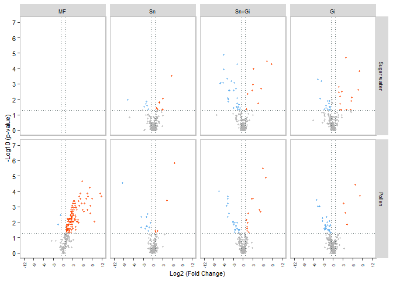

# Analysis of gut metabolomics dataset for (Figure 1B, 1C, S3)

## Experimental Design: Colonized bees \[S. alvi, Gilliamella, S. alvi + Gilliamella, MD\] fed \[sugar water, sugar water + pollen\]

### Aliquots from centrifuged gut supernatants were divided to extract soluble metabolites and short chain fatty acids (See Methods). Derivatized samples were run on an Agilent 8890/5977B series GC-MSD with VF-5MS column. Features were extracted using MassHunter Quantitative analysis software (Agilent) and identified using NIST 17 MS library or analytical standards.

### Load the required package to reproduce this analysis (Need to remove \#’s)

### Skip this chunk if required packages already downloaded

    #required_packages = c("dplyr", "data.table", "ggplot2", "readxl", "ggbeeswarm", "ggpubr", #"EnvStats", "tidyverse", "patchwork", "ggforce", "wesanderson", "RcolorBrewer", "extrafont", #"ggthemes" ,"egg", "officer", "rvg","ggh4x", "lubridate", "stringr", "modelr",
    #"grid", "lmm2met", "ggrepel")
    #need_install = required_packages[!(required_packages) %in% installed.packages()]

    #if (length(need_install) > 0){
    #  install.packages((need_install))
    #}

    #lapply(required_packages, require, character.only=T)

    #dir_script = dirname(rstudioapi::getSourceEditorContext()$path)

    #setwd(dir_script)

## Load data sheets

### Convert variables to factors

    library(readxl)
    library(RColorBrewer)
    library(EnvStats)
    library(ggpubr)
    library(lubridate)
    library(stringr)
    library(modelr)
    library(ggforce)
    library(tidyverse)

    ISTD <- read_csv("ISTD_all.csv")

    dat_smet <- read_csv("Data_all.csv")

    dat_smet$Bee_exp <- as.factor(dat_smet$Bee_exp)
    dat_smet$Condition <- as.factor(dat_smet$Condition)
    dat_smet$Food <- as.factor(dat_smet$Food)
    dat_smet$Metabolite <- as.factor(dat_smet$Metabolite)
    dat_smet$Date <- mdy_hm(dat_smet$Date)
    dat_smet$SCFA_Batch <- as.factor(dat_smet$SCFA_Batch)
    dat_smet$Smet_Batch <- as.factor(dat_smet$Smet_Batch)

## Normalize Response to internal standards

## Data split between GC-MS analysis of soluble metabolites vs short chain fatty acids

    dat_smet_norm <- dat_smet %>%
      left_join(ISTD, by = c("Sample","Type","Condition","SCFA_Batch","Smet_Batch"))%>%
      mutate(Norm_resp = case_when(
        str_detect(Metabolite, "Acetate") ~ Response / Ival_norm,
        str_detect(Metabolite, "Butyrate") ~ Response / Ival_norm,
        str_detect(Metabolite, "Formate") ~ Response / Ival_norm,
        str_detect(Metabolite, "Propionate") ~ Response / Ival_norm,
        str_detect(Metabolite, "Isovalerate") ~ Response / Ival_norm,
        str_detect(Metabolite, "Maleate") ~ Response / Ival_norm,
        str_detect(Metabolite, "Malonate") ~ Response / Ival_norm,
        str_detect(Metabolite, "Pentanoate") ~ Response / Ival_norm,
        TRUE ~ Response / Nle_norm),
        Metab_type = case_when(
        str_detect(Metabolite, "Acetate") ~ "SCFA",
        str_detect(Metabolite, "Butyrate") ~ "SCFA",
        str_detect(Metabolite, "Formate") ~ "SCFA",
        str_detect(Metabolite, "Propionate") ~ "SCFA",
        str_detect(Metabolite, "Isovalerate") ~ "SCFA",
        str_detect(Metabolite, "Maleate") ~ "SCFA",
        str_detect(Metabolite, "Malonate") ~ "SCFA",
        str_detect(Metabolite, "Pentanoate") ~ "SCFA",
        TRUE ~ "Smet"),
        Decision_Nle = replace_na(Decision_Nle,"ok"),
        Decision_Ival = replace_na(Decision_Ival,"ok"))

    Results_SCFA <- dat_smet_norm %>%
      filter(Type == "Sample" | Type == "PE" ) %>%
      filter(Decision_Ival != "error" & Metab_type == "SCFA") 
    Results_Smet <- dat_smet_norm %>%
      filter(Type == "Sample" | Type == "PE" ) %>%
      filter(Decision_Ival != "error" & Metab_type == "Smet") 
    Results <- bind_rows(Results_Smet,Results_SCFA)

    Results_contaminated <- filter(Results, Bee_exp == "E") ## Remove contaminated batch

    # adjust pollen extract values to levels in the gut
    Results_NC <- filter(Results, Bee_exp != "E") %>%
      filter(Sample != "QC9_PE10" & Sample != "QC8_PE10")%>%
      mutate(Norm_resp=case_when(Condition == "PE"~4.3*Norm_resp,
                                 TRUE ~Norm_resp))

## Calculate average normalized responses by treatment group

## Calculate fold changes and p-values vs reference group (MD)

    results_group <- Results_NC %>%
      group_by(Condition, Metabolite) %>%
      summarise(med = median(Norm_resp),
                sd = sd(Norm_resp),
                n = n())

    results_group_wide <- results_group %>%
      pivot_wider(names_from = Condition, values_from = c(med, sd, n))

    results_group_wide_Sn_SW <- results_group %>%
      filter(Condition == "Sn_SW" | Condition == "MD_SW") %>%
      pivot_wider(names_from = Condition, values_from = c(med, sd, n)) %>%
      mutate(FC = med_Sn_SW / med_MD_SW,
             Log_FC = log2(FC),
             stdev_fc = FC*sqrt((sd_Sn_SW/med_Sn_SW)^2 + (sd_MD_SW/med_MD_SW)^2))

    results_group_wide_Sn_P <- results_group %>%
      filter(Condition == "Sn_P" | Condition == "MD_P") %>%
      pivot_wider(names_from = Condition, values_from = c(med, sd, n)) %>%
      mutate(FC = med_Sn_P / med_MD_P,
             Log_FC = log2(FC),
             stdev_fc = FC*sqrt((sd_Sn_P/med_Sn_P)^2 + (sd_MD_P/med_MD_P)^2))

    results_group_wide_Gi_SW <- results_group %>%
      filter(Condition == "Gi_SW" | Condition == "MD_SW") %>%
      pivot_wider(names_from = Condition, values_from = c(med, sd, n)) %>%
      mutate(FC = med_Gi_SW / med_MD_SW,
             Log_FC = log2(FC),
             stdev_fc = FC*sqrt((sd_Gi_SW/med_Gi_SW)^2 + (sd_MD_SW/med_MD_SW)^2))

    results_group_wide_Gi_P <- results_group %>%
      filter(Condition == "Gi_P" | Condition == "MD_P") %>%
      pivot_wider(names_from = Condition, values_from = c(med, sd, n)) %>%
      mutate(FC = med_Gi_P / med_MD_P,
             Log_FC = log2(FC),
             stdev_fc = FC*sqrt((sd_Gi_P/med_Gi_P)^2 + (sd_MD_P/med_MD_P)^2))

    results_group_wide_Sn_Gi_SW <- results_group %>%
      filter(Condition == "Sn_Gi_SW" | Condition == "MD_SW") %>%
      pivot_wider(names_from = Condition, values_from = c(med, sd, n)) %>%
      mutate(FC = med_Sn_Gi_SW / med_MD_SW,
             Log_FC = log2(FC),
             stdev_fc = FC*sqrt((sd_Sn_Gi_SW/med_Sn_Gi_SW)^2 + (sd_MD_SW/med_MD_SW)^2))

    results_group_wide_Sn_Gi_P <- results_group %>%
      filter(Condition == "Sn_Gi_P" | Condition == "MD_P") %>%
      pivot_wider(names_from = Condition, values_from = c(med, sd, n)) %>%
      mutate(FC = med_Sn_Gi_P / med_MD_P,
             Log_FC = log2(FC),
             stdev_fc = FC*sqrt((sd_Sn_Gi_P/med_Sn_Gi_P)^2 + (sd_MD_P/med_MD_P)^2))

    results_group_wide_MD_P <- results_group %>%
      filter(Condition == "MD_P" | Condition == "MD_SW") %>%
      pivot_wider(names_from = Condition, values_from = c(med, sd, n)) %>%
      mutate(FC = med_MD_P / med_MD_SW,
             Log_FC = log2(FC),
             stdev_fc = FC*sqrt((sd_MD_P/med_MD_P)^2 + (sd_MD_SW/med_MD_SW)^2))

    results_group_wide_PE <- results_group %>%
      filter(Condition == "PE" | Condition == "MD_P") %>%
      pivot_wider(names_from = Condition, values_from = c(med, sd, n)) %>%
      mutate(FC = med_PE / med_MD_P,
             Log_FC = log2(FC),
             stdev_fc = FC*sqrt((sd_PE/med_PE)^2 + (sd_MD_P/med_MD_P)^2))

    p_value_sw <- Results_NC %>%
      filter(Food == "SW") 

    p_value_sn_sw <- p_value_sw %>%
      filter(Condition == "Sn_SW" | Condition == "MD_SW" ) 
    p_value_sn_sw <- compare_means(Norm_resp ~ Condition, data = p_value_sn_sw, 
                    group.by = "Metabolite", ref.group = "MD_SW", p.adjust.method = "BH")
    p_value_sn_sw <- p_value_sn_sw %>%
        mutate(Log10_p = -log10(p)) %>%
      rename(Condition = group2, Control = group1)

    p_value_gi_sw <- p_value_sw %>%
      filter(Condition == "Gi_SW" | Condition == "MD_SW" ) 
    p_value_gi_sw <- compare_means(Norm_resp ~ Condition, data = p_value_gi_sw, 
                    group.by = "Metabolite", ref.group = "MD_SW", p.adjust.method = "BH")
    p_value_gi_sw <- p_value_gi_sw %>%
        mutate(Log10_p = -log10(p)) %>%
      rename(Condition = group2, Control = group1)

    p_value_sn_gi_sw <- p_value_sw %>%
      filter(Condition == "Sn_Gi_SW" | Condition == "MD_SW" ) 
    p_value_sn_gi_sw <- compare_means(Norm_resp ~ Condition, data = p_value_sn_gi_sw, 
                    group.by = "Metabolite", ref.group = "MD_SW", p.adjust.method = "BH")
    p_value_sn_gi_sw <- p_value_sn_gi_sw %>%
        mutate(Log10_p = -log10(p)) %>%
      rename(Condition = group2, Control = group1)

    p_value_p <- Results_NC %>%
      filter(Food == "P") 

    p_value_sn_p <- p_value_p %>%
      filter(Condition == "Sn_P" | Condition == "MD_P" ) 
    p_value_sn_p <- compare_means(Norm_resp ~ Condition, data = p_value_sn_p, 
                    group.by = "Metabolite", ref.group = "MD_P", p.adjust.method = "BH")
    p_value_sn_p <- p_value_sn_p %>%
        mutate(Log10_p = -log10(p)) %>%
      rename(Condition = group2, Control = group1)

    p_value_gi_p <- p_value_p %>%
      filter(Condition == "Gi_P" | Condition == "MD_P" ) 
    p_value_gi_p <- compare_means(Norm_resp ~ Condition, data = p_value_gi_p, 
                    group.by = "Metabolite", ref.group = "MD_P", p.adjust.method = "BH")
    p_value_gi_p <- p_value_gi_p %>%
        mutate(Log10_p = -log10(p)) %>%
      rename(Condition = group2, Control = group1)

    p_value_sn_gi_p <- p_value_p %>%
      filter(Condition == "Sn_Gi_P" | Condition == "MD_P" ) 
    p_value_sn_gi_p <- compare_means(Norm_resp ~ Condition, data = p_value_sn_gi_p, 
                    group.by = "Metabolite", ref.group = "MD_P", p.adjust.method = "BH")
    p_value_sn_gi_p <- p_value_sn_gi_p %>%
        mutate(Log10_p = -log10(p)) %>%
      rename(Condition = group2, Control = group1)

    p_value_md <- Results_NC %>%
      filter(Condition == "MD_SW" | Condition == "MD_P") 
    p_value_md <- compare_means(Norm_resp ~ Condition, data = p_value_md, 
                    group.by = "Metabolite", ref.group = "MD_SW", p.adjust.method = "BH")
    p_value_md <- p_value_md %>%
        mutate(Log10_p = -log10(p)) %>%
      rename(Condition = group2, Control = group1)

    p_value_pe <- Results_NC %>%
      filter(Condition == "PE" | Condition == "MD_P") %>%
      filter(Metabolite != "Glutarate" & Metabolite != "Propanoate")
    p_value_pe <- compare_means(Norm_resp ~ Condition, data = p_value_pe, 
                    group.by = "Metabolite", ref.group = "MD_P", p.adjust.method = "BH")
    p_value_pe <- p_value_pe %>%
        mutate(Log10_p = -log10(p)) %>%
      rename(Condition = group2, Control = group1)

    results_group_wide_Sn_SW <- merge(results_group_wide_Sn_SW, p_value_sn_sw, by=c("Metabolite")) %>%
      rename(med_Condition = med_Sn_SW, sd_Condition = sd_Sn_SW, n_Condition = n_Sn_SW, 
             med_Control = med_MD_SW, sd_Control = sd_MD_SW, n_Control = n_MD_SW)

    results_group_wide_Gi_SW <- merge(results_group_wide_Gi_SW, p_value_gi_sw, by=c("Metabolite")) %>%
      rename(med_Condition = med_Gi_SW, sd_Condition = sd_Gi_SW, n_Condition = n_Gi_SW, 
             med_Control = med_MD_SW, sd_Control = sd_MD_SW, n_Control = n_MD_SW)

    results_group_wide_Sn_Gi_SW <- merge(results_group_wide_Sn_Gi_SW, p_value_sn_gi_sw, by=c("Metabolite")) %>%
      rename(med_Condition = med_Sn_Gi_SW, sd_Condition = sd_Sn_Gi_SW, n_Condition = n_Sn_Gi_SW, 
             med_Control = med_MD_SW, sd_Control = sd_MD_SW, n_Control = n_MD_SW)

    results_group_wide_Sn_P <- merge(results_group_wide_Sn_P, p_value_sn_p, by=c("Metabolite")) %>%
      rename(med_Condition = med_Sn_P, sd_Condition = sd_Sn_P, n_Condition = n_Sn_P, 
             med_Control = med_MD_P, sd_Control = sd_MD_P, n_Control = n_MD_P)

    results_group_wide_Gi_P <- merge(results_group_wide_Gi_P, p_value_gi_p, by=c("Metabolite")) %>%
      rename(med_Condition = med_Gi_P, sd_Condition = sd_Gi_P, n_Condition = n_Gi_P, 
             med_Control = med_MD_P, sd_Control = sd_MD_P, n_Control = n_MD_P)

    results_group_wide_Sn_Gi_P <- merge(results_group_wide_Sn_Gi_P, p_value_sn_gi_p, by=c("Metabolite")) %>%
      rename(med_Condition = med_Sn_Gi_P, sd_Condition = sd_Sn_Gi_P, n_Condition = n_Sn_Gi_P, 
             med_Control = med_MD_P, sd_Control = sd_MD_P, n_Control = n_MD_P)

    results_group_wide_MD_P <- merge(results_group_wide_MD_P, p_value_md, by=c("Metabolite")) %>%
      rename(med_Condition = med_MD_P, sd_Condition = sd_MD_P, n_Condition = n_MD_P, 
             med_Control = med_MD_SW, sd_Control = sd_MD_SW, n_Control = n_MD_SW)

    results_sig <- rbind(results_group_wide_Sn_SW,results_group_wide_Sn_P)
    results_sig <- rbind(results_sig,results_group_wide_Gi_SW)
    results_sig <- rbind(results_sig,results_group_wide_Gi_P)
    results_sig <- rbind(results_sig,results_group_wide_Sn_Gi_SW)
    results_sig <- rbind(results_sig,results_group_wide_Sn_Gi_P)
    results_sig <- rbind(results_sig,results_group_wide_MD_P)

    Substrates <- data.frame(Metabolite = c("3-Hydroxy-3-methylglutarate", "alpha-Ketoglutarate", "Citrate", "Gamma-Aminobutyrate", "Glycerate", "Acetate", "Malate", "Succinate", "Fumarate", "Pyruvate", "Hypoxanthine", "Lactate", "Caffeic_acid"),
                            Substrate= c("Yes", "Yes", "Yes", "Yes", "Yes", "Yes", "Yes", "Yes", "Yes", "Yes", "Yes", "Yes", "Yes"))

    results_sig_PE <- merge(results_group_wide_PE, p_value_pe, by=c("Metabolite")) %>%
      rename(med_Condition = med_PE, sd_Condition = sd_PE, n_Condition = n_PE, 
             med_Control = med_MD_P, sd_Control = sd_MD_P, n_Control = n_MD_P)%>%
      left_join(Substrates, by = "Metabolite")%>%
      mutate(Substrate=replace_na(Substrate,"No"))

    results_sig$Abundance <- "NO"
    results_sig$Abundance[results_sig$Log_FC > 0.6 & results_sig$p < 0.05] <- "UP"
    results_sig$Abundance[results_sig$Log_FC < -0.6 & results_sig$p < 0.05] <- "DOWN"
      
    results_sig$siglabel <- NA
    results_sig$Metabolite <- as.character(results_sig$Metabolite)
    results_sig$siglabel[results_sig$p < 0.05] <- results_sig$Metabolite[results_sig$p < 0.05]
      
    results_sig$siglabel <- factor(results_sig$siglabel)

    results_sig$Condition <- factor(results_sig$Condition, 
                                         levels = c("MD_P", "Sn_SW", "Sn_P", "Gi_SW", "Gi_P", "Sn_Gi_SW", "Sn_Gi_P"))
    results_sig$Abundance <- factor(results_sig$Abundance, 
                                         levels = c("UP", "DOWN", "NO"))

    results_sig_sn <- results_sig %>%
      filter(Condition == "Sn_SW" | Condition == "Sn_P" ) 

    results_sig_1 <- results_sig %>%
      mutate(Food = case_when(str_detect(Condition, "_P") ~ "Pollen",
                              TRUE ~ "Sugar water"),
             Colonization = case_when(str_detect(Condition, "Sn_SW") ~ "Sn",
                                      str_detect(Condition, "Sn_P") ~ "Sn",
                                      str_detect(Condition, "Sn_Gi_SW") ~ "Sn+Gi",
                                      str_detect(Condition, "Sn_Gi_P") ~ "Sn+Gi",
                                      str_detect(Condition, "Gi_SW") ~ "Gi",
                                      str_detect(Condition, "Gi_P") ~ "Gi",
                                      TRUE ~ "MF" ),
             Food = fct_relevel(Food, "Sugar water", "Pollen"),
             Colonization = fct_relevel(Colonization,"MF",  "Sn", "Sn+Gi", "Gi"))%>%
      ungroup() %>%
        add_count(siglabel, name = "Shared")

    results_sig_1$Shared[results_sig_1$Shared == 1338] <- 0
        results_sig_1 <- results_sig_1 %>%
          mutate(siglabel = case_when(Shared > 1 ~siglabel, TRUE ~ NA_integer_))

    Sig_count <- results_sig %>%
      group_by(Condition) %>%
      summarise(Total = n(),
                Higher = sum(Abundance == "UP")/Total,
                Lower = sum(Abundance == "DOWN")/Total,
                Same = sum(Abundance == "NO")/Total)

## Generate volcano-plots. Figure 1B, Figure S2

\##Calculate Z-Scores of metabolites

    Results_NC_samples <- Results_NC %>%
      filter(Type != "PE")%>%
      group_by(Metabolite) %>%
      mutate(z_score = (Norm_resp - mean(Norm_resp, na.rm = TRUE))/sd(Norm_resp, na.rm = TRUE),
             LOD = (1-mean(Norm_resp, na.rm = TRUE))/sd(Norm_resp, na.rm = TRUE)) %>%
      ungroup(Metabolite)

    Results_NC_samples$Condition <- factor(Results_NC_samples$Condition, 
                                         levels = c("MD_SW", "MD_P", "Sn_SW", "Sn_P", "Gi_SW", "Gi_P", "Sn_Gi_SW", "Sn_Gi_P"))

## Test for differentially abundant metabolites using mixed linear models

### Implement mixed linear model of lmm2met

#### Variables: Fixed (colonization and injection order), Random (batch)

    metabdf <- Results_NC_samples %>%
      select(Sample, Metabolite) %>%
      filter(Sample == "A12FF5")
    metabdf$metabID<-1:nrow(metabdf)
    metabdf$metabID = paste0('X', metabdf$metabID)
    metabdf$metabID <- factor(metabdf$metabID)

    metabdf <- metabdf %>%
      select(Metabolite, metabID)

    metab_lmm <- Results_NC_samples %>%
      select(Sample,Bee_exp,Condition,Food,Metabolite,z_score) %>%
      mutate(Sn=case_when(str_detect(Condition,"Sn")~1,
                          TRUE ~ 0),
             Gi=case_when(str_detect(Condition,"Gi")~1,
                          TRUE ~ 0))%>%
      full_join(metabdf) %>%
      ungroup() %>%
      group_by(metabID) %>%
      select(Sample, Bee_exp, Sn, Gi, Food, metabID, z_score) %>%
      pivot_wider(names_from = metabID, values_from = z_score)%>%
      replace(is.na(.), 0)

    metab_lmm$Food <- factor(metab_lmm$Food, levels = c("SW", "P"))
    metab_lmm$Sn <- factor(metab_lmm$Sn)
    metab_lmm$Gi <- factor(metab_lmm$Gi)
    metab_lmm$Bee_exp <- factor(metab_lmm$Bee_exp)

    library(lmm2met)
    fitMet = fitLmm(fix= c('Food','Sn',"Gi"), random='(1|Bee_exp)', data=metab_lmm, start=6, end=238)

    ## Fitting model to X1 
    ## Fitting model to X2 
    ## Fitting model to X3 
    ## Fitting model to X4 
    ## Fitting model to X5 
    ## Fitting model to X6 
    ## Fitting model to X7 
    ## Fitting model to X8 
    ## Fitting model to X9 
    ## Fitting model to X10 
    ## Fitting model to X11 
    ## Fitting model to X12 
    ## Fitting model to X13 
    ## Fitting model to X14 
    ## Fitting model to X15 
    ## Fitting model to X16 
    ## Fitting model to X17 
    ## Fitting model to X18 
    ## Fitting model to X19 
    ## Fitting model to X20 
    ## Fitting model to X21 
    ## Fitting model to X22 
    ## Fitting model to X23 
    ## Fitting model to X24 
    ## Fitting model to X25 
    ## Fitting model to X26 
    ## Fitting model to X27 
    ## Fitting model to X28 
    ## Fitting model to X29 
    ## Fitting model to X30 
    ## Fitting model to X31 
    ## Fitting model to X32 
    ## Fitting model to X33 
    ## Fitting model to X34 
    ## Fitting model to X35 
    ## Fitting model to X36 
    ## Fitting model to X37 
    ## Fitting model to X38 
    ## Fitting model to X39 
    ## Fitting model to X40 
    ## Fitting model to X41 
    ## Fitting model to X42 
    ## Fitting model to X43 
    ## Fitting model to X44 
    ## Fitting model to X45 
    ## Fitting model to X46 
    ## Fitting model to X47 
    ## Fitting model to X48 
    ## Fitting model to X49 
    ## Fitting model to X50 
    ## Fitting model to X51 
    ## Fitting model to X52 
    ## Fitting model to X53 
    ## Fitting model to X54 
    ## Fitting model to X55 
    ## Fitting model to X56 
    ## Fitting model to X57 
    ## Fitting model to X58 
    ## Fitting model to X59 
    ## Fitting model to X60 
    ## Fitting model to X61 
    ## Fitting model to X62 
    ## Fitting model to X63 
    ## Fitting model to X64 
    ## Fitting model to X65 
    ## Fitting model to X66 
    ## Fitting model to X67 
    ## Fitting model to X68 
    ## Fitting model to X69 
    ## Fitting model to X70 
    ## Fitting model to X71 
    ## Fitting model to X72 
    ## Fitting model to X73 
    ## Fitting model to X74 
    ## Fitting model to X75 
    ## Fitting model to X76 
    ## Fitting model to X77 
    ## Fitting model to X78 
    ## Fitting model to X79 
    ## Fitting model to X80 
    ## Fitting model to X81 
    ## Fitting model to X82 
    ## Fitting model to X83 
    ## Fitting model to X84 
    ## Fitting model to X85 
    ## Fitting model to X86 
    ## Fitting model to X87 
    ## Fitting model to X88 
    ## Fitting model to X89 
    ## Fitting model to X90 
    ## Fitting model to X91 
    ## Fitting model to X92 
    ## Fitting model to X93 
    ## Fitting model to X94 
    ## Fitting model to X95 
    ## Fitting model to X96 
    ## Fitting model to X97 
    ## Fitting model to X98 
    ## Fitting model to X99 
    ## Fitting model to X100 
    ## Fitting model to X101 
    ## Fitting model to X102 
    ## Fitting model to X103 
    ## Fitting model to X104 
    ## Fitting model to X105 
    ## Fitting model to X106 
    ## Fitting model to X107 
    ## Fitting model to X108 
    ## Fitting model to X109 
    ## Fitting model to X110 
    ## Fitting model to X111 
    ## Fitting model to X112 
    ## Fitting model to X113 
    ## Fitting model to X114 
    ## Fitting model to X115 
    ## Fitting model to X116 
    ## Fitting model to X117 
    ## Fitting model to X118 
    ## Fitting model to X119 
    ## Fitting model to X120 
    ## Fitting model to X121 
    ## Fitting model to X122 
    ## Fitting model to X123 
    ## Fitting model to X124 
    ## Fitting model to X125 
    ## Fitting model to X126 
    ## Fitting model to X127 
    ## Fitting model to X128 
    ## Fitting model to X129 
    ## Fitting model to X130 
    ## Fitting model to X131 
    ## Fitting model to X132 
    ## Fitting model to X133 
    ## Fitting model to X134 
    ## Fitting model to X135 
    ## Fitting model to X136 
    ## Fitting model to X137 
    ## Fitting model to X138 
    ## Fitting model to X139 
    ## Fitting model to X140 
    ## Fitting model to X141 
    ## Fitting model to X142 
    ## Fitting model to X143 
    ## Fitting model to X144 
    ## Fitting model to X145 
    ## Fitting model to X146 
    ## Fitting model to X147 
    ## Fitting model to X148 
    ## Fitting model to X149 
    ## Fitting model to X150 
    ## Fitting model to X151 
    ## Fitting model to X152 
    ## Fitting model to X153 
    ## Fitting model to X154 
    ## Fitting model to X155 
    ## Fitting model to X156 
    ## Fitting model to X157 
    ## Fitting model to X158 
    ## Fitting model to X159 
    ## Fitting model to X160 
    ## Fitting model to X161 
    ## Fitting model to X162 
    ## Fitting model to X163 
    ## Fitting model to X164 
    ## Fitting model to X165 
    ## Fitting model to X166 
    ## Fitting model to X167 
    ## Fitting model to X168 
    ## Fitting model to X169 
    ## Fitting model to X170 
    ## Fitting model to X171 
    ## Fitting model to X172 
    ## Fitting model to X173 
    ## Fitting model to X174 
    ## Fitting model to X175 
    ## Fitting model to X176 
    ## Fitting model to X177 
    ## Fitting model to X178 
    ## Fitting model to X179 
    ## Fitting model to X180 
    ## Fitting model to X181 
    ## Fitting model to X182 
    ## Fitting model to X183 
    ## Fitting model to X184 
    ## Fitting model to X185 
    ## Fitting model to X186 
    ## Fitting model to X187 
    ## Fitting model to X188 
    ## Fitting model to X189 
    ## Fitting model to X190 
    ## Fitting model to X191 
    ## Fitting model to X192 
    ## Fitting model to X193 
    ## Fitting model to X194 
    ## Fitting model to X195 
    ## Fitting model to X196 
    ## Fitting model to X197 
    ## Fitting model to X198 
    ## Fitting model to X199 
    ## Fitting model to X200 
    ## Fitting model to X201 
    ## Fitting model to X202 
    ## Fitting model to X203 
    ## Fitting model to X204 
    ## Fitting model to X205 
    ## Fitting model to X206 
    ## Fitting model to X207 
    ## Fitting model to X208 
    ## Fitting model to X209 
    ## Fitting model to X210 
    ## Fitting model to X211 
    ## Fitting model to X212 
    ## Fitting model to X213 
    ## Fitting model to X214 
    ## Fitting model to X215 
    ## Fitting model to X216 
    ## Fitting model to X217 
    ## Fitting model to X218 
    ## Fitting model to X219 
    ## Fitting model to X220 
    ## Fitting model to X221 
    ## Fitting model to X222 
    ## Fitting model to X223 
    ## Fitting model to X224 
    ## Fitting model to X225 
    ## Fitting model to X226 
    ## Fitting model to X227 
    ## Fitting model to X228 
    ## Fitting model to X229 
    ## Fitting model to X230 
    ## Fitting model to X231 
    ## Fitting model to X232 
    ## Fitting model to X233

    plot(fitMet, type='coeff')

    ## Ploting table of length 1  ...

<table class="table table-striped" style="width: auto !important; margin-left: auto; margin-right: auto;">
<thead>
<tr>
<th style="text-align:left;">
</th>
<th style="text-align:center;">
ID
</th>
<th style="text-align:center;">
(Intercept)
</th>
<th style="text-align:center;">
FoodP
</th>
<th style="text-align:center;">
Sn1
</th>
<th style="text-align:center;">
Gi1
</th>
</tr>
</thead>
<tbody>
<tr>
<td style="text-align:left;">
X1
</td>
<td style="text-align:center;">
X1
</td>
<td style="text-align:center;">
-0.618
</td>
<td style="text-align:center;">
1.324
</td>
<td style="text-align:center;">
0.174
</td>
<td style="text-align:center;">
-0.224
</td>
</tr>
<tr>
<td style="text-align:left;">
X2
</td>
<td style="text-align:center;">
X2
</td>
<td style="text-align:center;">
0.539
</td>
<td style="text-align:center;">
-0.191
</td>
<td style="text-align:center;">
-0.067
</td>
<td style="text-align:center;">
-0.093
</td>
</tr>
<tr>
<td style="text-align:left;">
X3
</td>
<td style="text-align:center;">
X3
</td>
<td style="text-align:center;">
0.261
</td>
<td style="text-align:center;">
-0.553
</td>
<td style="text-align:center;">
-0.188
</td>
<td style="text-align:center;">
0.185
</td>
</tr>
<tr>
<td style="text-align:left;">
X4
</td>
<td style="text-align:center;">
X4
</td>
<td style="text-align:center;">
-0.361
</td>
<td style="text-align:center;">
0.909
</td>
<td style="text-align:center;">
-0.08
</td>
<td style="text-align:center;">
-0.136
</td>
</tr>
<tr>
<td style="text-align:left;">
X5
</td>
<td style="text-align:center;">
X5
</td>
<td style="text-align:center;">
0.254
</td>
<td style="text-align:center;">
-0.061
</td>
<td style="text-align:center;">
0.2
</td>
<td style="text-align:center;">
-0.166
</td>
</tr>
<tr>
<td style="text-align:left;">
X6
</td>
<td style="text-align:center;">
X6
</td>
<td style="text-align:center;">
-0.392
</td>
<td style="text-align:center;">
0.439
</td>
<td style="text-align:center;">
0.019
</td>
<td style="text-align:center;">
0.245
</td>
</tr>
<tr>
<td style="text-align:left;">
X7
</td>
<td style="text-align:center;">
X7
</td>
<td style="text-align:center;">
-0.424
</td>
<td style="text-align:center;">
0.802
</td>
<td style="text-align:center;">
-0.073
</td>
<td style="text-align:center;">
0.094
</td>
</tr>
<tr>
<td style="text-align:left;">
X8
</td>
<td style="text-align:center;">
X8
</td>
<td style="text-align:center;">
0.155
</td>
<td style="text-align:center;">
0.684
</td>
<td style="text-align:center;">
0.017
</td>
<td style="text-align:center;">
-0.945
</td>
</tr>
<tr>
<td style="text-align:left;">
X9
</td>
<td style="text-align:center;">
X9
</td>
<td style="text-align:center;">
-0.865
</td>
<td style="text-align:center;">
0.58
</td>
<td style="text-align:center;">
0.23
</td>
<td style="text-align:center;">
0.833
</td>
</tr>
<tr>
<td style="text-align:left;">
X10
</td>
<td style="text-align:center;">
X10
</td>
<td style="text-align:center;">
-0.502
</td>
<td style="text-align:center;">
0.93
</td>
<td style="text-align:center;">
-0.291
</td>
<td style="text-align:center;">
0.366
</td>
</tr>
<tr>
<td style="text-align:left;">
X11
</td>
<td style="text-align:center;">
X11
</td>
<td style="text-align:center;">
-0.396
</td>
<td style="text-align:center;">
1.041
</td>
<td style="text-align:center;">
-0.057
</td>
<td style="text-align:center;">
-0.2
</td>
</tr>
<tr>
<td style="text-align:left;">
X12
</td>
<td style="text-align:center;">
X12
</td>
<td style="text-align:center;">
0.211
</td>
<td style="text-align:center;">
0.592
</td>
<td style="text-align:center;">
-0.763
</td>
<td style="text-align:center;">
-0.244
</td>
</tr>
<tr>
<td style="text-align:left;">
X13
</td>
<td style="text-align:center;">
X13
</td>
<td style="text-align:center;">
0.219
</td>
<td style="text-align:center;">
-0.061
</td>
<td style="text-align:center;">
0.18
</td>
<td style="text-align:center;">
-0.169
</td>
</tr>
<tr>
<td style="text-align:left;">
X14
</td>
<td style="text-align:center;">
X14
</td>
<td style="text-align:center;">
-0.537
</td>
<td style="text-align:center;">
1.163
</td>
<td style="text-align:center;">
0.063
</td>
<td style="text-align:center;">
-0.135
</td>
</tr>
<tr>
<td style="text-align:left;">
X15
</td>
<td style="text-align:center;">
X15
</td>
<td style="text-align:center;">
-0.367
</td>
<td style="text-align:center;">
0.878
</td>
<td style="text-align:center;">
-0.013
</td>
<td style="text-align:center;">
-0.099
</td>
</tr>
<tr>
<td style="text-align:left;">
X16
</td>
<td style="text-align:center;">
X16
</td>
<td style="text-align:center;">
-0.61
</td>
<td style="text-align:center;">
1.061
</td>
<td style="text-align:center;">
0.214
</td>
<td style="text-align:center;">
-0.107
</td>
</tr>
<tr>
<td style="text-align:left;">
X17
</td>
<td style="text-align:center;">
X17
</td>
<td style="text-align:center;">
-0.656
</td>
<td style="text-align:center;">
1.199
</td>
<td style="text-align:center;">
0.323
</td>
<td style="text-align:center;">
-0.153
</td>
</tr>
<tr>
<td style="text-align:left;">
X18
</td>
<td style="text-align:center;">
X18
</td>
<td style="text-align:center;">
-0.596
</td>
<td style="text-align:center;">
1.047
</td>
<td style="text-align:center;">
0.145
</td>
<td style="text-align:center;">
0.037
</td>
</tr>
<tr>
<td style="text-align:left;">
X19
</td>
<td style="text-align:center;">
X19
</td>
<td style="text-align:center;">
0.301
</td>
<td style="text-align:center;">
0.561
</td>
<td style="text-align:center;">
-0.978
</td>
<td style="text-align:center;">
-0.188
</td>
</tr>
<tr>
<td style="text-align:left;">
X20
</td>
<td style="text-align:center;">
X20
</td>
<td style="text-align:center;">
-0.463
</td>
<td style="text-align:center;">
0.733
</td>
<td style="text-align:center;">
0.232
</td>
<td style="text-align:center;">
-0.084
</td>
</tr>
<tr>
<td style="text-align:left;">
X21
</td>
<td style="text-align:center;">
X21
</td>
<td style="text-align:center;">
-0.599
</td>
<td style="text-align:center;">
0.991
</td>
<td style="text-align:center;">
0.127
</td>
<td style="text-align:center;">
0.11
</td>
</tr>
<tr>
<td style="text-align:left;">
X22
</td>
<td style="text-align:center;">
X22
</td>
<td style="text-align:center;">
-0.648
</td>
<td style="text-align:center;">
1.171
</td>
<td style="text-align:center;">
0.223
</td>
<td style="text-align:center;">
-0.052
</td>
</tr>
<tr>
<td style="text-align:left;">
X23
</td>
<td style="text-align:center;">
X23
</td>
<td style="text-align:center;">
-0.249
</td>
<td style="text-align:center;">
0.497
</td>
<td style="text-align:center;">
0.044
</td>
<td style="text-align:center;">
-0.21
</td>
</tr>
<tr>
<td style="text-align:left;">
X24
</td>
<td style="text-align:center;">
X24
</td>
<td style="text-align:center;">
-0.581
</td>
<td style="text-align:center;">
1.113
</td>
<td style="text-align:center;">
-0.137
</td>
<td style="text-align:center;">
0.154
</td>
</tr>
<tr>
<td style="text-align:left;">
X25
</td>
<td style="text-align:center;">
X25
</td>
<td style="text-align:center;">
-0.517
</td>
<td style="text-align:center;">
1.092
</td>
<td style="text-align:center;">
0.127
</td>
<td style="text-align:center;">
-0.152
</td>
</tr>
<tr>
<td style="text-align:left;">
X26
</td>
<td style="text-align:center;">
X26
</td>
<td style="text-align:center;">
-0.786
</td>
<td style="text-align:center;">
1.193
</td>
<td style="text-align:center;">
0.152
</td>
<td style="text-align:center;">
0.256
</td>
</tr>
<tr>
<td style="text-align:left;">
X27
</td>
<td style="text-align:center;">
X27
</td>
<td style="text-align:center;">
-0.134
</td>
<td style="text-align:center;">
0.171
</td>
<td style="text-align:center;">
-0.268
</td>
<td style="text-align:center;">
0.305
</td>
</tr>
<tr>
<td style="text-align:left;">
X28
</td>
<td style="text-align:center;">
X28
</td>
<td style="text-align:center;">
-0.151
</td>
<td style="text-align:center;">
0.387
</td>
<td style="text-align:center;">
0.009
</td>
<td style="text-align:center;">
0.029
</td>
</tr>
<tr>
<td style="text-align:left;">
X29
</td>
<td style="text-align:center;">
X29
</td>
<td style="text-align:center;">
-0.589
</td>
<td style="text-align:center;">
1.245
</td>
<td style="text-align:center;">
0.01
</td>
<td style="text-align:center;">
-0.037
</td>
</tr>
<tr>
<td style="text-align:left;">
X30
</td>
<td style="text-align:center;">
X30
</td>
<td style="text-align:center;">
-0.442
</td>
<td style="text-align:center;">
1.015
</td>
<td style="text-align:center;">
-0.18
</td>
<td style="text-align:center;">
-0.051
</td>
</tr>
<tr>
<td style="text-align:left;">
X31
</td>
<td style="text-align:center;">
X31
</td>
<td style="text-align:center;">
0.298
</td>
<td style="text-align:center;">
0.467
</td>
<td style="text-align:center;">
-0.15
</td>
<td style="text-align:center;">
-0.857
</td>
</tr>
<tr>
<td style="text-align:left;">
X32
</td>
<td style="text-align:center;">
X32
</td>
<td style="text-align:center;">
0.27
</td>
<td style="text-align:center;">
0.515
</td>
<td style="text-align:center;">
-0.16
</td>
<td style="text-align:center;">
-0.84
</td>
</tr>
<tr>
<td style="text-align:left;">
X33
</td>
<td style="text-align:center;">
X33
</td>
<td style="text-align:center;">
-0.925
</td>
<td style="text-align:center;">
0.54
</td>
<td style="text-align:center;">
0.088
</td>
<td style="text-align:center;">
1.179
</td>
</tr>
<tr>
<td style="text-align:left;">
X34
</td>
<td style="text-align:center;">
X34
</td>
<td style="text-align:center;">
-0.358
</td>
<td style="text-align:center;">
1.119
</td>
<td style="text-align:center;">
0.022
</td>
<td style="text-align:center;">
-0.486
</td>
</tr>
<tr>
<td style="text-align:left;">
X35
</td>
<td style="text-align:center;">
X35
</td>
<td style="text-align:center;">
-0.149
</td>
<td style="text-align:center;">
0.874
</td>
<td style="text-align:center;">
-0.002
</td>
<td style="text-align:center;">
-0.495
</td>
</tr>
<tr>
<td style="text-align:left;">
X36
</td>
<td style="text-align:center;">
X36
</td>
<td style="text-align:center;">
-0.521
</td>
<td style="text-align:center;">
1.106
</td>
<td style="text-align:center;">
-0.057
</td>
<td style="text-align:center;">
-0.153
</td>
</tr>
<tr>
<td style="text-align:left;">
X37
</td>
<td style="text-align:center;">
X37
</td>
<td style="text-align:center;">
-0.79
</td>
<td style="text-align:center;">
1.289
</td>
<td style="text-align:center;">
0.318
</td>
<td style="text-align:center;">
0.026
</td>
</tr>
<tr>
<td style="text-align:left;">
X38
</td>
<td style="text-align:center;">
X38
</td>
<td style="text-align:center;">
-0.187
</td>
<td style="text-align:center;">
0.654
</td>
<td style="text-align:center;">
0.2
</td>
<td style="text-align:center;">
-0.427
</td>
</tr>
<tr>
<td style="text-align:left;">
X39
</td>
<td style="text-align:center;">
X39
</td>
<td style="text-align:center;">
-0.103
</td>
<td style="text-align:center;">
0.958
</td>
<td style="text-align:center;">
-0.084
</td>
<td style="text-align:center;">
-0.608
</td>
</tr>
<tr>
<td style="text-align:left;">
X40
</td>
<td style="text-align:center;">
X40
</td>
<td style="text-align:center;">
-0.036
</td>
<td style="text-align:center;">
0.582
</td>
<td style="text-align:center;">
-0.931
</td>
<td style="text-align:center;">
0.296
</td>
</tr>
<tr>
<td style="text-align:left;">
X41
</td>
<td style="text-align:center;">
X41
</td>
<td style="text-align:center;">
-0.133
</td>
<td style="text-align:center;">
0.555
</td>
<td style="text-align:center;">
-0.344
</td>
<td style="text-align:center;">
0.075
</td>
</tr>
<tr>
<td style="text-align:left;">
X42
</td>
<td style="text-align:center;">
X42
</td>
<td style="text-align:center;">
-0.798
</td>
<td style="text-align:center;">
0.607
</td>
<td style="text-align:center;">
1.206
</td>
<td style="text-align:center;">
-0.156
</td>
</tr>
<tr>
<td style="text-align:left;">
X43
</td>
<td style="text-align:center;">
X43
</td>
<td style="text-align:center;">
-0.197
</td>
<td style="text-align:center;">
1.045
</td>
<td style="text-align:center;">
-0.225
</td>
<td style="text-align:center;">
-0.38
</td>
</tr>
<tr>
<td style="text-align:left;">
X44
</td>
<td style="text-align:center;">
X44
</td>
<td style="text-align:center;">
-0.424
</td>
<td style="text-align:center;">
1.11
</td>
<td style="text-align:center;">
-0.114
</td>
<td style="text-align:center;">
-0.069
</td>
</tr>
<tr>
<td style="text-align:left;">
X45
</td>
<td style="text-align:center;">
X45
</td>
<td style="text-align:center;">
0.053
</td>
<td style="text-align:center;">
0.906
</td>
<td style="text-align:center;">
-0.36
</td>
<td style="text-align:center;">
-0.592
</td>
</tr>
<tr>
<td style="text-align:left;">
X46
</td>
<td style="text-align:center;">
X46
</td>
<td style="text-align:center;">
-0.821
</td>
<td style="text-align:center;">
0.521
</td>
<td style="text-align:center;">
0.403
</td>
<td style="text-align:center;">
0.71
</td>
</tr>
<tr>
<td style="text-align:left;">
X47
</td>
<td style="text-align:center;">
X47
</td>
<td style="text-align:center;">
-0.34
</td>
<td style="text-align:center;">
0.716
</td>
<td style="text-align:center;">
0.09
</td>
<td style="text-align:center;">
-0.139
</td>
</tr>
<tr>
<td style="text-align:left;">
X48
</td>
<td style="text-align:center;">
X48
</td>
<td style="text-align:center;">
-0.448
</td>
<td style="text-align:center;">
1.082
</td>
<td style="text-align:center;">
0.084
</td>
<td style="text-align:center;">
-0.277
</td>
</tr>
<tr>
<td style="text-align:left;">
X49
</td>
<td style="text-align:center;">
X49
</td>
<td style="text-align:center;">
-0.07
</td>
<td style="text-align:center;">
0.822
</td>
<td style="text-align:center;">
-0.567
</td>
<td style="text-align:center;">
-0.101
</td>
</tr>
<tr>
<td style="text-align:left;">
X50
</td>
<td style="text-align:center;">
X50
</td>
<td style="text-align:center;">
0.438
</td>
<td style="text-align:center;">
0.304
</td>
<td style="text-align:center;">
-0.604
</td>
<td style="text-align:center;">
-0.556
</td>
</tr>
<tr>
<td style="text-align:left;">
X51
</td>
<td style="text-align:center;">
X51
</td>
<td style="text-align:center;">
-0.474
</td>
<td style="text-align:center;">
1.188
</td>
<td style="text-align:center;">
-0.032
</td>
<td style="text-align:center;">
-0.186
</td>
</tr>
<tr>
<td style="text-align:left;">
X52
</td>
<td style="text-align:center;">
X52
</td>
<td style="text-align:center;">
0.109
</td>
<td style="text-align:center;">
0.793
</td>
<td style="text-align:center;">
0.018
</td>
<td style="text-align:center;">
-0.962
</td>
</tr>
<tr>
<td style="text-align:left;">
X53
</td>
<td style="text-align:center;">
X53
</td>
<td style="text-align:center;">
0.273
</td>
<td style="text-align:center;">
0.002
</td>
<td style="text-align:center;">
0.137
</td>
<td style="text-align:center;">
-0.186
</td>
</tr>
<tr>
<td style="text-align:left;">
X54
</td>
<td style="text-align:center;">
X54
</td>
<td style="text-align:center;">
-0.226
</td>
<td style="text-align:center;">
0.876
</td>
<td style="text-align:center;">
-0.041
</td>
<td style="text-align:center;">
-0.279
</td>
</tr>
<tr>
<td style="text-align:left;">
X55
</td>
<td style="text-align:center;">
X55
</td>
<td style="text-align:center;">
-0.286
</td>
<td style="text-align:center;">
0.885
</td>
<td style="text-align:center;">
-0.179
</td>
<td style="text-align:center;">
-0.091
</td>
</tr>
<tr>
<td style="text-align:left;">
X56
</td>
<td style="text-align:center;">
X56
</td>
<td style="text-align:center;">
-0.546
</td>
<td style="text-align:center;">
1.194
</td>
<td style="text-align:center;">
0.172
</td>
<td style="text-align:center;">
-0.261
</td>
</tr>
<tr>
<td style="text-align:left;">
X57
</td>
<td style="text-align:center;">
X57
</td>
<td style="text-align:center;">
-0.35
</td>
<td style="text-align:center;">
0.13
</td>
<td style="text-align:center;">
0.11
</td>
<td style="text-align:center;">
-0.074
</td>
</tr>
<tr>
<td style="text-align:left;">
X58
</td>
<td style="text-align:center;">
X58
</td>
<td style="text-align:center;">
-0.322
</td>
<td style="text-align:center;">
0.642
</td>
<td style="text-align:center;">
-0.001
</td>
<td style="text-align:center;">
-0.173
</td>
</tr>
<tr>
<td style="text-align:left;">
X59
</td>
<td style="text-align:center;">
X59
</td>
<td style="text-align:center;">
-0.288
</td>
<td style="text-align:center;">
0.518
</td>
<td style="text-align:center;">
0.026
</td>
<td style="text-align:center;">
-0.183
</td>
</tr>
<tr>
<td style="text-align:left;">
X60
</td>
<td style="text-align:center;">
X60
</td>
<td style="text-align:center;">
-0.273
</td>
<td style="text-align:center;">
0.919
</td>
<td style="text-align:center;">
0.09
</td>
<td style="text-align:center;">
-0.41
</td>
</tr>
<tr>
<td style="text-align:left;">
X61
</td>
<td style="text-align:center;">
X61
</td>
<td style="text-align:center;">
-0.286
</td>
<td style="text-align:center;">
0.931
</td>
<td style="text-align:center;">
-0.108
</td>
<td style="text-align:center;">
-0.264
</td>
</tr>
<tr>
<td style="text-align:left;">
X62
</td>
<td style="text-align:center;">
X62
</td>
<td style="text-align:center;">
-0.705
</td>
<td style="text-align:center;">
1.324
</td>
<td style="text-align:center;">
0.205
</td>
<td style="text-align:center;">
-0.068
</td>
</tr>
<tr>
<td style="text-align:left;">
X63
</td>
<td style="text-align:center;">
X63
</td>
<td style="text-align:center;">
0.114
</td>
<td style="text-align:center;">
-0.387
</td>
<td style="text-align:center;">
0.032
</td>
<td style="text-align:center;">
0.39
</td>
</tr>
<tr>
<td style="text-align:left;">
X64
</td>
<td style="text-align:center;">
X64
</td>
<td style="text-align:center;">
-0.06
</td>
<td style="text-align:center;">
0.401
</td>
<td style="text-align:center;">
0.271
</td>
<td style="text-align:center;">
-0.503
</td>
</tr>
<tr>
<td style="text-align:left;">
X65
</td>
<td style="text-align:center;">
X65
</td>
<td style="text-align:center;">
-0.05
</td>
<td style="text-align:center;">
0.365
</td>
<td style="text-align:center;">
0.276
</td>
<td style="text-align:center;">
-0.495
</td>
</tr>
<tr>
<td style="text-align:left;">
X66
</td>
<td style="text-align:center;">
X66
</td>
<td style="text-align:center;">
0.214
</td>
<td style="text-align:center;">
0.679
</td>
<td style="text-align:center;">
-0.739
</td>
<td style="text-align:center;">
-0.356
</td>
</tr>
<tr>
<td style="text-align:left;">
X67
</td>
<td style="text-align:center;">
X67
</td>
<td style="text-align:center;">
-0.233
</td>
<td style="text-align:center;">
0.86
</td>
<td style="text-align:center;">
-0.012
</td>
<td style="text-align:center;">
-0.364
</td>
</tr>
<tr>
<td style="text-align:left;">
X68
</td>
<td style="text-align:center;">
X68
</td>
<td style="text-align:center;">
0.695
</td>
<td style="text-align:center;">
-0.292
</td>
<td style="text-align:center;">
0.073
</td>
<td style="text-align:center;">
-0.802
</td>
</tr>
<tr>
<td style="text-align:left;">
X69
</td>
<td style="text-align:center;">
X69
</td>
<td style="text-align:center;">
-0.251
</td>
<td style="text-align:center;">
1.066
</td>
<td style="text-align:center;">
-0.222
</td>
<td style="text-align:center;">
-0.299
</td>
</tr>
<tr>
<td style="text-align:left;">
X70
</td>
<td style="text-align:center;">
X70
</td>
<td style="text-align:center;">
-0.179
</td>
<td style="text-align:center;">
0.484
</td>
<td style="text-align:center;">
-0.072
</td>
<td style="text-align:center;">
-0.237
</td>
</tr>
<tr>
<td style="text-align:left;">
X71
</td>
<td style="text-align:center;">
X71
</td>
<td style="text-align:center;">
-0.515
</td>
<td style="text-align:center;">
0.892
</td>
<td style="text-align:center;">
0.269
</td>
<td style="text-align:center;">
-0.089
</td>
</tr>
<tr>
<td style="text-align:left;">
X72
</td>
<td style="text-align:center;">
X72
</td>
<td style="text-align:center;">
-0.106
</td>
<td style="text-align:center;">
0.928
</td>
<td style="text-align:center;">
0.026
</td>
<td style="text-align:center;">
-0.677
</td>
</tr>
<tr>
<td style="text-align:left;">
X73
</td>
<td style="text-align:center;">
X73
</td>
<td style="text-align:center;">
-0.318
</td>
<td style="text-align:center;">
1.152
</td>
<td style="text-align:center;">
-0.095
</td>
<td style="text-align:center;">
-0.378
</td>
</tr>
<tr>
<td style="text-align:left;">
X74
</td>
<td style="text-align:center;">
X74
</td>
<td style="text-align:center;">
-0.603
</td>
<td style="text-align:center;">
1.213
</td>
<td style="text-align:center;">
0.237
</td>
<td style="text-align:center;">
-0.188
</td>
</tr>
<tr>
<td style="text-align:left;">
X75
</td>
<td style="text-align:center;">
X75
</td>
<td style="text-align:center;">
0.378
</td>
<td style="text-align:center;">
0.094
</td>
<td style="text-align:center;">
-0.04
</td>
<td style="text-align:center;">
-0.845
</td>
</tr>
<tr>
<td style="text-align:left;">
X76
</td>
<td style="text-align:center;">
X76
</td>
<td style="text-align:center;">
-0.058
</td>
<td style="text-align:center;">
0.564
</td>
<td style="text-align:center;">
-0.011
</td>
<td style="text-align:center;">
-0.415
</td>
</tr>
<tr>
<td style="text-align:left;">
X77
</td>
<td style="text-align:center;">
X77
</td>
<td style="text-align:center;">
0.192
</td>
<td style="text-align:center;">
0.164
</td>
<td style="text-align:center;">
-0.015
</td>
<td style="text-align:center;">
-0.675
</td>
</tr>
<tr>
<td style="text-align:left;">
X78
</td>
<td style="text-align:center;">
X78
</td>
<td style="text-align:center;">
-0.047
</td>
<td style="text-align:center;">
0.752
</td>
<td style="text-align:center;">
0.075
</td>
<td style="text-align:center;">
-0.649
</td>
</tr>
<tr>
<td style="text-align:left;">
X79
</td>
<td style="text-align:center;">
X79
</td>
<td style="text-align:center;">
-0.1
</td>
<td style="text-align:center;">
1.009
</td>
<td style="text-align:center;">
-0.145
</td>
<td style="text-align:center;">
-0.606
</td>
</tr>
<tr>
<td style="text-align:left;">
X80
</td>
<td style="text-align:center;">
X80
</td>
<td style="text-align:center;">
-0.152
</td>
<td style="text-align:center;">
1.007
</td>
<td style="text-align:center;">
-0.416
</td>
<td style="text-align:center;">
-0.254
</td>
</tr>
<tr>
<td style="text-align:left;">
X81
</td>
<td style="text-align:center;">
X81
</td>
<td style="text-align:center;">
-0.047
</td>
<td style="text-align:center;">
-0.276
</td>
<td style="text-align:center;">
0.2
</td>
<td style="text-align:center;">
0.159
</td>
</tr>
<tr>
<td style="text-align:left;">
X82
</td>
<td style="text-align:center;">
X82
</td>
<td style="text-align:center;">
0.476
</td>
<td style="text-align:center;">
0.561
</td>
<td style="text-align:center;">
-0.943
</td>
<td style="text-align:center;">
-0.531
</td>
</tr>
<tr>
<td style="text-align:left;">
X83
</td>
<td style="text-align:center;">
X83
</td>
<td style="text-align:center;">
-0.788
</td>
<td style="text-align:center;">
1.222
</td>
<td style="text-align:center;">
0.509
</td>
<td style="text-align:center;">
-0.096
</td>
</tr>
<tr>
<td style="text-align:left;">
X84
</td>
<td style="text-align:center;">
X84
</td>
<td style="text-align:center;">
-0.581
</td>
<td style="text-align:center;">
0.89
</td>
<td style="text-align:center;">
0.246
</td>
<td style="text-align:center;">
0.057
</td>
</tr>
<tr>
<td style="text-align:left;">
X85
</td>
<td style="text-align:center;">
X85
</td>
<td style="text-align:center;">
-0.261
</td>
<td style="text-align:center;">
0.215
</td>
<td style="text-align:center;">
0.015
</td>
<td style="text-align:center;">
0.187
</td>
</tr>
<tr>
<td style="text-align:left;">
X86
</td>
<td style="text-align:center;">
X86
</td>
<td style="text-align:center;">
-0.592
</td>
<td style="text-align:center;">
1.159
</td>
<td style="text-align:center;">
0.216
</td>
<td style="text-align:center;">
-0.228
</td>
</tr>
<tr>
<td style="text-align:left;">
X87
</td>
<td style="text-align:center;">
X87
</td>
<td style="text-align:center;">
-0.116
</td>
<td style="text-align:center;">
-0.109
</td>
<td style="text-align:center;">
0.322
</td>
<td style="text-align:center;">
0.025
</td>
</tr>
<tr>
<td style="text-align:left;">
X88
</td>
<td style="text-align:center;">
X88
</td>
<td style="text-align:center;">
-0.376
</td>
<td style="text-align:center;">
0.895
</td>
<td style="text-align:center;">
-0.067
</td>
<td style="text-align:center;">
-0.133
</td>
</tr>
<tr>
<td style="text-align:left;">
X89
</td>
<td style="text-align:center;">
X89
</td>
<td style="text-align:center;">
-0.607
</td>
<td style="text-align:center;">
1.329
</td>
<td style="text-align:center;">
0.134
</td>
<td style="text-align:center;">
-0.193
</td>
</tr>
<tr>
<td style="text-align:left;">
X90
</td>
<td style="text-align:center;">
X90
</td>
<td style="text-align:center;">
0.246
</td>
<td style="text-align:center;">
0.597
</td>
<td style="text-align:center;">
-0.238
</td>
<td style="text-align:center;">
-0.842
</td>
</tr>
<tr>
<td style="text-align:left;">
X91
</td>
<td style="text-align:center;">
X91
</td>
<td style="text-align:center;">
-0.577
</td>
<td style="text-align:center;">
1.25
</td>
<td style="text-align:center;">
0.067
</td>
<td style="text-align:center;">
-0.238
</td>
</tr>
<tr>
<td style="text-align:left;">
X92
</td>
<td style="text-align:center;">
X92
</td>
<td style="text-align:center;">
-0.671
</td>
<td style="text-align:center;">
1.245
</td>
<td style="text-align:center;">
-0.014
</td>
<td style="text-align:center;">
0.142
</td>
</tr>
<tr>
<td style="text-align:left;">
X93
</td>
<td style="text-align:center;">
X93
</td>
<td style="text-align:center;">
-0.194
</td>
<td style="text-align:center;">
0.94
</td>
<td style="text-align:center;">
0.047
</td>
<td style="text-align:center;">
-0.536
</td>
</tr>
<tr>
<td style="text-align:left;">
X94
</td>
<td style="text-align:center;">
X94
</td>
<td style="text-align:center;">
-0.28
</td>
<td style="text-align:center;">
0.817
</td>
<td style="text-align:center;">
0.082
</td>
<td style="text-align:center;">
-0.309
</td>
</tr>
<tr>
<td style="text-align:left;">
X95
</td>
<td style="text-align:center;">
X95
</td>
<td style="text-align:center;">
-0.247
</td>
<td style="text-align:center;">
0.972
</td>
<td style="text-align:center;">
-0.149
</td>
<td style="text-align:center;">
-0.309
</td>
</tr>
<tr>
<td style="text-align:left;">
X96
</td>
<td style="text-align:center;">
X96
</td>
<td style="text-align:center;">
-0.379
</td>
<td style="text-align:center;">
0.754
</td>
<td style="text-align:center;">
0.086
</td>
<td style="text-align:center;">
-0.208
</td>
</tr>
<tr>
<td style="text-align:left;">
X97
</td>
<td style="text-align:center;">
X97
</td>
<td style="text-align:center;">
0.01
</td>
<td style="text-align:center;">
0.772
</td>
<td style="text-align:center;">
-0.24
</td>
<td style="text-align:center;">
-0.366
</td>
</tr>
<tr>
<td style="text-align:left;">
X98
</td>
<td style="text-align:center;">
X98
</td>
<td style="text-align:center;">
-0.584
</td>
<td style="text-align:center;">
1.262
</td>
<td style="text-align:center;">
0.21
</td>
<td style="text-align:center;">
-0.231
</td>
</tr>
<tr>
<td style="text-align:left;">
X99
</td>
<td style="text-align:center;">
X99
</td>
<td style="text-align:center;">
-0.162
</td>
<td style="text-align:center;">
0.899
</td>
<td style="text-align:center;">
-0.359
</td>
<td style="text-align:center;">
-0.188
</td>
</tr>
<tr>
<td style="text-align:left;">
X100
</td>
<td style="text-align:center;">
X100
</td>
<td style="text-align:center;">
-0.411
</td>
<td style="text-align:center;">
0.533
</td>
<td style="text-align:center;">
-0.394
</td>
<td style="text-align:center;">
0.613
</td>
</tr>
<tr>
<td style="text-align:left;">
X101
</td>
<td style="text-align:center;">
X101
</td>
<td style="text-align:center;">
-0.312
</td>
<td style="text-align:center;">
0.436
</td>
<td style="text-align:center;">
0.234
</td>
<td style="text-align:center;">
-0.234
</td>
</tr>
<tr>
<td style="text-align:left;">
X102
</td>
<td style="text-align:center;">
X102
</td>
<td style="text-align:center;">
-0.582
</td>
<td style="text-align:center;">
1.262
</td>
<td style="text-align:center;">
0.205
</td>
<td style="text-align:center;">
-0.226
</td>
</tr>
<tr>
<td style="text-align:left;">
X103
</td>
<td style="text-align:center;">
X103
</td>
<td style="text-align:center;">
-0.785
</td>
<td style="text-align:center;">
1.245
</td>
<td style="text-align:center;">
0.188
</td>
<td style="text-align:center;">
0.167
</td>
</tr>
<tr>
<td style="text-align:left;">
X104
</td>
<td style="text-align:center;">
X104
</td>
<td style="text-align:center;">
0.439
</td>
<td style="text-align:center;">
0.478
</td>
<td style="text-align:center;">
-0.943
</td>
<td style="text-align:center;">
-0.385
</td>
</tr>
<tr>
<td style="text-align:left;">
X105
</td>
<td style="text-align:center;">
X105
</td>
<td style="text-align:center;">
-0.45
</td>
<td style="text-align:center;">
0.403
</td>
<td style="text-align:center;">
0.561
</td>
<td style="text-align:center;">
-0.032
</td>
</tr>
<tr>
<td style="text-align:left;">
X106
</td>
<td style="text-align:center;">
X106
</td>
<td style="text-align:center;">
-0.411
</td>
<td style="text-align:center;">
1.197
</td>
<td style="text-align:center;">
0.008
</td>
<td style="text-align:center;">
-0.336
</td>
</tr>
<tr>
<td style="text-align:left;">
X107
</td>
<td style="text-align:center;">
X107
</td>
<td style="text-align:center;">
0.046
</td>
<td style="text-align:center;">
0.742
</td>
<td style="text-align:center;">
-0.111
</td>
<td style="text-align:center;">
-0.68
</td>
</tr>
<tr>
<td style="text-align:left;">
X108
</td>
<td style="text-align:center;">
X108
</td>
<td style="text-align:center;">
-0.546
</td>
<td style="text-align:center;">
1.254
</td>
<td style="text-align:center;">
0.304
</td>
<td style="text-align:center;">
-0.407
</td>
</tr>
<tr>
<td style="text-align:left;">
X109
</td>
<td style="text-align:center;">
X109
</td>
<td style="text-align:center;">
-0.445
</td>
<td style="text-align:center;">
0.904
</td>
<td style="text-align:center;">
0.231
</td>
<td style="text-align:center;">
-0.255
</td>
</tr>
<tr>
<td style="text-align:left;">
X110
</td>
<td style="text-align:center;">
X110
</td>
<td style="text-align:center;">
-0.598
</td>
<td style="text-align:center;">
1.244
</td>
<td style="text-align:center;">
0.203
</td>
<td style="text-align:center;">
-0.198
</td>
</tr>
<tr>
<td style="text-align:left;">
X111
</td>
<td style="text-align:center;">
X111
</td>
<td style="text-align:center;">
0.471
</td>
<td style="text-align:center;">
-0.259
</td>
<td style="text-align:center;">
-0.234
</td>
<td style="text-align:center;">
-0.441
</td>
</tr>
<tr>
<td style="text-align:left;">
X112
</td>
<td style="text-align:center;">
X112
</td>
<td style="text-align:center;">
-0.067
</td>
<td style="text-align:center;">
0.167
</td>
<td style="text-align:center;">
0.2
</td>
<td style="text-align:center;">
-0.137
</td>
</tr>
<tr>
<td style="text-align:left;">
X113
</td>
<td style="text-align:center;">
X113
</td>
<td style="text-align:center;">
0.02
</td>
<td style="text-align:center;">
0.125
</td>
<td style="text-align:center;">
0.112
</td>
<td style="text-align:center;">
-0.194
</td>
</tr>
<tr>
<td style="text-align:left;">
X114
</td>
<td style="text-align:center;">
X114
</td>
<td style="text-align:center;">
-0.58
</td>
<td style="text-align:center;">
1.125
</td>
<td style="text-align:center;">
0.125
</td>
<td style="text-align:center;">
-0.059
</td>
</tr>
<tr>
<td style="text-align:left;">
X115
</td>
<td style="text-align:center;">
X115
</td>
<td style="text-align:center;">
-0.513
</td>
<td style="text-align:center;">
0.851
</td>
<td style="text-align:center;">
0.073
</td>
<td style="text-align:center;">
0.023
</td>
</tr>
<tr>
<td style="text-align:left;">
X116
</td>
<td style="text-align:center;">
X116
</td>
<td style="text-align:center;">
-0.512
</td>
<td style="text-align:center;">
0.817
</td>
<td style="text-align:center;">
0.123
</td>
<td style="text-align:center;">
-0.251
</td>
</tr>
<tr>
<td style="text-align:left;">
X117
</td>
<td style="text-align:center;">
X117
</td>
<td style="text-align:center;">
-0.433
</td>
<td style="text-align:center;">
0.786
</td>
<td style="text-align:center;">
-0.227
</td>
<td style="text-align:center;">
0.305
</td>
</tr>
<tr>
<td style="text-align:left;">
X118
</td>
<td style="text-align:center;">
X118
</td>
<td style="text-align:center;">
-0.517
</td>
<td style="text-align:center;">
1.274
</td>
<td style="text-align:center;">
0.063
</td>
<td style="text-align:center;">
-0.282
</td>
</tr>
<tr>
<td style="text-align:left;">
X119
</td>
<td style="text-align:center;">
X119
</td>
<td style="text-align:center;">
-0.003
</td>
<td style="text-align:center;">
-0.039
</td>
<td style="text-align:center;">
-0.013
</td>
<td style="text-align:center;">
0.054
</td>
</tr>
<tr>
<td style="text-align:left;">
X120
</td>
<td style="text-align:center;">
X120
</td>
<td style="text-align:center;">
-0.448
</td>
<td style="text-align:center;">
1.059
</td>
<td style="text-align:center;">
0.16
</td>
<td style="text-align:center;">
-0.215
</td>
</tr>
<tr>
<td style="text-align:left;">
X121
</td>
<td style="text-align:center;">
X121
</td>
<td style="text-align:center;">
-0.397
</td>
<td style="text-align:center;">
1.029
</td>
<td style="text-align:center;">
-0.031
</td>
<td style="text-align:center;">
-0.153
</td>
</tr>
<tr>
<td style="text-align:left;">
X122
</td>
<td style="text-align:center;">
X122
</td>
<td style="text-align:center;">
-0.534
</td>
<td style="text-align:center;">
1.298
</td>
<td style="text-align:center;">
0.083
</td>
<td style="text-align:center;">
-0.242
</td>
</tr>
<tr>
<td style="text-align:left;">
X123
</td>
<td style="text-align:center;">
X123
</td>
<td style="text-align:center;">
-0.607
</td>
<td style="text-align:center;">
1.292
</td>
<td style="text-align:center;">
0.236
</td>
<td style="text-align:center;">
-0.266
</td>
</tr>
<tr>
<td style="text-align:left;">
X124
</td>
<td style="text-align:center;">
X124
</td>
<td style="text-align:center;">
-0.687
</td>
<td style="text-align:center;">
0.933
</td>
<td style="text-align:center;">
0.333
</td>
<td style="text-align:center;">
0.14
</td>
</tr>
<tr>
<td style="text-align:left;">
X125
</td>
<td style="text-align:center;">
X125
</td>
<td style="text-align:center;">
-0.695
</td>
<td style="text-align:center;">
1.15
</td>
<td style="text-align:center;">
0.321
</td>
<td style="text-align:center;">
-0.033
</td>
</tr>
<tr>
<td style="text-align:left;">
X126
</td>
<td style="text-align:center;">
X126
</td>
<td style="text-align:center;">
-0.719
</td>
<td style="text-align:center;">
1.157
</td>
<td style="text-align:center;">
0.125
</td>
<td style="text-align:center;">
0.154
</td>
</tr>
<tr>
<td style="text-align:left;">
X127
</td>
<td style="text-align:center;">
X127
</td>
<td style="text-align:center;">
-0.058
</td>
<td style="text-align:center;">
-0.178
</td>
<td style="text-align:center;">
0.198
</td>
<td style="text-align:center;">
0.092
</td>
</tr>
<tr>
<td style="text-align:left;">
X128
</td>
<td style="text-align:center;">
X128
</td>
<td style="text-align:center;">
-0.485
</td>
<td style="text-align:center;">
1.216
</td>
<td style="text-align:center;">
-0.127
</td>
<td style="text-align:center;">
-0.08
</td>
</tr>
<tr>
<td style="text-align:left;">
X129
</td>
<td style="text-align:center;">
X129
</td>
<td style="text-align:center;">
-0.547
</td>
<td style="text-align:center;">
1.231
</td>
<td style="text-align:center;">
0.137
</td>
<td style="text-align:center;">
-0.22
</td>
</tr>
<tr>
<td style="text-align:left;">
X130
</td>
<td style="text-align:center;">
X130
</td>
<td style="text-align:center;">
-0.278
</td>
<td style="text-align:center;">
0.682
</td>
<td style="text-align:center;">
0.345
</td>
<td style="text-align:center;">
-0.416
</td>
</tr>
<tr>
<td style="text-align:left;">
X131
</td>
<td style="text-align:center;">
X131
</td>
<td style="text-align:center;">
-0.366
</td>
<td style="text-align:center;">
0.591
</td>
<td style="text-align:center;">
-0.56
</td>
<td style="text-align:center;">
0.642
</td>
</tr>
<tr>
<td style="text-align:left;">
X132
</td>
<td style="text-align:center;">
X132
</td>
<td style="text-align:center;">
-0.193
</td>
<td style="text-align:center;">
0.683
</td>
<td style="text-align:center;">
0.084
</td>
<td style="text-align:center;">
-0.542
</td>
</tr>
<tr>
<td style="text-align:left;">
X133
</td>
<td style="text-align:center;">
X133
</td>
<td style="text-align:center;">
-0.187
</td>
<td style="text-align:center;">
0.537
</td>
<td style="text-align:center;">
-0.271
</td>
<td style="text-align:center;">
0.112
</td>
</tr>
<tr>
<td style="text-align:left;">
X134
</td>
<td style="text-align:center;">
X134
</td>
<td style="text-align:center;">
-0.727
</td>
<td style="text-align:center;">
1.007
</td>
<td style="text-align:center;">
0.328
</td>
<td style="text-align:center;">
0.172
</td>
</tr>
<tr>
<td style="text-align:left;">
X135
</td>
<td style="text-align:center;">
X135
</td>
<td style="text-align:center;">
0.049
</td>
<td style="text-align:center;">
0.645
</td>
<td style="text-align:center;">
-0.133
</td>
<td style="text-align:center;">
-0.629
</td>
</tr>
<tr>
<td style="text-align:left;">
X136
</td>
<td style="text-align:center;">
X136
</td>
<td style="text-align:center;">
-0.581
</td>
<td style="text-align:center;">
1.167
</td>
<td style="text-align:center;">
0.213
</td>
<td style="text-align:center;">
-0.249
</td>
</tr>
<tr>
<td style="text-align:left;">
X137
</td>
<td style="text-align:center;">
X137
</td>
<td style="text-align:center;">
-0.674
</td>
<td style="text-align:center;">
1.305
</td>
<td style="text-align:center;">
0.001
</td>
<td style="text-align:center;">
0.08
</td>
</tr>
<tr>
<td style="text-align:left;">
X138
</td>
<td style="text-align:center;">
X138
</td>
<td style="text-align:center;">
-0.356
</td>
<td style="text-align:center;">
1.038
</td>
<td style="text-align:center;">
-0.186
</td>
<td style="text-align:center;">
-0.108
</td>
</tr>
<tr>
<td style="text-align:left;">
X139
</td>
<td style="text-align:center;">
X139
</td>
<td style="text-align:center;">
-0.469
</td>
<td style="text-align:center;">
1.165
</td>
<td style="text-align:center;">
0.085
</td>
<td style="text-align:center;">
-0.266
</td>
</tr>
<tr>
<td style="text-align:left;">
X140
</td>
<td style="text-align:center;">
X140
</td>
<td style="text-align:center;">
-0.122
</td>
<td style="text-align:center;">
0.966
</td>
<td style="text-align:center;">
-0.072
</td>
<td style="text-align:center;">
-0.59
</td>
</tr>
<tr>
<td style="text-align:left;">
X141
</td>
<td style="text-align:center;">
X141
</td>
<td style="text-align:center;">
-0.487
</td>
<td style="text-align:center;">
1.266
</td>
<td style="text-align:center;">
0.055
</td>
<td style="text-align:center;">
-0.281
</td>
</tr>
<tr>
<td style="text-align:left;">
X142
</td>
<td style="text-align:center;">
X142
</td>
<td style="text-align:center;">
-0.051
</td>
<td style="text-align:center;">
0.619
</td>
<td style="text-align:center;">
0.037
</td>
<td style="text-align:center;">
-0.437
</td>
</tr>
<tr>
<td style="text-align:left;">
X143
</td>
<td style="text-align:center;">
X143
</td>
<td style="text-align:center;">
-0.456
</td>
<td style="text-align:center;">
0.911
</td>
<td style="text-align:center;">
-0.103
</td>
<td style="text-align:center;">
-0.009
</td>
</tr>
<tr>
<td style="text-align:left;">
X144
</td>
<td style="text-align:center;">
X144
</td>
<td style="text-align:center;">
-0.757
</td>
<td style="text-align:center;">
0.541
</td>
<td style="text-align:center;">
0.413
</td>
<td style="text-align:center;">
0.512
</td>
</tr>
<tr>
<td style="text-align:left;">
X145
</td>
<td style="text-align:center;">
X145
</td>
<td style="text-align:center;">
-0.005
</td>
<td style="text-align:center;">
-0.278
</td>
<td style="text-align:center;">
0.332
</td>
<td style="text-align:center;">
-0.041
</td>
</tr>
<tr>
<td style="text-align:left;">
X146
</td>
<td style="text-align:center;">
X146
</td>
<td style="text-align:center;">
-0.315
</td>
<td style="text-align:center;">
0.989
</td>
<td style="text-align:center;">
-0.364
</td>
<td style="text-align:center;">
0.011
</td>
</tr>
<tr>
<td style="text-align:left;">
X147
</td>
<td style="text-align:center;">
X147
</td>
<td style="text-align:center;">
-0.251
</td>
<td style="text-align:center;">
0.704
</td>
<td style="text-align:center;">
0.304
</td>
<td style="text-align:center;">
-0.45
</td>
</tr>
<tr>
<td style="text-align:left;">
X148
</td>
<td style="text-align:center;">
X148
</td>
<td style="text-align:center;">
-0.573
</td>
<td style="text-align:center;">
1.34
</td>
<td style="text-align:center;">
0.048
</td>
<td style="text-align:center;">
-0.188
</td>
</tr>
<tr>
<td style="text-align:left;">
X149
</td>
<td style="text-align:center;">
X149
</td>
<td style="text-align:center;">
0.038
</td>
<td style="text-align:center;">
0.441
</td>
<td style="text-align:center;">
0.154
</td>
<td style="text-align:center;">
-0.619
</td>
</tr>
<tr>
<td style="text-align:left;">
X150
</td>
<td style="text-align:center;">
X150
</td>
<td style="text-align:center;">
-0.684
</td>
<td style="text-align:center;">
0.57
</td>
<td style="text-align:center;">
0.1
</td>
<td style="text-align:center;">
0.684
</td>
</tr>
<tr>
<td style="text-align:left;">
X151
</td>
<td style="text-align:center;">
X151
</td>
<td style="text-align:center;">
-0.158
</td>
<td style="text-align:center;">
0.674
</td>
<td style="text-align:center;">
-0.14
</td>
<td style="text-align:center;">
-0.248
</td>
</tr>
<tr>
<td style="text-align:left;">
X152
</td>
<td style="text-align:center;">
X152
</td>
<td style="text-align:center;">
0.166
</td>
<td style="text-align:center;">
0.029
</td>
<td style="text-align:center;">
-0.005
</td>
<td style="text-align:center;">
-0.342
</td>
</tr>
<tr>
<td style="text-align:left;">
X153
</td>
<td style="text-align:center;">
X153
</td>
<td style="text-align:center;">
0.292
</td>
<td style="text-align:center;">
-0.211
</td>
<td style="text-align:center;">
0.061
</td>
<td style="text-align:center;">
-0.266
</td>
</tr>
<tr>
<td style="text-align:left;">
X154
</td>
<td style="text-align:center;">
X154
</td>
<td style="text-align:center;">
-0.419
</td>
<td style="text-align:center;">
1.134
</td>
<td style="text-align:center;">
0.066
</td>
<td style="text-align:center;">
-0.347
</td>
</tr>
<tr>
<td style="text-align:left;">
X155
</td>
<td style="text-align:center;">
X155
</td>
<td style="text-align:center;">
-0.54
</td>
<td style="text-align:center;">
1.271
</td>
<td style="text-align:center;">
0.105
</td>
<td style="text-align:center;">
-0.29
</td>
</tr>
<tr>
<td style="text-align:left;">
X156
</td>
<td style="text-align:center;">
X156
</td>
<td style="text-align:center;">
-0.434
</td>
<td style="text-align:center;">
0.642
</td>
<td style="text-align:center;">
-0.101
</td>
<td style="text-align:center;">
0.24
</td>
</tr>
<tr>
<td style="text-align:left;">
X157
</td>
<td style="text-align:center;">
X157
</td>
<td style="text-align:center;">
0.286
</td>
<td style="text-align:center;">
-0.137
</td>
<td style="text-align:center;">
0.017
</td>
<td style="text-align:center;">
-0.274
</td>
</tr>
<tr>
<td style="text-align:left;">
X158
</td>
<td style="text-align:center;">
X158
</td>
<td style="text-align:center;">
-0.136
</td>
<td style="text-align:center;">
0.344
</td>
<td style="text-align:center;">
0.045
</td>
<td style="text-align:center;">
-0.099
</td>
</tr>
<tr>
<td style="text-align:left;">
X159
</td>
<td style="text-align:center;">
X159
</td>
<td style="text-align:center;">
-0.162
</td>
<td style="text-align:center;">
0.24
</td>
<td style="text-align:center;">
0.093
</td>
<td style="text-align:center;">
0.001
</td>
</tr>
<tr>
<td style="text-align:left;">
X160
</td>
<td style="text-align:center;">
X160
</td>
<td style="text-align:center;">
-0.67
</td>
<td style="text-align:center;">
1.359
</td>
<td style="text-align:center;">
0.167
</td>
<td style="text-align:center;">
-0.131
</td>
</tr>
<tr>
<td style="text-align:left;">
X161
</td>
<td style="text-align:center;">
X161
</td>
<td style="text-align:center;">
-0.69
</td>
<td style="text-align:center;">
1.341
</td>
<td style="text-align:center;">
0.252
</td>
<td style="text-align:center;">
-0.154
</td>
</tr>
<tr>
<td style="text-align:left;">
X162
</td>
<td style="text-align:center;">
X162
</td>
<td style="text-align:center;">
0.072
</td>
<td style="text-align:center;">
0.465
</td>
<td style="text-align:center;">
-0.26
</td>
<td style="text-align:center;">
-0.324
</td>
</tr>
<tr>
<td style="text-align:left;">
X163
</td>
<td style="text-align:center;">
X163
</td>
<td style="text-align:center;">
-0.725
</td>
<td style="text-align:center;">
-0.054
</td>
<td style="text-align:center;">
0.796
</td>
<td style="text-align:center;">
0.696
</td>
</tr>
<tr>
<td style="text-align:left;">
X164
</td>
<td style="text-align:center;">
X164
</td>
<td style="text-align:center;">
0.101
</td>
<td style="text-align:center;">
0.55
</td>
<td style="text-align:center;">
-0.131
</td>
<td style="text-align:center;">
-0.646
</td>
</tr>
<tr>
<td style="text-align:left;">
X165
</td>
<td style="text-align:center;">
X165
</td>
<td style="text-align:center;">
-0.513
</td>
<td style="text-align:center;">
0.928
</td>
<td style="text-align:center;">
-0.082
</td>
<td style="text-align:center;">
0.174
</td>
</tr>
<tr>
<td style="text-align:left;">
X166
</td>
<td style="text-align:center;">
X166
</td>
<td style="text-align:center;">
-0.107
</td>
<td style="text-align:center;">
0.578
</td>
<td style="text-align:center;">
-0.145
</td>
<td style="text-align:center;">
-0.047
</td>
</tr>
<tr>
<td style="text-align:left;">
X167
</td>
<td style="text-align:center;">
X167
</td>
<td style="text-align:center;">
-0.063
</td>
<td style="text-align:center;">
0.575
</td>
<td style="text-align:center;">
-0.217
</td>
<td style="text-align:center;">
-0.17
</td>
</tr>
<tr>
<td style="text-align:left;">
X168
</td>
<td style="text-align:center;">
X168
</td>
<td style="text-align:center;">
-0.783
</td>
<td style="text-align:center;">
0.625
</td>
<td style="text-align:center;">
0.336
</td>
<td style="text-align:center;">
0.709
</td>
</tr>
<tr>
<td style="text-align:left;">
X169
</td>
<td style="text-align:center;">
X169
</td>
<td style="text-align:center;">
-0.718
</td>
<td style="text-align:center;">
1.196
</td>
<td style="text-align:center;">
0.356
</td>
<td style="text-align:center;">
-0.064
</td>
</tr>
<tr>
<td style="text-align:left;">
X170
</td>
<td style="text-align:center;">
X170
</td>
<td style="text-align:center;">
-0.331
</td>
<td style="text-align:center;">
0.536
</td>
<td style="text-align:center;">
-0.432
</td>
<td style="text-align:center;">
0.517
</td>
</tr>
<tr>
<td style="text-align:left;">
X171
</td>
<td style="text-align:center;">
X171
</td>
<td style="text-align:center;">
-0.248
</td>
<td style="text-align:center;">
1.047
</td>
<td style="text-align:center;">
-0.084
</td>
<td style="text-align:center;">
-0.433
</td>
</tr>
<tr>
<td style="text-align:left;">
X172
</td>
<td style="text-align:center;">
X172
</td>
<td style="text-align:center;">
-0.245
</td>
<td style="text-align:center;">
0.602
</td>
<td style="text-align:center;">
-0.052
</td>
<td style="text-align:center;">
-0.208
</td>
</tr>
<tr>
<td style="text-align:left;">
X173
</td>
<td style="text-align:center;">
X173
</td>
<td style="text-align:center;">
-0.317
</td>
<td style="text-align:center;">
0.464
</td>
<td style="text-align:center;">
-0.43
</td>
<td style="text-align:center;">
0.562
</td>
</tr>
<tr>
<td style="text-align:left;">
X174
</td>
<td style="text-align:center;">
X174
</td>
<td style="text-align:center;">
-0.27
</td>
<td style="text-align:center;">
1.009
</td>
<td style="text-align:center;">
0.004
</td>
<td style="text-align:center;">
-0.419
</td>
</tr>
<tr>
<td style="text-align:left;">
X175
</td>
<td style="text-align:center;">
X175
</td>
<td style="text-align:center;">
-0.398
</td>
<td style="text-align:center;">
1.016
</td>
<td style="text-align:center;">
-0.012
</td>
<td style="text-align:center;">
-0.271
</td>
</tr>
<tr>
<td style="text-align:left;">
X176
</td>
<td style="text-align:center;">
X176
</td>
<td style="text-align:center;">
-0.35
</td>
<td style="text-align:center;">
0.028
</td>
<td style="text-align:center;">
0.129
</td>
<td style="text-align:center;">
-0.046
</td>
</tr>
<tr>
<td style="text-align:left;">
X177
</td>
<td style="text-align:center;">
X177
</td>
<td style="text-align:center;">
-0.036
</td>
<td style="text-align:center;">
0.331
</td>
<td style="text-align:center;">
0.296
</td>
<td style="text-align:center;">
-0.51
</td>
</tr>
<tr>
<td style="text-align:left;">
X178
</td>
<td style="text-align:center;">
X178
</td>
<td style="text-align:center;">
-0.469
</td>
<td style="text-align:center;">
0.326
</td>
<td style="text-align:center;">
0.186
</td>
<td style="text-align:center;">
-0.093
</td>
</tr>
<tr>
<td style="text-align:left;">
X179
</td>
<td style="text-align:center;">
X179
</td>
<td style="text-align:center;">
-0.447
</td>
<td style="text-align:center;">
1.128
</td>
<td style="text-align:center;">
0.15
</td>
<td style="text-align:center;">
-0.326
</td>
</tr>
<tr>
<td style="text-align:left;">
X180
</td>
<td style="text-align:center;">
X180
</td>
<td style="text-align:center;">
0.585
</td>
<td style="text-align:center;">
-0.297
</td>
<td style="text-align:center;">
-0.062
</td>
<td style="text-align:center;">
-0.128
</td>
</tr>
<tr>
<td style="text-align:left;">
X181
</td>
<td style="text-align:center;">
X181
</td>
<td style="text-align:center;">
0.381
</td>
<td style="text-align:center;">
0.088
</td>
<td style="text-align:center;">
-0.035
</td>
<td style="text-align:center;">
-0.851
</td>
</tr>
<tr>
<td style="text-align:left;">
X182
</td>
<td style="text-align:center;">
X182
</td>
<td style="text-align:center;">
0.089
</td>
<td style="text-align:center;">
0.546
</td>
<td style="text-align:center;">
-0.027
</td>
<td style="text-align:center;">
-0.646
</td>
</tr>
<tr>
<td style="text-align:left;">
X183
</td>
<td style="text-align:center;">
X183
</td>
<td style="text-align:center;">
-0.343
</td>
<td style="text-align:center;">
1.082
</td>
<td style="text-align:center;">
-0.262
</td>
<td style="text-align:center;">
-0.095
</td>
</tr>
<tr>
<td style="text-align:left;">
X184
</td>
<td style="text-align:center;">
X184
</td>
<td style="text-align:center;">
-0.241
</td>
<td style="text-align:center;">
0.878
</td>
<td style="text-align:center;">
-0.009
</td>
<td style="text-align:center;">
-0.372
</td>
</tr>
<tr>
<td style="text-align:left;">
X185
</td>
<td style="text-align:center;">
X185
</td>
<td style="text-align:center;">
0.175
</td>
<td style="text-align:center;">
0.135
</td>
<td style="text-align:center;">
0.032
</td>
<td style="text-align:center;">
-0.696
</td>
</tr>
<tr>
<td style="text-align:left;">
X186
</td>
<td style="text-align:center;">
X186
</td>
<td style="text-align:center;">
0.255
</td>
<td style="text-align:center;">
0.514
</td>
<td style="text-align:center;">
-0.15
</td>
<td style="text-align:center;">
-0.821
</td>
</tr>
<tr>
<td style="text-align:left;">
X187
</td>
<td style="text-align:center;">
X187
</td>
<td style="text-align:center;">
-0.314
</td>
<td style="text-align:center;">
0.888
</td>
<td style="text-align:center;">
0.104
</td>
<td style="text-align:center;">
-0.317
</td>
</tr>
<tr>
<td style="text-align:left;">
X188
</td>
<td style="text-align:center;">
X188
</td>
<td style="text-align:center;">
0.007
</td>
<td style="text-align:center;">
0.398
</td>
<td style="text-align:center;">
0.107
</td>
<td style="text-align:center;">
-0.307
</td>
</tr>
<tr>
<td style="text-align:left;">
X189
</td>
<td style="text-align:center;">
X189
</td>
<td style="text-align:center;">
0.107
</td>
<td style="text-align:center;">
0.206
</td>
<td style="text-align:center;">
0.101
</td>
<td style="text-align:center;">
-0.337
</td>
</tr>
<tr>
<td style="text-align:left;">
X190
</td>
<td style="text-align:center;">
X190
</td>
<td style="text-align:center;">
0.441
</td>
<td style="text-align:center;">
0.326
</td>
<td style="text-align:center;">
-0.124
</td>
<td style="text-align:center;">
-0.962
</td>
</tr>
<tr>
<td style="text-align:left;">
X191
</td>
<td style="text-align:center;">
X191
</td>
<td style="text-align:center;">
-0.476
</td>
<td style="text-align:center;">
1.171
</td>
<td style="text-align:center;">
0.104
</td>
<td style="text-align:center;">
-0.267
</td>
</tr>
<tr>
<td style="text-align:left;">
X192
</td>
<td style="text-align:center;">
X192
</td>
<td style="text-align:center;">
-0.67
</td>
<td style="text-align:center;">
1.296
</td>
<td style="text-align:center;">
0.233
</td>
<td style="text-align:center;">
-0.166
</td>
</tr>
<tr>
<td style="text-align:left;">
X193
</td>
<td style="text-align:center;">
X193
</td>
<td style="text-align:center;">
-0.59
</td>
<td style="text-align:center;">
1.226
</td>
<td style="text-align:center;">
0.199
</td>
<td style="text-align:center;">
-0.19
</td>
</tr>
<tr>
<td style="text-align:left;">
X194
</td>
<td style="text-align:center;">
X194
</td>
<td style="text-align:center;">
0.149
</td>
<td style="text-align:center;">
0.718
</td>
<td style="text-align:center;">
-0.116
</td>
<td style="text-align:center;">
-0.885
</td>
</tr>
<tr>
<td style="text-align:left;">
X195
</td>
<td style="text-align:center;">
X195
</td>
<td style="text-align:center;">
-0.507
</td>
<td style="text-align:center;">
0.95
</td>
<td style="text-align:center;">
0.028
</td>
<td style="text-align:center;">
-0.062
</td>
</tr>
<tr>
<td style="text-align:left;">
X196
</td>
<td style="text-align:center;">
X196
</td>
<td style="text-align:center;">
-0.378
</td>
<td style="text-align:center;">
1.028
</td>
<td style="text-align:center;">
0.069
</td>
<td style="text-align:center;">
-0.325
</td>
</tr>
<tr>
<td style="text-align:left;">
X197
</td>
<td style="text-align:center;">
X197
</td>
<td style="text-align:center;">
0.391
</td>
<td style="text-align:center;">
-0.333
</td>
<td style="text-align:center;">
-0.022
</td>
<td style="text-align:center;">
0.208
</td>
</tr>
<tr>
<td style="text-align:left;">
X198
</td>
<td style="text-align:center;">
X198
</td>
<td style="text-align:center;">
0.118
</td>
<td style="text-align:center;">
-0.132
</td>
<td style="text-align:center;">
0.253
</td>
<td style="text-align:center;">
-0.244
</td>
</tr>
<tr>
<td style="text-align:left;">
X199
</td>
<td style="text-align:center;">
X199
</td>
<td style="text-align:center;">
-0.092
</td>
<td style="text-align:center;">
-0.099
</td>
<td style="text-align:center;">
0.149
</td>
<td style="text-align:center;">
0.129
</td>
</tr>
<tr>
<td style="text-align:left;">
X200
</td>
<td style="text-align:center;">
X200
</td>
<td style="text-align:center;">
0.057
</td>
<td style="text-align:center;">
-0.135
</td>
<td style="text-align:center;">
-0.141
</td>
<td style="text-align:center;">
0.161
</td>
</tr>
<tr>
<td style="text-align:left;">
X201
</td>
<td style="text-align:center;">
X201
</td>
<td style="text-align:center;">
0.486
</td>
<td style="text-align:center;">
-0.249
</td>
<td style="text-align:center;">
-0.074
</td>
<td style="text-align:center;">
-0.084
</td>
</tr>
<tr>
<td style="text-align:left;">
X202
</td>
<td style="text-align:center;">
X202
</td>
<td style="text-align:center;">
-0.114
</td>
<td style="text-align:center;">
0.246
</td>
<td style="text-align:center;">
-0.008
</td>
<td style="text-align:center;">
0.002
</td>
</tr>
<tr>
<td style="text-align:left;">
X203
</td>
<td style="text-align:center;">
X203
</td>
<td style="text-align:center;">
0.447
</td>
<td style="text-align:center;">
-0.215
</td>
<td style="text-align:center;">
-0.52
</td>
<td style="text-align:center;">
-0.136
</td>
</tr>
<tr>
<td style="text-align:left;">
X204
</td>
<td style="text-align:center;">
X204
</td>
<td style="text-align:center;">
-0.057
</td>
<td style="text-align:center;">
0.029
</td>
<td style="text-align:center;">
-0.053
</td>
<td style="text-align:center;">
0.111
</td>
</tr>
<tr>
<td style="text-align:left;">
X205
</td>
<td style="text-align:center;">
X205
</td>
<td style="text-align:center;">
0.058
</td>
<td style="text-align:center;">
0.916
</td>
<td style="text-align:center;">
-0.04
</td>
<td style="text-align:center;">
-0.915
</td>
</tr>
<tr>
<td style="text-align:left;">
X206
</td>
<td style="text-align:center;">
X206
</td>
<td style="text-align:center;">
0.499
</td>
<td style="text-align:center;">
-0.39
</td>
<td style="text-align:center;">
-0.121
</td>
<td style="text-align:center;">
0.099
</td>
</tr>
<tr>
<td style="text-align:left;">
X207
</td>
<td style="text-align:center;">
X207
</td>
<td style="text-align:center;">
-0.186
</td>
<td style="text-align:center;">
0.046
</td>
<td style="text-align:center;">
0.128
</td>
<td style="text-align:center;">
0.193
</td>
</tr>
<tr>
<td style="text-align:left;">
X208
</td>
<td style="text-align:center;">
X208
</td>
<td style="text-align:center;">
-0.638
</td>
<td style="text-align:center;">
0.887
</td>
<td style="text-align:center;">
0.006
</td>
<td style="text-align:center;">
0.391
</td>
</tr>
<tr>
<td style="text-align:left;">
X209
</td>
<td style="text-align:center;">
X209
</td>
<td style="text-align:center;">
-0.265
</td>
<td style="text-align:center;">
0.813
</td>
<td style="text-align:center;">
-0.07
</td>
<td style="text-align:center;">
-0.242
</td>
</tr>
<tr>
<td style="text-align:left;">
X210
</td>
<td style="text-align:center;">
X210
</td>
<td style="text-align:center;">
-0.075
</td>
<td style="text-align:center;">
0.028
</td>
<td style="text-align:center;">
0.086
</td>
<td style="text-align:center;">
0.037
</td>
</tr>
<tr>
<td style="text-align:left;">
X211
</td>
<td style="text-align:center;">
X211
</td>
<td style="text-align:center;">
-0.457
</td>
<td style="text-align:center;">
0.894
</td>
<td style="text-align:center;">
-0.171
</td>
<td style="text-align:center;">
0.165
</td>
</tr>
<tr>
<td style="text-align:left;">
X212
</td>
<td style="text-align:center;">
X212
</td>
<td style="text-align:center;">
-0.19
</td>
<td style="text-align:center;">
0.162
</td>
<td style="text-align:center;">
0.044
</td>
<td style="text-align:center;">
0.171
</td>
</tr>
<tr>
<td style="text-align:left;">
X213
</td>
<td style="text-align:center;">
X213
</td>
<td style="text-align:center;">
-0.176
</td>
<td style="text-align:center;">
0.182
</td>
<td style="text-align:center;">
-0.009
</td>
<td style="text-align:center;">
0.175
</td>
</tr>
<tr>
<td style="text-align:left;">
X214
</td>
<td style="text-align:center;">
X214
</td>
<td style="text-align:center;">
-0.287
</td>
<td style="text-align:center;">
0.852
</td>
<td style="text-align:center;">
-0.221
</td>
<td style="text-align:center;">
-0.056
</td>
</tr>
<tr>
<td style="text-align:left;">
X215
</td>
<td style="text-align:center;">
X215
</td>
<td style="text-align:center;">
0.066
</td>
<td style="text-align:center;">
0.029
</td>
<td style="text-align:center;">
-0.047
</td>
<td style="text-align:center;">
-0.075
</td>
</tr>
<tr>
<td style="text-align:left;">
X216
</td>
<td style="text-align:center;">
X216
</td>
<td style="text-align:center;">
-0.054
</td>
<td style="text-align:center;">
0.08
</td>
<td style="text-align:center;">
-0.343
</td>
<td style="text-align:center;">
0.309
</td>
</tr>
<tr>
<td style="text-align:left;">
X217
</td>
<td style="text-align:center;">
X217
</td>
<td style="text-align:center;">
-0.417
</td>
<td style="text-align:center;">
0.748
</td>
<td style="text-align:center;">
-0.111
</td>
<td style="text-align:center;">
0.127
</td>
</tr>
<tr>
<td style="text-align:left;">
X218
</td>
<td style="text-align:center;">
X218
</td>
<td style="text-align:center;">
-0.295
</td>
<td style="text-align:center;">
0.932
</td>
<td style="text-align:center;">
0.153
</td>
<td style="text-align:center;">
-0.461
</td>
</tr>
<tr>
<td style="text-align:left;">
X219
</td>
<td style="text-align:center;">
X219
</td>
<td style="text-align:center;">
-0.656
</td>
<td style="text-align:center;">
0.677
</td>
<td style="text-align:center;">
-0.152
</td>
<td style="text-align:center;">
0.763
</td>
</tr>
<tr>
<td style="text-align:left;">
X220
</td>
<td style="text-align:center;">
X220
</td>
<td style="text-align:center;">
-0.439
</td>
<td style="text-align:center;">
0.93
</td>
<td style="text-align:center;">
-0.018
</td>
<td style="text-align:center;">
-0.004
</td>
</tr>
<tr>
<td style="text-align:left;">
X221
</td>
<td style="text-align:center;">
X221
</td>
<td style="text-align:center;">
0.78
</td>
<td style="text-align:center;">
-0.654
</td>
<td style="text-align:center;">
-0.728
</td>
<td style="text-align:center;">
-0.215
</td>
</tr>
<tr>
<td style="text-align:left;">
X222
</td>
<td style="text-align:center;">
X222
</td>
<td style="text-align:center;">
-0.467
</td>
<td style="text-align:center;">
0.904
</td>
<td style="text-align:center;">
0.067
</td>
<td style="text-align:center;">
-0.006
</td>
</tr>
<tr>
<td style="text-align:left;">
X223
</td>
<td style="text-align:center;">
X223
</td>
<td style="text-align:center;">
-0.565
</td>
<td style="text-align:center;">
1.138
</td>
<td style="text-align:center;">
0.251
</td>
<td style="text-align:center;">
-0.204
</td>
</tr>
<tr>
<td style="text-align:left;">
X224
</td>
<td style="text-align:center;">
X224
</td>
<td style="text-align:center;">
-0.661
</td>
<td style="text-align:center;">
1.347
</td>
<td style="text-align:center;">
0.206
</td>
<td style="text-align:center;">
-0.161
</td>
</tr>
<tr>
<td style="text-align:left;">
X225
</td>
<td style="text-align:center;">
X225
</td>
<td style="text-align:center;">
-0.748
</td>
<td style="text-align:center;">
0.547
</td>
<td style="text-align:center;">
-0.063
</td>
<td style="text-align:center;">
0.975
</td>
</tr>
<tr>
<td style="text-align:left;">
X226
</td>
<td style="text-align:center;">
X226
</td>
<td style="text-align:center;">
-0.616
</td>
<td style="text-align:center;">
1.223
</td>
<td style="text-align:center;">
0.225
</td>
<td style="text-align:center;">
-0.262
</td>
</tr>
<tr>
<td style="text-align:left;">
X227
</td>
<td style="text-align:center;">
X227
</td>
<td style="text-align:center;">
-0.656
</td>
<td style="text-align:center;">
0.071
</td>
<td style="text-align:center;">
0.435
</td>
<td style="text-align:center;">
0.83
</td>
</tr>
<tr>
<td style="text-align:left;">
X228
</td>
<td style="text-align:center;">
X228
</td>
<td style="text-align:center;">
-0.297
</td>
<td style="text-align:center;">
0.242
</td>
<td style="text-align:center;">
0.194
</td>
<td style="text-align:center;">
0.169
</td>
</tr>
<tr>
<td style="text-align:left;">
X229
</td>
<td style="text-align:center;">
X229
</td>
<td style="text-align:center;">
0.055
</td>
<td style="text-align:center;">
0.007
</td>
<td style="text-align:center;">
-0.079
</td>
<td style="text-align:center;">
-0.037
</td>
</tr>
<tr>
<td style="text-align:left;">
X230
</td>
<td style="text-align:center;">
X230
</td>
<td style="text-align:center;">
-0.077
</td>
<td style="text-align:center;">
0.171
</td>
<td style="text-align:center;">
-0.053
</td>
<td style="text-align:center;">
0.056
</td>
</tr>
<tr>
<td style="text-align:left;">
X231
</td>
<td style="text-align:center;">
X231
</td>
<td style="text-align:center;">
-0.214
</td>
<td style="text-align:center;">
0.157
</td>
<td style="text-align:center;">
0.002
</td>
<td style="text-align:center;">
0.261
</td>
</tr>
<tr>
<td style="text-align:left;">
X232
</td>
<td style="text-align:center;">
X232
</td>
<td style="text-align:center;">
-0.49
</td>
<td style="text-align:center;">
0.797
</td>
<td style="text-align:center;">
0.009
</td>
<td style="text-align:center;">
0.191
</td>
</tr>
<tr>
<td style="text-align:left;">
X233
</td>
<td style="text-align:center;">
X233
</td>
<td style="text-align:center;">
-0.177
</td>
<td style="text-align:center;">
0.378
</td>
<td style="text-align:center;">
-0.163
</td>
<td style="text-align:center;">
0.167
</td>
</tr>
</tbody>
</table>

    plot(fitMet, type='residual') 

    ## Ploting graph of length 233  ...

    ## Succcessfully saved to ->  Y:/DMF/GROUPS/gr_Engel/lab_resources/Manuscripts/2022_Quinn_Elchazli_host_feeding/Github_repo/AQuinn_YElChazli_NatMicrobiol_2022/Fig_1_Metabolomics/residual.pdf

    plot(fitMet, type='fixeff')

    ## Ploting graph of length 1  ...

    ## Succcessfully saved to ->  Y:/DMF/GROUPS/gr_Engel/lab_resources/Manuscripts/2022_Quinn_Elchazli_host_feeding/Github_repo/AQuinn_YElChazli_NatMicrobiol_2022/Fig_1_Metabolomics/fixEffect.pdf

    plot(fitMet, type='randeff') 

    ## Ploting graph of length 233  ...

    ## Succcessfully saved to ->  Y:/DMF/GROUPS/gr_Engel/lab_resources/Manuscripts/2022_Quinn_Elchazli_host_feeding/Github_repo/AQuinn_YElChazli_NatMicrobiol_2022/Fig_1_Metabolomics/randomEffect.pdf

    plot(fitMet, type='chisq')

    ## Ploting table of length 1  ...

<table class="table table-striped" style="width: auto !important; margin-left: auto; margin-right: auto;">
<thead>
<tr>
<th style="text-align:left;">
</th>
<th style="text-align:center;">
ID
</th>
<th style="text-align:center;">
Pr(Chi).Food
</th>
<th style="text-align:center;">
Pr(Chi).Sn
</th>
<th style="text-align:center;">
Pr(Chi).Gi
</th>
</tr>
</thead>
<tbody>
<tr>
<td style="text-align:left;">
X1
</td>
<td style="text-align:center;">
X1
</td>
<td style="text-align:center;">
0
</td>
<td style="text-align:center;">
0.248
</td>
<td style="text-align:center;">
0.134
</td>
</tr>
<tr>
<td style="text-align:left;">
X2
</td>
<td style="text-align:center;">
X2
</td>
<td style="text-align:center;">
0.266
</td>
<td style="text-align:center;">
0.757
</td>
<td style="text-align:center;">
0.586
</td>
</tr>
<tr>
<td style="text-align:left;">
X3
</td>
<td style="text-align:center;">
X3
</td>
<td style="text-align:center;">
0.005
</td>
<td style="text-align:center;">
0.336
</td>
<td style="text-align:center;">
0.343
</td>
</tr>
<tr>
<td style="text-align:left;">
X4
</td>
<td style="text-align:center;">
X4
</td>
<td style="text-align:center;">
0
</td>
<td style="text-align:center;">
0.926
</td>
<td style="text-align:center;">
0.521
</td>
</tr>
<tr>
<td style="text-align:left;">
X5
</td>
<td style="text-align:center;">
X5
</td>
<td style="text-align:center;">
0.735
</td>
<td style="text-align:center;">
0.337
</td>
<td style="text-align:center;">
0.375
</td>
</tr>
<tr>
<td style="text-align:left;">
X6
</td>
<td style="text-align:center;">
X6
</td>
<td style="text-align:center;">
0.028
</td>
<td style="text-align:center;">
0.83
</td>
<td style="text-align:center;">
0.202
</td>
</tr>
<tr>
<td style="text-align:left;">
X7
</td>
<td style="text-align:center;">
X7
</td>
<td style="text-align:center;">
0
</td>
<td style="text-align:center;">
0.966
</td>
<td style="text-align:center;">
0.547
</td>
</tr>
<tr>
<td style="text-align:left;">
X8
</td>
<td style="text-align:center;">
X8
</td>
<td style="text-align:center;">
0
</td>
<td style="text-align:center;">
0.887
</td>
<td style="text-align:center;">
0
</td>
</tr>
<tr>
<td style="text-align:left;">
X9
</td>
<td style="text-align:center;">
X9
</td>
<td style="text-align:center;">
0.001
</td>
<td style="text-align:center;">
0.194
</td>
<td style="text-align:center;">
0
</td>
</tr>
<tr>
<td style="text-align:left;">
X10
</td>
<td style="text-align:center;">
X10
</td>
<td style="text-align:center;">
0
</td>
<td style="text-align:center;">
0.098
</td>
<td style="text-align:center;">
0.041
</td>
</tr>
<tr>
<td style="text-align:left;">
X11
</td>
<td style="text-align:center;">
X11
</td>
<td style="text-align:center;">
0
</td>
<td style="text-align:center;">
0.969
</td>
<td style="text-align:center;">
0.299
</td>
</tr>
<tr>
<td style="text-align:left;">
X12
</td>
<td style="text-align:center;">
X12
</td>
<td style="text-align:center;">
0.001
</td>
<td style="text-align:center;">
0
</td>
<td style="text-align:center;">
0.168
</td>
</tr>
<tr>
<td style="text-align:left;">
X13
</td>
<td style="text-align:center;">
X13
</td>
<td style="text-align:center;">
0.737
</td>
<td style="text-align:center;">
0.382
</td>
<td style="text-align:center;">
0.366
</td>
</tr>
<tr>
<td style="text-align:left;">
X14
</td>
<td style="text-align:center;">
X14
</td>
<td style="text-align:center;">
0
</td>
<td style="text-align:center;">
0.691
</td>
<td style="text-align:center;">
0.416
</td>
</tr>
<tr>
<td style="text-align:left;">
X15
</td>
<td style="text-align:center;">
X15
</td>
<td style="text-align:center;">
0
</td>
<td style="text-align:center;">
0.944
</td>
<td style="text-align:center;">
0.591
</td>
</tr>
<tr>
<td style="text-align:left;">
X16
</td>
<td style="text-align:center;">
X16
</td>
<td style="text-align:center;">
0
</td>
<td style="text-align:center;">
0.206
</td>
<td style="text-align:center;">
0.668
</td>
</tr>
<tr>
<td style="text-align:left;">
X17
</td>
<td style="text-align:center;">
X17
</td>
<td style="text-align:center;">
0
</td>
<td style="text-align:center;">
0.048
</td>
<td style="text-align:center;">
0.339
</td>
</tr>
<tr>
<td style="text-align:left;">
X18
</td>
<td style="text-align:center;">
X18
</td>
<td style="text-align:center;">
0
</td>
<td style="text-align:center;">
0.406
</td>
<td style="text-align:center;">
0.833
</td>
</tr>
<tr>
<td style="text-align:left;">
X19
</td>
<td style="text-align:center;">
X19
</td>
<td style="text-align:center;">
0.001
</td>
<td style="text-align:center;">
0
</td>
<td style="text-align:center;">
0.26
</td>
</tr>
<tr>
<td style="text-align:left;">
X20
</td>
<td style="text-align:center;">
X20
</td>
<td style="text-align:center;">
0
</td>
<td style="text-align:center;">
0.207
</td>
<td style="text-align:center;">
0.795
</td>
</tr>
<tr>
<td style="text-align:left;">
X21
</td>
<td style="text-align:center;">
X21
</td>
<td style="text-align:center;">
0
</td>
<td style="text-align:center;">
0.476
</td>
<td style="text-align:center;">
0.535
</td>
</tr>
<tr>
<td style="text-align:left;">
X22
</td>
<td style="text-align:center;">
X22
</td>
<td style="text-align:center;">
0
</td>
<td style="text-align:center;">
0.178
</td>
<td style="text-align:center;">
0.754
</td>
</tr>
<tr>
<td style="text-align:left;">
X23
</td>
<td style="text-align:center;">
X23
</td>
<td style="text-align:center;">
0.01
</td>
<td style="text-align:center;">
0.785
</td>
<td style="text-align:center;">
0.32
</td>
</tr>
<tr>
<td style="text-align:left;">
X24
</td>
<td style="text-align:center;">
X24
</td>
<td style="text-align:center;">
0
</td>
<td style="text-align:center;">
0.534
</td>
<td style="text-align:center;">
0.327
</td>
</tr>
<tr>
<td style="text-align:left;">
X25
</td>
<td style="text-align:center;">
X25
</td>
<td style="text-align:center;">
0
</td>
<td style="text-align:center;">
0.48
</td>
<td style="text-align:center;">
0.366
</td>
</tr>
<tr>
<td style="text-align:left;">
X26
</td>
<td style="text-align:center;">
X26
</td>
<td style="text-align:center;">
0
</td>
<td style="text-align:center;">
0.351
</td>
<td style="text-align:center;">
0.118
</td>
</tr>
<tr>
<td style="text-align:left;">
X27
</td>
<td style="text-align:center;">
X27
</td>
<td style="text-align:center;">
0.393
</td>
<td style="text-align:center;">
0.317
</td>
<td style="text-align:center;">
0.116
</td>
</tr>
<tr>
<td style="text-align:left;">
X28
</td>
<td style="text-align:center;">
X28
</td>
<td style="text-align:center;">
0.041
</td>
<td style="text-align:center;">
0.962
</td>
<td style="text-align:center;">
0.912
</td>
</tr>
<tr>
<td style="text-align:left;">
X29
</td>
<td style="text-align:center;">
X29
</td>
<td style="text-align:center;">
0
</td>
<td style="text-align:center;">
0.812
</td>
<td style="text-align:center;">
0.775
</td>
</tr>
<tr>
<td style="text-align:left;">
X30
</td>
<td style="text-align:center;">
X30
</td>
<td style="text-align:center;">
0
</td>
<td style="text-align:center;">
0.481
</td>
<td style="text-align:center;">
0.843
</td>
</tr>
<tr>
<td style="text-align:left;">
X31
</td>
<td style="text-align:center;">
X31
</td>
<td style="text-align:center;">
0.01
</td>
<td style="text-align:center;">
0.396
</td>
<td style="text-align:center;">
0
</td>
</tr>
<tr>
<td style="text-align:left;">
X32
</td>
<td style="text-align:center;">
X32
</td>
<td style="text-align:center;">
0.004
</td>
<td style="text-align:center;">
0.364
</td>
<td style="text-align:center;">
0
</td>
</tr>
<tr>
<td style="text-align:left;">
X33
</td>
<td style="text-align:center;">
X33
</td>
<td style="text-align:center;">
0.001
</td>
<td style="text-align:center;">
0.576
</td>
<td style="text-align:center;">
0
</td>
</tr>
<tr>
<td style="text-align:left;">
X34
</td>
<td style="text-align:center;">
X34
</td>
<td style="text-align:center;">
0
</td>
<td style="text-align:center;">
0.827
</td>
<td style="text-align:center;">
0.009
</td>
</tr>
<tr>
<td style="text-align:left;">
X35
</td>
<td style="text-align:center;">
X35
</td>
<td style="text-align:center;">
0
</td>
<td style="text-align:center;">
0.869
</td>
<td style="text-align:center;">
0.005
</td>
</tr>
<tr>
<td style="text-align:left;">
X36
</td>
<td style="text-align:center;">
X36
</td>
<td style="text-align:center;">
0
</td>
<td style="text-align:center;">
0.821
</td>
<td style="text-align:center;">
0.409
</td>
</tr>
<tr>
<td style="text-align:left;">
X37
</td>
<td style="text-align:center;">
X37
</td>
<td style="text-align:center;">
0
</td>
<td style="text-align:center;">
0.044
</td>
<td style="text-align:center;">
0.907
</td>
</tr>
<tr>
<td style="text-align:left;">
X38
</td>
<td style="text-align:center;">
X38
</td>
<td style="text-align:center;">
0.001
</td>
<td style="text-align:center;">
0.271
</td>
<td style="text-align:center;">
0.022
</td>
</tr>
<tr>
<td style="text-align:left;">
X39
</td>
<td style="text-align:center;">
X39
</td>
<td style="text-align:center;">
0
</td>
<td style="text-align:center;">
0.614
</td>
<td style="text-align:center;">
0
</td>
</tr>
<tr>
<td style="text-align:left;">
X40
</td>
<td style="text-align:center;">
X40
</td>
<td style="text-align:center;">
0.001
</td>
<td style="text-align:center;">
0
</td>
<td style="text-align:center;">
0.083
</td>
</tr>
<tr>
<td style="text-align:left;">
X41
</td>
<td style="text-align:center;">
X41
</td>
<td style="text-align:center;">
0.004
</td>
<td style="text-align:center;">
0.122
</td>
<td style="text-align:center;">
0.727
</td>
</tr>
<tr>
<td style="text-align:left;">
X42
</td>
<td style="text-align:center;">
X42
</td>
<td style="text-align:center;">
0
</td>
<td style="text-align:center;">
0
</td>
<td style="text-align:center;">
0.311
</td>
</tr>
<tr>
<td style="text-align:left;">
X43
</td>
<td style="text-align:center;">
X43
</td>
<td style="text-align:center;">
0
</td>
<td style="text-align:center;">
0.178
</td>
<td style="text-align:center;">
0.025
</td>
</tr>
<tr>
<td style="text-align:left;">
X44
</td>
<td style="text-align:center;">
X44
</td>
<td style="text-align:center;">
0
</td>
<td style="text-align:center;">
0.534
</td>
<td style="text-align:center;">
0.661
</td>
</tr>
<tr>
<td style="text-align:left;">
X45
</td>
<td style="text-align:center;">
X45
</td>
<td style="text-align:center;">
0
</td>
<td style="text-align:center;">
0.042
</td>
<td style="text-align:center;">
0.001
</td>
</tr>
<tr>
<td style="text-align:left;">
X46
</td>
<td style="text-align:center;">
X46
</td>
<td style="text-align:center;">
0.005
</td>
<td style="text-align:center;">
0.04
</td>
<td style="text-align:center;">
0
</td>
</tr>
<tr>
<td style="text-align:left;">
X47
</td>
<td style="text-align:center;">
X47
</td>
<td style="text-align:center;">
0
</td>
<td style="text-align:center;">
0.538
</td>
<td style="text-align:center;">
0.562
</td>
</tr>
<tr>
<td style="text-align:left;">
X48
</td>
<td style="text-align:center;">
X48
</td>
<td style="text-align:center;">
0
</td>
<td style="text-align:center;">
0.544
</td>
<td style="text-align:center;">
0.157
</td>
</tr>
<tr>
<td style="text-align:left;">
X49
</td>
<td style="text-align:center;">
X49
</td>
<td style="text-align:center;">
0
</td>
<td style="text-align:center;">
0.002
</td>
<td style="text-align:center;">
0.565
</td>
</tr>
<tr>
<td style="text-align:left;">
X50
</td>
<td style="text-align:center;">
X50
</td>
<td style="text-align:center;">
0.101
</td>
<td style="text-align:center;">
0.001
</td>
<td style="text-align:center;">
0.003
</td>
</tr>
<tr>
<td style="text-align:left;">
X51
</td>
<td style="text-align:center;">
X51
</td>
<td style="text-align:center;">
0
</td>
<td style="text-align:center;">
0.97
</td>
<td style="text-align:center;">
0.256
</td>
</tr>
<tr>
<td style="text-align:left;">
X52
</td>
<td style="text-align:center;">
X52
</td>
<td style="text-align:center;">
0
</td>
<td style="text-align:center;">
0.877
</td>
<td style="text-align:center;">
0
</td>
</tr>
<tr>
<td style="text-align:left;">
X53
</td>
<td style="text-align:center;">
X53
</td>
<td style="text-align:center;">
0.997
</td>
<td style="text-align:center;">
0.501
</td>
<td style="text-align:center;">
0.318
</td>
</tr>
<tr>
<td style="text-align:left;">
X54
</td>
<td style="text-align:center;">
X54
</td>
<td style="text-align:center;">
0
</td>
<td style="text-align:center;">
0.828
</td>
<td style="text-align:center;">
0.113
</td>
</tr>
<tr>
<td style="text-align:left;">
X55
</td>
<td style="text-align:center;">
X55
</td>
<td style="text-align:center;">
0
</td>
<td style="text-align:center;">
0.402
</td>
<td style="text-align:center;">
0.556
</td>
</tr>
<tr>
<td style="text-align:left;">
X56
</td>
<td style="text-align:center;">
X56
</td>
<td style="text-align:center;">
0
</td>
<td style="text-align:center;">
0.259
</td>
<td style="text-align:center;">
0.115
</td>
</tr>
<tr>
<td style="text-align:left;">
X57
</td>
<td style="text-align:center;">
X57
</td>
<td style="text-align:center;">
0.398
</td>
<td style="text-align:center;">
0.526
</td>
<td style="text-align:center;">
0.676
</td>
</tr>
<tr>
<td style="text-align:left;">
X58
</td>
<td style="text-align:center;">
X58
</td>
<td style="text-align:center;">
0.001
</td>
<td style="text-align:center;">
0.937
</td>
<td style="text-align:center;">
0.405
</td>
</tr>
<tr>
<td style="text-align:left;">
X59
</td>
<td style="text-align:center;">
X59
</td>
<td style="text-align:center;">
0.006
</td>
<td style="text-align:center;">
0.856
</td>
<td style="text-align:center;">
0.383
</td>
</tr>
<tr>
<td style="text-align:left;">
X60
</td>
<td style="text-align:center;">
X60
</td>
<td style="text-align:center;">
0
</td>
<td style="text-align:center;">
0.609
</td>
<td style="text-align:center;">
0.021
</td>
</tr>
<tr>
<td style="text-align:left;">
X61
</td>
<td style="text-align:center;">
X61
</td>
<td style="text-align:center;">
0
</td>
<td style="text-align:center;">
0.784
</td>
<td style="text-align:center;">
0.153
</td>
</tr>
<tr>
<td style="text-align:left;">
X62
</td>
<td style="text-align:center;">
X62
</td>
<td style="text-align:center;">
0
</td>
<td style="text-align:center;">
0.18
</td>
<td style="text-align:center;">
0.657
</td>
</tr>
<tr>
<td style="text-align:left;">
X63
</td>
<td style="text-align:center;">
X63
</td>
<td style="text-align:center;">
0.045
</td>
<td style="text-align:center;">
0.813
</td>
<td style="text-align:center;">
0.078
</td>
</tr>
<tr>
<td style="text-align:left;">
X64
</td>
<td style="text-align:center;">
X64
</td>
<td style="text-align:center;">
0.038
</td>
<td style="text-align:center;">
0.159
</td>
<td style="text-align:center;">
0.01
</td>
</tr>
<tr>
<td style="text-align:left;">
X65
</td>
<td style="text-align:center;">
X65
</td>
<td style="text-align:center;">
0.06
</td>
<td style="text-align:center;">
0.153
</td>
<td style="text-align:center;">
0.011
</td>
</tr>
<tr>
<td style="text-align:left;">
X66
</td>
<td style="text-align:center;">
X66
</td>
<td style="text-align:center;">
0
</td>
<td style="text-align:center;">
0
</td>
<td style="text-align:center;">
0.045
</td>
</tr>
<tr>
<td style="text-align:left;">
X67
</td>
<td style="text-align:center;">
X67
</td>
<td style="text-align:center;">
0
</td>
<td style="text-align:center;">
0.993
</td>
<td style="text-align:center;">
0.043
</td>
</tr>
<tr>
<td style="text-align:left;">
X68
</td>
<td style="text-align:center;">
X68
</td>
<td style="text-align:center;">
0.082
</td>
<td style="text-align:center;">
0.707
</td>
<td style="text-align:center;">
0
</td>
</tr>
<tr>
<td style="text-align:left;">
X69
</td>
<td style="text-align:center;">
X69
</td>
<td style="text-align:center;">
0
</td>
<td style="text-align:center;">
0.186
</td>
<td style="text-align:center;">
0.076
</td>
</tr>
<tr>
<td style="text-align:left;">
X70
</td>
<td style="text-align:center;">
X70
</td>
<td style="text-align:center;">
0.012
</td>
<td style="text-align:center;">
0.795
</td>
<td style="text-align:center;">
0.25
</td>
</tr>
<tr>
<td style="text-align:left;">
X71
</td>
<td style="text-align:center;">
X71
</td>
<td style="text-align:center;">
0
</td>
<td style="text-align:center;">
0.146
</td>
<td style="text-align:center;">
0.61
</td>
</tr>
<tr>
<td style="text-align:left;">
X72
</td>
<td style="text-align:center;">
X72
</td>
<td style="text-align:center;">
0
</td>
<td style="text-align:center;">
0.875
</td>
<td style="text-align:center;">
0
</td>
</tr>
<tr>
<td style="text-align:left;">
X73
</td>
<td style="text-align:center;">
X73
</td>
<td style="text-align:center;">
0
</td>
<td style="text-align:center;">
0.582
</td>
<td style="text-align:center;">
0.022
</td>
</tr>
<tr>
<td style="text-align:left;">
X74
</td>
<td style="text-align:center;">
X74
</td>
<td style="text-align:center;">
0
</td>
<td style="text-align:center;">
0.139
</td>
<td style="text-align:center;">
0.24
</td>
</tr>
<tr>
<td style="text-align:left;">
X75
</td>
<td style="text-align:center;">
X75
</td>
<td style="text-align:center;">
0.609
</td>
<td style="text-align:center;">
0.783
</td>
<td style="text-align:center;">
0
</td>
</tr>
<tr>
<td style="text-align:left;">
X76
</td>
<td style="text-align:center;">
X76
</td>
<td style="text-align:center;">
0.003
</td>
<td style="text-align:center;">
0.874
</td>
<td style="text-align:center;">
0.033
</td>
</tr>
<tr>
<td style="text-align:left;">
X77
</td>
<td style="text-align:center;">
X77
</td>
<td style="text-align:center;">
0.387
</td>
<td style="text-align:center;">
0.973
</td>
<td style="text-align:center;">
0.002
</td>
</tr>
<tr>
<td style="text-align:left;">
X78
</td>
<td style="text-align:center;">
X78
</td>
<td style="text-align:center;">
0
</td>
<td style="text-align:center;">
0.654
</td>
<td style="text-align:center;">
0
</td>
</tr>
<tr>
<td style="text-align:left;">
X79
</td>
<td style="text-align:center;">
X79
</td>
<td style="text-align:center;">
0
</td>
<td style="text-align:center;">
0.373
</td>
<td style="text-align:center;">
0
</td>
</tr>
<tr>
<td style="text-align:left;">
X80
</td>
<td style="text-align:center;">
X80
</td>
<td style="text-align:center;">
0
</td>
<td style="text-align:center;">
0.014
</td>
<td style="text-align:center;">
0.133
</td>
</tr>
<tr>
<td style="text-align:left;">
X81
</td>
<td style="text-align:center;">
X81
</td>
<td style="text-align:center;">
0.1
</td>
<td style="text-align:center;">
0.232
</td>
<td style="text-align:center;">
0.342
</td>
</tr>
<tr>
<td style="text-align:left;">
X82
</td>
<td style="text-align:center;">
X82
</td>
<td style="text-align:center;">
0.001
</td>
<td style="text-align:center;">
0
</td>
<td style="text-align:center;">
0.002
</td>
</tr>
<tr>
<td style="text-align:left;">
X83
</td>
<td style="text-align:center;">
X83
</td>
<td style="text-align:center;">
0
</td>
<td style="text-align:center;">
0.002
</td>
<td style="text-align:center;">
0.536
</td>
</tr>
<tr>
<td style="text-align:left;">
X84
</td>
<td style="text-align:center;">
X84
</td>
<td style="text-align:center;">
0
</td>
<td style="text-align:center;">
0.181
</td>
<td style="text-align:center;">
0.757
</td>
</tr>
<tr>
<td style="text-align:left;">
X85
</td>
<td style="text-align:center;">
X85
</td>
<td style="text-align:center;">
0.286
</td>
<td style="text-align:center;">
0.846
</td>
<td style="text-align:center;">
0.328
</td>
</tr>
<tr>
<td style="text-align:left;">
X86
</td>
<td style="text-align:center;">
X86
</td>
<td style="text-align:center;">
0
</td>
<td style="text-align:center;">
0.165
</td>
<td style="text-align:center;">
0.267
</td>
</tr>
<tr>
<td style="text-align:left;">
X87
</td>
<td style="text-align:center;">
X87
</td>
<td style="text-align:center;">
0.59
</td>
<td style="text-align:center;">
0.112
</td>
<td style="text-align:center;">
0.902
</td>
</tr>
<tr>
<td style="text-align:left;">
X88
</td>
<td style="text-align:center;">
X88
</td>
<td style="text-align:center;">
0
</td>
<td style="text-align:center;">
0.936
</td>
<td style="text-align:center;">
0.591
</td>
</tr>
<tr>
<td style="text-align:left;">
X89
</td>
<td style="text-align:center;">
X89
</td>
<td style="text-align:center;">
0
</td>
<td style="text-align:center;">
0.372
</td>
<td style="text-align:center;">
0.202
</td>
</tr>
<tr>
<td style="text-align:left;">
X90
</td>
<td style="text-align:center;">
X90
</td>
<td style="text-align:center;">
0
</td>
<td style="text-align:center;">
0.2
</td>
<td style="text-align:center;">
0
</td>
</tr>
<tr>
<td style="text-align:left;">
X91
</td>
<td style="text-align:center;">
X91
</td>
<td style="text-align:center;">
0
</td>
<td style="text-align:center;">
0.638
</td>
<td style="text-align:center;">
0.175
</td>
</tr>
<tr>
<td style="text-align:left;">
X92
</td>
<td style="text-align:center;">
X92
</td>
<td style="text-align:center;">
0
</td>
<td style="text-align:center;">
0.931
</td>
<td style="text-align:center;">
0.376
</td>
</tr>
<tr>
<td style="text-align:left;">
X93
</td>
<td style="text-align:center;">
X93
</td>
<td style="text-align:center;">
0
</td>
<td style="text-align:center;">
0.53
</td>
<td style="text-align:center;">
0.002
</td>
</tr>
<tr>
<td style="text-align:left;">
X94
</td>
<td style="text-align:center;">
X94
</td>
<td style="text-align:center;">
0
</td>
<td style="text-align:center;">
0.641
</td>
<td style="text-align:center;">
0.064
</td>
</tr>
<tr>
<td style="text-align:left;">
X95
</td>
<td style="text-align:center;">
X95
</td>
<td style="text-align:center;">
0
</td>
<td style="text-align:center;">
0.472
</td>
<td style="text-align:center;">
0.079
</td>
</tr>
<tr>
<td style="text-align:left;">
X96
</td>
<td style="text-align:center;">
X96
</td>
<td style="text-align:center;">
0
</td>
<td style="text-align:center;">
0.606
</td>
<td style="text-align:center;">
0.298
</td>
</tr>
<tr>
<td style="text-align:left;">
X97
</td>
<td style="text-align:center;">
X97
</td>
<td style="text-align:center;">
0
</td>
<td style="text-align:center;">
0.225
</td>
<td style="text-align:center;">
0.037
</td>
</tr>
<tr>
<td style="text-align:left;">
X98
</td>
<td style="text-align:center;">
X98
</td>
<td style="text-align:center;">
0
</td>
<td style="text-align:center;">
0.179
</td>
<td style="text-align:center;">
0.121
</td>
</tr>
<tr>
<td style="text-align:left;">
X99
</td>
<td style="text-align:center;">
X99
</td>
<td style="text-align:center;">
0
</td>
<td style="text-align:center;">
0.044
</td>
<td style="text-align:center;">
0.289
</td>
</tr>
<tr>
<td style="text-align:left;">
X100
</td>
<td style="text-align:center;">
X100
</td>
<td style="text-align:center;">
0.004
</td>
<td style="text-align:center;">
0.036
</td>
<td style="text-align:center;">
0.001
</td>
</tr>
<tr>
<td style="text-align:left;">
X101
</td>
<td style="text-align:center;">
X101
</td>
<td style="text-align:center;">
0.022
</td>
<td style="text-align:center;">
0.25
</td>
<td style="text-align:center;">
0.26
</td>
</tr>
<tr>
<td style="text-align:left;">
X102
</td>
<td style="text-align:center;">
X102
</td>
<td style="text-align:center;">
0
</td>
<td style="text-align:center;">
0.194
</td>
<td style="text-align:center;">
0.137
</td>
</tr>
<tr>
<td style="text-align:left;">
X103
</td>
<td style="text-align:center;">
X103
</td>
<td style="text-align:center;">
0
</td>
<td style="text-align:center;">
0.206
</td>
<td style="text-align:center;">
0.305
</td>
</tr>
<tr>
<td style="text-align:left;">
X104
</td>
<td style="text-align:center;">
X104
</td>
<td style="text-align:center;">
0.006
</td>
<td style="text-align:center;">
0
</td>
<td style="text-align:center;">
0.03
</td>
</tr>
<tr>
<td style="text-align:left;">
X105
</td>
<td style="text-align:center;">
X105
</td>
<td style="text-align:center;">
0.038
</td>
<td style="text-align:center;">
0.004
</td>
<td style="text-align:center;">
0.867
</td>
</tr>
<tr>
<td style="text-align:left;">
X106
</td>
<td style="text-align:center;">
X106
</td>
<td style="text-align:center;">
0
</td>
<td style="text-align:center;">
0.933
</td>
<td style="text-align:center;">
0.03
</td>
</tr>
<tr>
<td style="text-align:left;">
X107
</td>
<td style="text-align:center;">
X107
</td>
<td style="text-align:center;">
0
</td>
<td style="text-align:center;">
0.535
</td>
<td style="text-align:center;">
0
</td>
</tr>
<tr>
<td style="text-align:left;">
X108
</td>
<td style="text-align:center;">
X108
</td>
<td style="text-align:center;">
0
</td>
<td style="text-align:center;">
0.052
</td>
<td style="text-align:center;">
0.009
</td>
</tr>
<tr>
<td style="text-align:left;">
X109
</td>
<td style="text-align:center;">
X109
</td>
<td style="text-align:center;">
0
</td>
<td style="text-align:center;">
0.192
</td>
<td style="text-align:center;">
0.223
</td>
</tr>
<tr>
<td style="text-align:left;">
X110
</td>
<td style="text-align:center;">
X110
</td>
<td style="text-align:center;">
0
</td>
<td style="text-align:center;">
0.199
</td>
<td style="text-align:center;">
0.188
</td>
</tr>
<tr>
<td style="text-align:left;">
X111
</td>
<td style="text-align:center;">
X111
</td>
<td style="text-align:center;">
0.191
</td>
<td style="text-align:center;">
0.238
</td>
<td style="text-align:center;">
0.027
</td>
</tr>
<tr>
<td style="text-align:left;">
X112
</td>
<td style="text-align:center;">
X112
</td>
<td style="text-align:center;">
0.419
</td>
<td style="text-align:center;">
0.272
</td>
<td style="text-align:center;">
0.412
</td>
</tr>
<tr>
<td style="text-align:left;">
X113
</td>
<td style="text-align:center;">
X113
</td>
<td style="text-align:center;">
0.547
</td>
<td style="text-align:center;">
0.415
</td>
<td style="text-align:center;">
0.268
</td>
</tr>
<tr>
<td style="text-align:left;">
X114
</td>
<td style="text-align:center;">
X114
</td>
<td style="text-align:center;">
0
</td>
<td style="text-align:center;">
0.461
</td>
<td style="text-align:center;">
0.716
</td>
</tr>
<tr>
<td style="text-align:left;">
X115
</td>
<td style="text-align:center;">
X115
</td>
<td style="text-align:center;">
0
</td>
<td style="text-align:center;">
0.648
</td>
<td style="text-align:center;">
0.82
</td>
</tr>
<tr>
<td style="text-align:left;">
X116
</td>
<td style="text-align:center;">
X116
</td>
<td style="text-align:center;">
0
</td>
<td style="text-align:center;">
0.494
</td>
<td style="text-align:center;">
0.168
</td>
</tr>
<tr>
<td style="text-align:left;">
X117
</td>
<td style="text-align:center;">
X117
</td>
<td style="text-align:center;">
0
</td>
<td style="text-align:center;">
0.222
</td>
<td style="text-align:center;">
0.098
</td>
</tr>
<tr>
<td style="text-align:left;">
X118
</td>
<td style="text-align:center;">
X118
</td>
<td style="text-align:center;">
0
</td>
<td style="text-align:center;">
0.663
</td>
<td style="text-align:center;">
0.066
</td>
</tr>
<tr>
<td style="text-align:left;">
X119
</td>
<td style="text-align:center;">
X119
</td>
<td style="text-align:center;">
0.85
</td>
<td style="text-align:center;">
0.951
</td>
<td style="text-align:center;">
0.793
</td>
</tr>
<tr>
<td style="text-align:left;">
X120
</td>
<td style="text-align:center;">
X120
</td>
<td style="text-align:center;">
0
</td>
<td style="text-align:center;">
0.34
</td>
<td style="text-align:center;">
0.198
</td>
</tr>
<tr>
<td style="text-align:left;">
X121
</td>
<td style="text-align:center;">
X121
</td>
<td style="text-align:center;">
0
</td>
<td style="text-align:center;">
0.901
</td>
<td style="text-align:center;">
0.361
</td>
</tr>
<tr>
<td style="text-align:left;">
X122
</td>
<td style="text-align:center;">
X122
</td>
<td style="text-align:center;">
0
</td>
<td style="text-align:center;">
0.387
</td>
<td style="text-align:center;">
0.088
</td>
</tr>
<tr>
<td style="text-align:left;">
X123
</td>
<td style="text-align:center;">
X123
</td>
<td style="text-align:center;">
0
</td>
<td style="text-align:center;">
0.125
</td>
<td style="text-align:center;">
0.09
</td>
</tr>
<tr>
<td style="text-align:left;">
X124
</td>
<td style="text-align:center;">
X124
</td>
<td style="text-align:center;">
0
</td>
<td style="text-align:center;">
0.065
</td>
<td style="text-align:center;">
0.433
</td>
</tr>
<tr>
<td style="text-align:left;">
X125
</td>
<td style="text-align:center;">
X125
</td>
<td style="text-align:center;">
0
</td>
<td style="text-align:center;">
0.054
</td>
<td style="text-align:center;">
0.843
</td>
</tr>
<tr>
<td style="text-align:left;">
X126
</td>
<td style="text-align:center;">
X126
</td>
<td style="text-align:center;">
0
</td>
<td style="text-align:center;">
0.402
</td>
<td style="text-align:center;">
0.313
</td>
</tr>
<tr>
<td style="text-align:left;">
X127
</td>
<td style="text-align:center;">
X127
</td>
<td style="text-align:center;">
0.294
</td>
<td style="text-align:center;">
0.243
</td>
<td style="text-align:center;">
0.585
</td>
</tr>
<tr>
<td style="text-align:left;">
X128
</td>
<td style="text-align:center;">
X128
</td>
<td style="text-align:center;">
0
</td>
<td style="text-align:center;">
0.431
</td>
<td style="text-align:center;">
0.618
</td>
</tr>
<tr>
<td style="text-align:left;">
X129
</td>
<td style="text-align:center;">
X129
</td>
<td style="text-align:center;">
0
</td>
<td style="text-align:center;">
0.388
</td>
<td style="text-align:center;">
0.167
</td>
</tr>
<tr>
<td style="text-align:left;">
X130
</td>
<td style="text-align:center;">
X130
</td>
<td style="text-align:center;">
0
</td>
<td style="text-align:center;">
0.063
</td>
<td style="text-align:center;">
0.025
</td>
</tr>
<tr>
<td style="text-align:left;">
X131
</td>
<td style="text-align:center;">
X131
</td>
<td style="text-align:center;">
0.001
</td>
<td style="text-align:center;">
0.002
</td>
<td style="text-align:center;">
0
</td>
</tr>
<tr>
<td style="text-align:left;">
X132
</td>
<td style="text-align:center;">
X132
</td>
<td style="text-align:center;">
0
</td>
<td style="text-align:center;">
0.623
</td>
<td style="text-align:center;">
0.005
</td>
</tr>
<tr>
<td style="text-align:left;">
X133
</td>
<td style="text-align:center;">
X133
</td>
<td style="text-align:center;">
0.006
</td>
<td style="text-align:center;">
0.229
</td>
<td style="text-align:center;">
0.604
</td>
</tr>
<tr>
<td style="text-align:left;">
X134
</td>
<td style="text-align:center;">
X134
</td>
<td style="text-align:center;">
0
</td>
<td style="text-align:center;">
0.067
</td>
<td style="text-align:center;">
0.37
</td>
</tr>
<tr>
<td style="text-align:left;">
X135
</td>
<td style="text-align:center;">
X135
</td>
<td style="text-align:center;">
0
</td>
<td style="text-align:center;">
0.419
</td>
<td style="text-align:center;">
0.001
</td>
</tr>
<tr>
<td style="text-align:left;">
X136
</td>
<td style="text-align:center;">
X136
</td>
<td style="text-align:center;">
0
</td>
<td style="text-align:center;">
0.165
</td>
<td style="text-align:center;">
0.205
</td>
</tr>
<tr>
<td style="text-align:left;">
X137
</td>
<td style="text-align:center;">
X137
</td>
<td style="text-align:center;">
0
</td>
<td style="text-align:center;">
0.995
</td>
<td style="text-align:center;">
0.604
</td>
</tr>
<tr>
<td style="text-align:left;">
X138
</td>
<td style="text-align:center;">
X138
</td>
<td style="text-align:center;">
0
</td>
<td style="text-align:center;">
0.284
</td>
<td style="text-align:center;">
0.534
</td>
</tr>
<tr>
<td style="text-align:left;">
X139
</td>
<td style="text-align:center;">
X139
</td>
<td style="text-align:center;">
0
</td>
<td style="text-align:center;">
0.549
</td>
<td style="text-align:center;">
0.101
</td>
</tr>
<tr>
<td style="text-align:left;">
X140
</td>
<td style="text-align:center;">
X140
</td>
<td style="text-align:center;">
0
</td>
<td style="text-align:center;">
0.666
</td>
<td style="text-align:center;">
0.001
</td>
</tr>
<tr>
<td style="text-align:left;">
X141
</td>
<td style="text-align:center;">
X141
</td>
<td style="text-align:center;">
0
</td>
<td style="text-align:center;">
0.68
</td>
<td style="text-align:center;">
0.065
</td>
</tr>
<tr>
<td style="text-align:left;">
X142
</td>
<td style="text-align:center;">
X142
</td>
<td style="text-align:center;">
0
</td>
<td style="text-align:center;">
0.817
</td>
<td style="text-align:center;">
0.008
</td>
</tr>
<tr>
<td style="text-align:left;">
X143
</td>
<td style="text-align:center;">
X143
</td>
<td style="text-align:center;">
0
</td>
<td style="text-align:center;">
0.663
</td>
<td style="text-align:center;">
0.966
</td>
</tr>
<tr>
<td style="text-align:left;">
X144
</td>
<td style="text-align:center;">
X144
</td>
<td style="text-align:center;">
0.003
</td>
<td style="text-align:center;">
0.036
</td>
<td style="text-align:center;">
0.006
</td>
</tr>
<tr>
<td style="text-align:left;">
X145
</td>
<td style="text-align:center;">
X145
</td>
<td style="text-align:center;">
0.165
</td>
<td style="text-align:center;">
0.098
</td>
<td style="text-align:center;">
0.838
</td>
</tr>
<tr>
<td style="text-align:left;">
X146
</td>
<td style="text-align:center;">
X146
</td>
<td style="text-align:center;">
0
</td>
<td style="text-align:center;">
0.045
</td>
<td style="text-align:center;">
0.916
</td>
</tr>
<tr>
<td style="text-align:left;">
X147
</td>
<td style="text-align:center;">
X147
</td>
<td style="text-align:center;">
0
</td>
<td style="text-align:center;">
0.098
</td>
<td style="text-align:center;">
0.015
</td>
</tr>
<tr>
<td style="text-align:left;">
X148
</td>
<td style="text-align:center;">
X148
</td>
<td style="text-align:center;">
0
</td>
<td style="text-align:center;">
0.694
</td>
<td style="text-align:center;">
0.202
</td>
</tr>
<tr>
<td style="text-align:left;">
X149
</td>
<td style="text-align:center;">
X149
</td>
<td style="text-align:center;">
0.021
</td>
<td style="text-align:center;">
0.413
</td>
<td style="text-align:center;">
0.001
</td>
</tr>
<tr>
<td style="text-align:left;">
X150
</td>
<td style="text-align:center;">
X150
</td>
<td style="text-align:center;">
0.003
</td>
<td style="text-align:center;">
0.589
</td>
<td style="text-align:center;">
0
</td>
</tr>
<tr>
<td style="text-align:left;">
X151
</td>
<td style="text-align:center;">
X151
</td>
<td style="text-align:center;">
0
</td>
<td style="text-align:center;">
0.436
</td>
<td style="text-align:center;">
0.18
</td>
</tr>
<tr>
<td style="text-align:left;">
X152
</td>
<td style="text-align:center;">
X152
</td>
<td style="text-align:center;">
0.861
</td>
<td style="text-align:center;">
0.93
</td>
<td style="text-align:center;">
0.067
</td>
</tr>
<tr>
<td style="text-align:left;">
X153
</td>
<td style="text-align:center;">
X153
</td>
<td style="text-align:center;">
0.233
</td>
<td style="text-align:center;">
0.822
</td>
<td style="text-align:center;">
0.148
</td>
</tr>
<tr>
<td style="text-align:left;">
X154
</td>
<td style="text-align:center;">
X154
</td>
<td style="text-align:center;">
0
</td>
<td style="text-align:center;">
0.634
</td>
<td style="text-align:center;">
0.038
</td>
</tr>
<tr>
<td style="text-align:left;">
X155
</td>
<td style="text-align:center;">
X155
</td>
<td style="text-align:center;">
0
</td>
<td style="text-align:center;">
0.493
</td>
<td style="text-align:center;">
0.06
</td>
</tr>
<tr>
<td style="text-align:left;">
X156
</td>
<td style="text-align:center;">
X156
</td>
<td style="text-align:center;">
0.001
</td>
<td style="text-align:center;">
0.754
</td>
<td style="text-align:center;">
0.195
</td>
</tr>
<tr>
<td style="text-align:left;">
X157
</td>
<td style="text-align:center;">
X157
</td>
<td style="text-align:center;">
0.458
</td>
<td style="text-align:center;">
0.997
</td>
<td style="text-align:center;">
0.151
</td>
</tr>
<tr>
<td style="text-align:left;">
X158
</td>
<td style="text-align:center;">
X158
</td>
<td style="text-align:center;">
0.09
</td>
<td style="text-align:center;">
0.822
</td>
<td style="text-align:center;">
0.625
</td>
</tr>
<tr>
<td style="text-align:left;">
X159
</td>
<td style="text-align:center;">
X159
</td>
<td style="text-align:center;">
0.239
</td>
<td style="text-align:center;">
0.648
</td>
<td style="text-align:center;">
0.994
</td>
</tr>
<tr>
<td style="text-align:left;">
X160
</td>
<td style="text-align:center;">
X160
</td>
<td style="text-align:center;">
0
</td>
<td style="text-align:center;">
0.261
</td>
<td style="text-align:center;">
0.377
</td>
</tr>
<tr>
<td style="text-align:left;">
X161
</td>
<td style="text-align:center;">
X161
</td>
<td style="text-align:center;">
0
</td>
<td style="text-align:center;">
0.093
</td>
<td style="text-align:center;">
0.301
</td>
</tr>
<tr>
<td style="text-align:left;">
X162
</td>
<td style="text-align:center;">
X162
</td>
<td style="text-align:center;">
0.018
</td>
<td style="text-align:center;">
0.181
</td>
<td style="text-align:center;">
0.097
</td>
</tr>
<tr>
<td style="text-align:left;">
X163
</td>
<td style="text-align:center;">
X163
</td>
<td style="text-align:center;">
0.756
</td>
<td style="text-align:center;">
0
</td>
<td style="text-align:center;">
0
</td>
</tr>
<tr>
<td style="text-align:left;">
X164
</td>
<td style="text-align:center;">
X164
</td>
<td style="text-align:center;">
0.002
</td>
<td style="text-align:center;">
0.439
</td>
<td style="text-align:center;">
0.001
</td>
</tr>
<tr>
<td style="text-align:left;">
X165
</td>
<td style="text-align:center;">
X165
</td>
<td style="text-align:center;">
0
</td>
<td style="text-align:center;">
0.836
</td>
<td style="text-align:center;">
0.301
</td>
</tr>
<tr>
<td style="text-align:left;">
X166
</td>
<td style="text-align:center;">
X166
</td>
<td style="text-align:center;">
0.002
</td>
<td style="text-align:center;">
0.582
</td>
<td style="text-align:center;">
0.773
</td>
</tr>
<tr>
<td style="text-align:left;">
X167
</td>
<td style="text-align:center;">
X167
</td>
<td style="text-align:center;">
0.002
</td>
<td style="text-align:center;">
0.333
</td>
<td style="text-align:center;">
0.366
</td>
</tr>
<tr>
<td style="text-align:left;">
X168
</td>
<td style="text-align:center;">
X168
</td>
<td style="text-align:center;">
0.001
</td>
<td style="text-align:center;">
0.09
</td>
<td style="text-align:center;">
0
</td>
</tr>
<tr>
<td style="text-align:left;">
X169
</td>
<td style="text-align:center;">
X169
</td>
<td style="text-align:center;">
0
</td>
<td style="text-align:center;">
0.036
</td>
<td style="text-align:center;">
0.691
</td>
</tr>
<tr>
<td style="text-align:left;">
X170
</td>
<td style="text-align:center;">
X170
</td>
<td style="text-align:center;">
0.004
</td>
<td style="text-align:center;">
0.022
</td>
<td style="text-align:center;">
0.006
</td>
</tr>
<tr>
<td style="text-align:left;">
X171
</td>
<td style="text-align:center;">
X171
</td>
<td style="text-align:center;">
0
</td>
<td style="text-align:center;">
0.749
</td>
<td style="text-align:center;">
0.012
</td>
</tr>
<tr>
<td style="text-align:left;">
X172
</td>
<td style="text-align:center;">
X172
</td>
<td style="text-align:center;">
0.002
</td>
<td style="text-align:center;">
0.885
</td>
<td style="text-align:center;">
0.325
</td>
</tr>
<tr>
<td style="text-align:left;">
X173
</td>
<td style="text-align:center;">
X173
</td>
<td style="text-align:center;">
0.014
</td>
<td style="text-align:center;">
0.022
</td>
<td style="text-align:center;">
0.003
</td>
</tr>
<tr>
<td style="text-align:left;">
X174
</td>
<td style="text-align:center;">
X174
</td>
<td style="text-align:center;">
0
</td>
<td style="text-align:center;">
0.979
</td>
<td style="text-align:center;">
0.015
</td>
</tr>
<tr>
<td style="text-align:left;">
X175
</td>
<td style="text-align:center;">
X175
</td>
<td style="text-align:center;">
0
</td>
<td style="text-align:center;">
0.893
</td>
<td style="text-align:center;">
0.169
</td>
</tr>
<tr>
<td style="text-align:left;">
X176
</td>
<td style="text-align:center;">
X176
</td>
<td style="text-align:center;">
0.842
</td>
<td style="text-align:center;">
0.428
</td>
<td style="text-align:center;">
0.785
</td>
</tr>
<tr>
<td style="text-align:left;">
X177
</td>
<td style="text-align:center;">
X177
</td>
<td style="text-align:center;">
0.087
</td>
<td style="text-align:center;">
0.125
</td>
<td style="text-align:center;">
0.009
</td>
</tr>
<tr>
<td style="text-align:left;">
X178
</td>
<td style="text-align:center;">
X178
</td>
<td style="text-align:center;">
0.046
</td>
<td style="text-align:center;">
0.314
</td>
<td style="text-align:center;">
0.62
</td>
</tr>
<tr>
<td style="text-align:left;">
X179
</td>
<td style="text-align:center;">
X179
</td>
<td style="text-align:center;">
0
</td>
<td style="text-align:center;">
0.361
</td>
<td style="text-align:center;">
0.049
</td>
</tr>
<tr>
<td style="text-align:left;">
X180
</td>
<td style="text-align:center;">
X180
</td>
<td style="text-align:center;">
0.085
</td>
<td style="text-align:center;">
0.781
</td>
<td style="text-align:center;">
0.463
</td>
</tr>
<tr>
<td style="text-align:left;">
X181
</td>
<td style="text-align:center;">
X181
</td>
<td style="text-align:center;">
0.632
</td>
<td style="text-align:center;">
0.801
</td>
<td style="text-align:center;">
0
</td>
</tr>
<tr>
<td style="text-align:left;">
X182
</td>
<td style="text-align:center;">
X182
</td>
<td style="text-align:center;">
0.004
</td>
<td style="text-align:center;">
0.883
</td>
<td style="text-align:center;">
0.001
</td>
</tr>
<tr>
<td style="text-align:left;">
X183
</td>
<td style="text-align:center;">
X183
</td>
<td style="text-align:center;">
0
</td>
<td style="text-align:center;">
0.115
</td>
<td style="text-align:center;">
0.537
</td>
</tr>
<tr>
<td style="text-align:left;">
X184
</td>
<td style="text-align:center;">
X184
</td>
<td style="text-align:center;">
0
</td>
<td style="text-align:center;">
0.993
</td>
<td style="text-align:center;">
0.038
</td>
</tr>
<tr>
<td style="text-align:left;">
X185
</td>
<td style="text-align:center;">
X185
</td>
<td style="text-align:center;">
0.46
</td>
<td style="text-align:center;">
0.82
</td>
<td style="text-align:center;">
0.001
</td>
</tr>
<tr>
<td style="text-align:left;">
X186
</td>
<td style="text-align:center;">
X186
</td>
<td style="text-align:center;">
0.004
</td>
<td style="text-align:center;">
0.399
</td>
<td style="text-align:center;">
0
</td>
</tr>
<tr>
<td style="text-align:left;">
X187
</td>
<td style="text-align:center;">
X187
</td>
<td style="text-align:center;">
0
</td>
<td style="text-align:center;">
0.563
</td>
<td style="text-align:center;">
0.08
</td>
</tr>
<tr>
<td style="text-align:left;">
X188
</td>
<td style="text-align:center;">
X188
</td>
<td style="text-align:center;">
0.034
</td>
<td style="text-align:center;">
0.58
</td>
<td style="text-align:center;">
0.107
</td>
</tr>
<tr>
<td style="text-align:left;">
X189
</td>
<td style="text-align:center;">
X189
</td>
<td style="text-align:center;">
0.283
</td>
<td style="text-align:center;">
0.61
</td>
<td style="text-align:center;">
0.085
</td>
</tr>
<tr>
<td style="text-align:left;">
X190
</td>
<td style="text-align:center;">
X190
</td>
<td style="text-align:center;">
0.048
</td>
<td style="text-align:center;">
0.541
</td>
<td style="text-align:center;">
0
</td>
</tr>
<tr>
<td style="text-align:left;">
X191
</td>
<td style="text-align:center;">
X191
</td>
<td style="text-align:center;">
0
</td>
<td style="text-align:center;">
0.524
</td>
<td style="text-align:center;">
0.103
</td>
</tr>
<tr>
<td style="text-align:left;">
X192
</td>
<td style="text-align:center;">
X192
</td>
<td style="text-align:center;">
0
</td>
<td style="text-align:center;">
0.134
</td>
<td style="text-align:center;">
0.286
</td>
</tr>
<tr>
<td style="text-align:left;">
X193
</td>
<td style="text-align:center;">
X193
</td>
<td style="text-align:center;">
0
</td>
<td style="text-align:center;">
0.211
</td>
<td style="text-align:center;">
0.234
</td>
</tr>
<tr>
<td style="text-align:left;">
X194
</td>
<td style="text-align:center;">
X194
</td>
<td style="text-align:center;">
0
</td>
<td style="text-align:center;">
0.586
</td>
<td style="text-align:center;">
0
</td>
</tr>
<tr>
<td style="text-align:left;">
X195
</td>
<td style="text-align:center;">
X195
</td>
<td style="text-align:center;">
0
</td>
<td style="text-align:center;">
0.82
</td>
<td style="text-align:center;">
0.833
</td>
</tr>
<tr>
<td style="text-align:left;">
X196
</td>
<td style="text-align:center;">
X196
</td>
<td style="text-align:center;">
0
</td>
<td style="text-align:center;">
0.671
</td>
<td style="text-align:center;">
0.052
</td>
</tr>
<tr>
<td style="text-align:left;">
X197
</td>
<td style="text-align:center;">
X197
</td>
<td style="text-align:center;">
0.064
</td>
<td style="text-align:center;">
0.932
</td>
<td style="text-align:center;">
0.303
</td>
</tr>
<tr>
<td style="text-align:left;">
X198
</td>
<td style="text-align:center;">
X198
</td>
<td style="text-align:center;">
0.477
</td>
<td style="text-align:center;">
0.228
</td>
<td style="text-align:center;">
0.21
</td>
</tr>
<tr>
<td style="text-align:left;">
X199
</td>
<td style="text-align:center;">
X199
</td>
<td style="text-align:center;">
0.627
</td>
<td style="text-align:center;">
0.463
</td>
<td style="text-align:center;">
0.528
</td>
</tr>
<tr>
<td style="text-align:left;">
X200
</td>
<td style="text-align:center;">
X200
</td>
<td style="text-align:center;">
0.508
</td>
<td style="text-align:center;">
0.42
</td>
<td style="text-align:center;">
0.46
</td>
</tr>
<tr>
<td style="text-align:left;">
X201
</td>
<td style="text-align:center;">
X201
</td>
<td style="text-align:center;">
0.17
</td>
<td style="text-align:center;">
0.758
</td>
<td style="text-align:center;">
0.631
</td>
</tr>
<tr>
<td style="text-align:left;">
X202
</td>
<td style="text-align:center;">
X202
</td>
<td style="text-align:center;">
0.226
</td>
<td style="text-align:center;">
0.996
</td>
<td style="text-align:center;">
0.99
</td>
</tr>
<tr>
<td style="text-align:left;">
X203
</td>
<td style="text-align:center;">
X203
</td>
<td style="text-align:center;">
0.257
</td>
<td style="text-align:center;">
0.028
</td>
<td style="text-align:center;">
0.457
</td>
</tr>
<tr>
<td style="text-align:left;">
X204
</td>
<td style="text-align:center;">
X204
</td>
<td style="text-align:center;">
0.895
</td>
<td style="text-align:center;">
0.9
</td>
<td style="text-align:center;">
0.546
</td>
</tr>
<tr>
<td style="text-align:left;">
X205
</td>
<td style="text-align:center;">
X205
</td>
<td style="text-align:center;">
0
</td>
<td style="text-align:center;">
0.806
</td>
<td style="text-align:center;">
0
</td>
</tr>
<tr>
<td style="text-align:left;">
X206
</td>
<td style="text-align:center;">
X206
</td>
<td style="text-align:center;">
0.031
</td>
<td style="text-align:center;">
0.583
</td>
<td style="text-align:center;">
0.644
</td>
</tr>
<tr>
<td style="text-align:left;">
X207
</td>
<td style="text-align:center;">
X207
</td>
<td style="text-align:center;">
0.822
</td>
<td style="text-align:center;">
0.529
</td>
<td style="text-align:center;">
0.343
</td>
</tr>
<tr>
<td style="text-align:left;">
X208
</td>
<td style="text-align:center;">
X208
</td>
<td style="text-align:center;">
0
</td>
<td style="text-align:center;">
0.974
</td>
<td style="text-align:center;">
0.032
</td>
</tr>
<tr>
<td style="text-align:left;">
X209
</td>
<td style="text-align:center;">
X209
</td>
<td style="text-align:center;">
0
</td>
<td style="text-align:center;">
0.78
</td>
<td style="text-align:center;">
0.246
</td>
</tr>
<tr>
<td style="text-align:left;">
X210
</td>
<td style="text-align:center;">
X210
</td>
<td style="text-align:center;">
0.891
</td>
<td style="text-align:center;">
0.673
</td>
<td style="text-align:center;">
0.855
</td>
</tr>
<tr>
<td style="text-align:left;">
X211
</td>
<td style="text-align:center;">
X211
</td>
<td style="text-align:center;">
0
</td>
<td style="text-align:center;">
0.52
</td>
<td style="text-align:center;">
0.357
</td>
</tr>
<tr>
<td style="text-align:left;">
X212
</td>
<td style="text-align:center;">
X212
</td>
<td style="text-align:center;">
0.427
</td>
<td style="text-align:center;">
0.829
</td>
<td style="text-align:center;">
0.402
</td>
</tr>
<tr>
<td style="text-align:left;">
X213
</td>
<td style="text-align:center;">
X213
</td>
<td style="text-align:center;">
0.37
</td>
<td style="text-align:center;">
0.964
</td>
<td style="text-align:center;">
0.391
</td>
</tr>
<tr>
<td style="text-align:left;">
X214
</td>
<td style="text-align:center;">
X214
</td>
<td style="text-align:center;">
0
</td>
<td style="text-align:center;">
0.452
</td>
<td style="text-align:center;">
0.771
</td>
</tr>
<tr>
<td style="text-align:left;">
X215
</td>
<td style="text-align:center;">
X215
</td>
<td style="text-align:center;">
0.91
</td>
<td style="text-align:center;">
0.931
</td>
<td style="text-align:center;">
0.678
</td>
</tr>
<tr>
<td style="text-align:left;">
X216
</td>
<td style="text-align:center;">
X216
</td>
<td style="text-align:center;">
0.689
</td>
<td style="text-align:center;">
0.151
</td>
<td style="text-align:center;">
0.11
</td>
</tr>
<tr>
<td style="text-align:left;">
X217
</td>
<td style="text-align:center;">
X217
</td>
<td style="text-align:center;">
0
</td>
<td style="text-align:center;">
0.649
</td>
<td style="text-align:center;">
0.481
</td>
</tr>
<tr>
<td style="text-align:left;">
X218
</td>
<td style="text-align:center;">
X218
</td>
<td style="text-align:center;">
0
</td>
<td style="text-align:center;">
0.344
</td>
<td style="text-align:center;">
0.009
</td>
</tr>
<tr>
<td style="text-align:left;">
X219
</td>
<td style="text-align:center;">
X219
</td>
<td style="text-align:center;">
0
</td>
<td style="text-align:center;">
0.388
</td>
<td style="text-align:center;">
0
</td>
</tr>
<tr>
<td style="text-align:left;">
X220
</td>
<td style="text-align:center;">
X220
</td>
<td style="text-align:center;">
0
</td>
<td style="text-align:center;">
0.919
</td>
<td style="text-align:center;">
0.984
</td>
</tr>
<tr>
<td style="text-align:left;">
X221
</td>
<td style="text-align:center;">
X221
</td>
<td style="text-align:center;">
0
</td>
<td style="text-align:center;">
0.001
</td>
<td style="text-align:center;">
0.251
</td>
</tr>
<tr>
<td style="text-align:left;">
X222
</td>
<td style="text-align:center;">
X222
</td>
<td style="text-align:center;">
0
</td>
<td style="text-align:center;">
0.715
</td>
<td style="text-align:center;">
0.975
</td>
</tr>
<tr>
<td style="text-align:left;">
X223
</td>
<td style="text-align:center;">
X223
</td>
<td style="text-align:center;">
0
</td>
<td style="text-align:center;">
0.13
</td>
<td style="text-align:center;">
0.217
</td>
</tr>
<tr>
<td style="text-align:left;">
X224
</td>
<td style="text-align:center;">
X224
</td>
<td style="text-align:center;">
0
</td>
<td style="text-align:center;">
0.166
</td>
<td style="text-align:center;">
0.261
</td>
</tr>
<tr>
<td style="text-align:left;">
X225
</td>
<td style="text-align:center;">
X225
</td>
<td style="text-align:center;">
0.002
</td>
<td style="text-align:center;">
0.713
</td>
<td style="text-align:center;">
0
</td>
</tr>
<tr>
<td style="text-align:left;">
X226
</td>
<td style="text-align:center;">
X226
</td>
<td style="text-align:center;">
0
</td>
<td style="text-align:center;">
0.163
</td>
<td style="text-align:center;">
0.156
</td>
</tr>
<tr>
<td style="text-align:left;">
X227
</td>
<td style="text-align:center;">
X227
</td>
<td style="text-align:center;">
0.617
</td>
<td style="text-align:center;">
0.005
</td>
<td style="text-align:center;">
0
</td>
</tr>
<tr>
<td style="text-align:left;">
X228
</td>
<td style="text-align:center;">
X228
</td>
<td style="text-align:center;">
0.141
</td>
<td style="text-align:center;">
0.385
</td>
<td style="text-align:center;">
0.341
</td>
</tr>
<tr>
<td style="text-align:left;">
X229
</td>
<td style="text-align:center;">
X229
</td>
<td style="text-align:center;">
0.969
</td>
<td style="text-align:center;">
0.643
</td>
<td style="text-align:center;">
0.831
</td>
</tr>
<tr>
<td style="text-align:left;">
X230
</td>
<td style="text-align:center;">
X230
</td>
<td style="text-align:center;">
0.304
</td>
<td style="text-align:center;">
0.633
</td>
<td style="text-align:center;">
0.801
</td>
</tr>
<tr>
<td style="text-align:left;">
X231
</td>
<td style="text-align:center;">
X231
</td>
<td style="text-align:center;">
0.355
</td>
<td style="text-align:center;">
0.99
</td>
<td style="text-align:center;">
0.125
</td>
</tr>
<tr>
<td style="text-align:left;">
X232
</td>
<td style="text-align:center;">
X232
</td>
<td style="text-align:center;">
0
</td>
<td style="text-align:center;">
0.974
</td>
<td style="text-align:center;">
0.21
</td>
</tr>
<tr>
<td style="text-align:left;">
X233
</td>
<td style="text-align:center;">
X233
</td>
<td style="text-align:center;">
0.02
</td>
<td style="text-align:center;">
0.311
</td>
<td style="text-align:center;">
0.34
</td>
</tr>
</tbody>
</table>

    getFixCoeff(fitMet, save=TRUE) 

    ## Exporting table of length 1 
    ## Succcessfully saved to ->  Y:/DMF/GROUPS/gr_Engel/lab_resources/Manuscripts/2022_Quinn_Elchazli_host_feeding/Github_repo/AQuinn_YElChazli_NatMicrobiol_2022/Fig_1_Metabolomics/output.csv

    ##       (Intercept)       FoodP           Sn1          Gi1 Pr(Chi).Food
    ## X1   -0.618147968  1.32392921  0.1743553232 -0.224269301 9.489392e-15
    ## X2    0.538926311 -0.19103828 -0.0673365942 -0.093423648 2.656429e-01
    ## X3    0.261192499 -0.55289350 -0.1880016805  0.185357820 5.421206e-03
    ## X4   -0.360991244  0.90858128 -0.0796924386 -0.136001231 1.587770e-06
    ## X5    0.254397497 -0.06114961  0.1997199750 -0.166159884 7.354475e-01
    ## X6   -0.391641038  0.43934569  0.0187615556  0.245340322 2.759531e-02
    ## X7   -0.423642305  0.80234518 -0.0727275717  0.093877697 3.175249e-05
    ## X8    0.154913169  0.68368097  0.0171819797 -0.944879487 2.500736e-05
    ## X9   -0.865186169  0.57979897  0.2297729609  0.833121088 1.107711e-03
    ## X10  -0.502042819  0.93009121 -0.2907123371  0.365652791 6.122819e-07
    ## X11  -0.396480285  1.04110564 -0.0570458950 -0.199522255 2.084302e-08
    ## X12   0.211056016  0.59215751 -0.7630298412 -0.243803883 1.073726e-03
    ## X13   0.218508033 -0.06126576  0.1801923536 -0.169124277 7.372156e-01
    ## X14  -0.536667018  1.16257699  0.0634190428 -0.134709079 5.579866e-11
    ## X15  -0.366935559  0.87767168 -0.0127961287 -0.098507949 5.817976e-06
    ## X16  -0.610229806  1.06102211  0.2143181898 -0.106545519 1.187025e-08
    ## X17  -0.656394878  1.19922676  0.3229949190 -0.153293678 2.969558e-11
    ## X18  -0.596348988  1.04662165  0.1449273012  0.036838037 3.156943e-08
    ## X19   0.300556428  0.56092070 -0.9776524257 -0.187664022 1.030620e-03
    ## X20  -0.463470442  0.73325274  0.2320739034 -0.083664796 1.691501e-04
    ## X21  -0.599236638  0.99092828  0.1267428723  0.110292148 2.100567e-07
    ## X22  -0.647607484  1.17097332  0.2226714156 -0.051698938 1.898125e-10
    ## X23  -0.248598530  0.49700543  0.0438717402 -0.209822281 1.019562e-02
    ## X24  -0.580861300  1.11307546 -0.1370175361  0.154268695 2.275894e-09
    ## X25  -0.516854820  1.09235107  0.1265708802 -0.152050861 9.612685e-10
    ## X26  -0.786399648  1.19308747  0.1522515463  0.256447432 6.866120e-11
    ## X27  -0.133951027  0.17139204 -0.2683903434  0.304827161 3.925252e-01
    ## X28  -0.150704341  0.38689587  0.0093438614  0.029383335 4.113350e-02
    ## X29  -0.589466146  1.24535730  0.0102389914 -0.037307627 4.130051e-12
    ## X30  -0.442116493  1.01514390 -0.1796547795 -0.050888001 4.234009e-08
    ## X31   0.297964629  0.46674875 -0.1503891681 -0.857183606 9.507441e-03
    ## X32   0.270209791  0.51515744 -0.1599838897 -0.840158267 4.190021e-03
    ## X33  -0.924726767  0.53976565  0.0884916870  1.178984104 9.030384e-04
    ## X34  -0.357828409  1.11930292  0.0223637489 -0.485524665 3.776072e-10
    ## X35  -0.149369970  0.87356089 -0.0017818879 -0.495025752 1.516489e-06
    ## X36  -0.520929352  1.10578126 -0.0569336534 -0.152823451 1.075663e-09
    ## X37  -0.789843182  1.28865830  0.3183739744  0.025851732 3.196651e-13
    ## X38  -0.187236484  0.65449444  0.1995187523 -0.426916155 6.222356e-04
    ## X39  -0.103261031  0.95846884 -0.0838191129 -0.608481787 9.055546e-08
    ## X40  -0.036209269  0.58219996 -0.9306010552  0.296344012 8.267089e-04
    ## X41  -0.133014436  0.55474394 -0.3444451889  0.075133825 4.089981e-03
    ## X42  -0.797744789  0.60742366  1.2059963040 -0.155732891 1.140564e-04
    ## X43  -0.197412419  1.04549676 -0.2252481300 -0.379545145 9.250011e-09
    ## X44  -0.424212500  1.10973916 -0.1139501285 -0.069063261 4.739165e-10
    ## X45   0.052936327  0.90633034 -0.3604064410 -0.591853175 2.055191e-07
    ## X46  -0.821186421  0.52070952  0.4034540208  0.710023744 4.979928e-03
    ## X47  -0.339946535  0.71562726  0.0900748719 -0.138972851 3.007107e-04
    ## X48  -0.448283094  1.08204294  0.0835704459 -0.277202285 5.270360e-09
    ## X49  -0.070407545  0.82182430 -0.5666226728 -0.101011159 8.734542e-06
    ## X50   0.438166679  0.30368465 -0.6039808484 -0.556244189 1.010218e-01
    ## X51  -0.474355961  1.18818928 -0.0315098512 -0.185861213 3.264750e-11
    ## X52   0.109361395  0.79319397  0.0177607763 -0.962183577 1.063411e-06
    ## X53   0.273383435  0.00239337  0.1367495727 -0.186365540 9.965416e-01
    ## X54  -0.225767578  0.87582159 -0.0411738600 -0.278702498 1.230180e-06
    ## X55  -0.286185613  0.88468767 -0.1787878235 -0.091040823 3.769581e-06
    ## X56  -0.545721304  1.19392163  0.1717534124 -0.260865495 1.623519e-11
    ## X57  -0.350200822  0.13003759  0.1101645731 -0.073801702 3.983948e-01
    ## X58  -0.321991650  0.64223691 -0.0005217661 -0.173070984 7.397054e-04
    ## X59  -0.287742131  0.51807054  0.0264667521 -0.183495067 6.406268e-03
    ## X60  -0.272764912  0.91859348  0.0899257551 -0.409584362 9.284537e-07
    ## X61  -0.286104297  0.93082105 -0.1075094628 -0.264311302 5.977576e-07
    ## X62  -0.705005678  1.32436542  0.2050762448 -0.067575541 7.874519e-14
    ## X63   0.113994883 -0.38673140  0.0321921497  0.390364353 4.470407e-02
    ## X64  -0.060264290  0.40098898  0.2706486581 -0.503404477 3.809818e-02
    ## X65  -0.049805450  0.36520949  0.2759428192 -0.495229767 5.966012e-02
    ## X66   0.213690397  0.67884470 -0.7392312415 -0.355584728 1.564449e-04
    ## X67  -0.233222617  0.85971768 -0.0121185006 -0.364143879 1.914590e-06
    ## X68   0.695058869 -0.29157002  0.0731076472 -0.802130577 8.171840e-02
    ## X69  -0.250863055  1.06572114 -0.2221058590 -0.299486251 5.890047e-09
    ## X70  -0.178578905  0.48424237 -0.0718503056 -0.237492508 1.173810e-02
    ## X71  -0.514783024  0.89177405  0.2687614827 -0.088511912 5.043722e-07
    ## X72  -0.105862703  0.92811072  0.0259896467 -0.676633204 1.801368e-07
    ## X73  -0.317569261  1.15232222 -0.0949535683 -0.377915999 1.363607e-10
    ## X74  -0.603191376  1.21297794  0.2373733811 -0.188259605 1.792700e-11
    ## X75   0.377988414  0.09386264 -0.0397996373 -0.845379033 6.090326e-01
    ## X76  -0.057970235  0.56380557 -0.0107318792 -0.414871737 3.187170e-03
    ## X77   0.191804611  0.16373885 -0.0149837446 -0.675249495 3.865143e-01
    ## X78  -0.046724496  0.75177440  0.0746361684 -0.648666348 7.880706e-06
    ## X79  -0.099580393  1.00900033 -0.1448730652 -0.605794339 1.232724e-08
    ## X80  -0.152341555  1.00663237 -0.4162970380 -0.253659547 3.167155e-08
    ## X81  -0.046864149 -0.27634134  0.2001900652  0.159101057 1.003012e-01
    ## X82   0.475812518  0.56129571 -0.9425064056 -0.530906586 6.178575e-04
    ## X83  -0.787822446  1.22192802  0.5092045482 -0.095779311 3.986173e-12
    ## X84  -0.580787505  0.88957148  0.2464679221  0.057346071 8.949162e-07
    ## X85  -0.260982537  0.21453300  0.0153327673  0.186940421 2.858475e-01
    ## X86  -0.592371734  1.15934739  0.2164022658 -0.227938635 1.298112e-10
    ## X87  -0.116440346 -0.10876481  0.3223366186  0.024750595 5.899936e-01
    ## X88  -0.376252002  0.89520849 -0.0669366036 -0.133265003 2.828784e-06
    ## X89  -0.606991066  1.32871314  0.1344687630 -0.192844328 4.205009e-14
    ## X90   0.246467956  0.59682494 -0.2381371982 -0.842229249 3.460083e-04
    ## X91  -0.577335697  1.25043574  0.0668152693 -0.237774118 2.371897e-12
    ## X92  -0.670674115  1.24464644 -0.0137923433  0.141895049 7.216986e-12
    ## X93  -0.194481238  0.94048740  0.0469334139 -0.535821847 2.885798e-07
    ## X94  -0.280477299  0.81749763  0.0822118649 -0.309089735 9.635708e-07
    ## X95  -0.246611547  0.97236900 -0.1485070010 -0.309462495 1.152988e-07
    ## X96  -0.378872006  0.75442909  0.0857661378 -0.207749687 6.130167e-05
    ## X97   0.010437280  0.77235487 -0.2396833354 -0.366446387 1.603147e-05
    ## X98  -0.583823855  1.26180513  0.2103744618 -0.231360618 5.073951e-14
    ## X99  -0.162332375  0.89906342 -0.3594950100 -0.187971422 1.680883e-06
    ## X100 -0.410763378  0.53296475 -0.3936054725  0.613038062 4.318592e-03
    ## X101 -0.312386455  0.43612430  0.2337214885 -0.234254645 2.212403e-02
    ## X102 -0.582114025  1.26165353  0.2049508949 -0.225695397 1.737623e-13
    ## X103 -0.785016422  1.24536575  0.1879089030  0.166514284 4.062190e-12
    ## X104  0.438837327  0.47793699 -0.9430122383 -0.384605305 6.108121e-03
    ## X105 -0.449929852  0.40319417  0.5611384445 -0.032319291 3.848765e-02
    ## X106 -0.411440825  1.19721971  0.0081086281 -0.335647956 1.141976e-12
    ## X107  0.045552729  0.74178966 -0.1112686743 -0.679682634 4.228008e-05
    ## X108 -0.546211798  1.25429448  0.3039625909 -0.406692848 3.771029e-13
    ## X109 -0.445098301  0.90350788  0.2314857053 -0.255025769 1.885648e-06
    ## X110 -0.598432087  1.24449533  0.2026116685 -0.197970531 9.662852e-14
    ## X111  0.470763764 -0.25905021 -0.2335867983 -0.441225105 1.910558e-01
    ## X112 -0.066738317  0.16658285  0.2003208779 -0.137129463 4.194298e-01
    ## X113  0.019812358  0.12505435  0.1124336870 -0.193565858 5.474257e-01
    ## X114 -0.580452415  1.12485590  0.1248013816 -0.059024667 8.006192e-10
    ## X115 -0.512602145  0.85117258  0.0728205000  0.023209473 1.100361e-05
    ## X116 -0.512064637  0.81696681  0.1227208796 -0.250817722 2.571423e-06
    ## X117 -0.433277501  0.78563664 -0.2269665035  0.305316884 4.465433e-05
    ## X118 -0.516742258  1.27405715  0.0633498605 -0.281959399 6.111906e-14
    ## X119 -0.003428310 -0.03864693 -0.0126550221  0.053711580 8.502541e-01
    ## X120 -0.448306486  1.05901578  0.1595843207 -0.215139981 3.541657e-09
    ## X121 -0.397170231  1.02942830 -0.0310496142 -0.152517792 4.118453e-09
    ## X122 -0.533641115  1.29813511  0.0827784747 -0.241704118 1.908272e-13
    ## X123 -0.606504083  1.29245810  0.2357057431 -0.265775083 1.673900e-13
    ## X124 -0.686721443  0.93271152  0.3328761159  0.140430113 9.757882e-07
    ## X125 -0.695023920  1.15009820  0.3207187813 -0.032606175 3.712272e-10
    ## X126 -0.719012240  1.15654100  0.1253848785  0.154066632 4.352993e-10
    ## X127 -0.058319321 -0.17785252  0.1979044526  0.092358936 2.941329e-01
    ## X128 -0.485274685  1.21608682 -0.1266299872 -0.080278381 2.098739e-11
    ## X129 -0.546658445  1.23141530  0.1368440069 -0.220147515 7.709486e-12
    ## X130 -0.278314685  0.68226455  0.3447718771 -0.416075610 3.314744e-04
    ## X131 -0.365637176  0.59100816 -0.5598529222  0.642493996 9.832246e-04
    ## X132 -0.192889150  0.68273016  0.0836259530 -0.542120817 1.490619e-04
    ## X133 -0.186877889  0.53672886 -0.2714717885  0.111594277 6.055601e-03
    ## X134 -0.727304138  1.00712196  0.3279207208  0.171514094 1.390873e-07
    ## X135  0.048845647  0.64527606 -0.1326029081 -0.629017353 3.278676e-04
    ## X136 -0.580755753  1.16725797  0.2128018023 -0.249447588 8.455190e-11
    ## X137 -0.674474510  1.30463348  0.0009566845  0.080358621 3.298625e-13
    ## X138 -0.355836541  1.03764264 -0.1863086850 -0.108098458 3.051501e-08
    ## X139 -0.468927315  1.16451721  0.0850851417 -0.265597220 6.179953e-11
    ## X140 -0.122436437  0.96614366 -0.0719637073 -0.590016329 7.785373e-08
    ## X141 -0.487245938  1.26636550  0.0551729795 -0.280553596 9.947828e-14
    ## X142 -0.051364880  0.61861644  0.0367475383 -0.436538473 1.126133e-04
    ## X143 -0.456069846  0.91108181 -0.1033371590 -0.009198844 1.778594e-06
    ## X144 -0.756566776  0.54138754  0.4134478089  0.512480550 3.047600e-03
    ## X145 -0.004722866 -0.27835186  0.3324183834 -0.040767753 1.652438e-01
    ## X146 -0.314780706  0.98896428 -0.3637444434  0.010858358 1.139815e-07
    ## X147 -0.250539248  0.70372786  0.3040452842 -0.450103829 2.012980e-04
    ## X148 -0.572798051  1.33992547  0.0480027982 -0.187786470 5.561960e-15
    ## X149  0.037969541  0.44073596  0.1540616011 -0.619355885 2.066633e-02
    ## X150 -0.684435999  0.57049566  0.0997406790  0.683810963 2.532385e-03
    ## X151 -0.158222699  0.67378959 -0.1401041354 -0.248104540 2.298862e-04
    ## X152  0.166197214  0.02867390 -0.0047290871 -0.342471095 8.610298e-01
    ## X153  0.292028607 -0.21096258  0.0614711194 -0.266428190 2.325802e-01
    ## X154 -0.419426490  1.13398880  0.0661783536 -0.347221087 1.642703e-10
    ## X155 -0.540467467  1.27088981  0.1045844911 -0.290260564 5.724041e-14
    ## X156 -0.434411149  0.64245663 -0.1013105288  0.239721846 1.051224e-03
    ## X157  0.286350594 -0.13684860  0.0174006947 -0.274136151 4.584280e-01
    ## X158 -0.136432551  0.34368517  0.0452557131 -0.098603766 9.028171e-02
    ## X159 -0.161920519  0.24006769  0.0927731853  0.001435383 2.390336e-01
    ## X160 -0.670088474  1.35930976  0.1671512301 -0.131176006 8.215931e-15
    ## X161 -0.689706849  1.34073698  0.2515474118 -0.154458628 1.799072e-14
    ## X162  0.071748675  0.46486923 -0.2604350079 -0.324401964 1.819171e-02
    ## X163 -0.725220943 -0.05431911  0.7959617100  0.695608602 7.562300e-01
    ## X164  0.101248079  0.54980290 -0.1307864400 -0.645904309 2.110579e-03
    ## X165 -0.513403556  0.92810513 -0.0816656950  0.173765065 1.180329e-06
    ## X166 -0.107064815  0.57777535 -0.1452949538 -0.047355944 2.410579e-03
    ## X167 -0.063373522  0.57490388 -0.2167000030 -0.170498249 2.117456e-03
    ## X168 -0.783456904  0.62547956  0.3364429907  0.709401557 5.373293e-04
    ## X169 -0.717679701  1.19583308  0.3557824417 -0.063894849 3.900074e-11
    ## X170 -0.330815965  0.53634661 -0.4318071225  0.517407274 4.452120e-03
    ## X171 -0.247752738  1.04656789 -0.0841378513 -0.433032866 8.189168e-09
    ## X172 -0.245156774  0.60154908 -0.0520775228 -0.208119210 1.847170e-03
    ## X173 -0.316583126  0.46399992 -0.4296840018  0.562337557 1.364420e-02
    ## X174 -0.270221938  1.00862141  0.0044264249 -0.418582326 4.385971e-08
    ## X175 -0.397928433  1.01582921 -0.0124818531 -0.270716207 3.631933e-08
    ## X176 -0.349810704  0.02828353  0.1293612102 -0.045953690 8.423675e-01
    ## X177 -0.035769295  0.33141897  0.2963248737 -0.509562677 8.679207e-02
    ## X178 -0.468757127  0.32609866  0.1857392992 -0.092815516 4.628866e-02
    ## X179 -0.447298110  1.12843078  0.1501113444 -0.326392346 5.535331e-10
    ## X180  0.585476492 -0.29740975 -0.0615288390 -0.127783410 8.535338e-02
    ## X181  0.380945804  0.08782711 -0.0352439089 -0.850551228 6.315935e-01
    ## X182  0.088660969  0.54583384 -0.0270698308 -0.645718733 3.789159e-03
    ## X183 -0.343013557  1.08225299 -0.2623265900 -0.095051071 4.179910e-09
    ## X184 -0.240735274  0.87812602 -0.0094101477 -0.371609081 1.134677e-06
    ## X185  0.175239243  0.13501017  0.0319472354 -0.696162948 4.597621e-01
    ## X186  0.255412658  0.51418326 -0.1495728734 -0.820725603 4.494840e-03
    ## X187 -0.313632383  0.88803468  0.1037704077 -0.316559156 3.032410e-06
    ## X188  0.006915265  0.39752819  0.1068113306 -0.307276292 3.422654e-02
    ## X189  0.107030699  0.20553540  0.1006154989 -0.337293453 2.834938e-01
    ## X190  0.441049592  0.32627633 -0.1235341700 -0.962432610 4.753465e-02
    ## X191 -0.476433319  1.17068949  0.1035117946 -0.267041876 1.181941e-10
    ## X192 -0.669736298  1.29554887  0.2330340761 -0.166047135 6.928351e-14
    ## X193 -0.590061764  1.22575164  0.1992601087 -0.189893457 1.045087e-11
    ## X194  0.148790831  0.71758890 -0.1162121295 -0.884677638 1.865200e-05
    ## X195 -0.506914045  0.94987292  0.0280569712 -0.061633963 6.094600e-07
    ## X196 -0.377643411  1.02846891  0.0686221816 -0.324761458 3.037283e-09
    ## X197  0.391025649 -0.33334390 -0.0223642134  0.207553980 6.443637e-02
    ## X198  0.117768645 -0.13186505  0.2530362521 -0.243534275 4.769817e-01
    ## X199 -0.092240929 -0.09883282  0.1494909439  0.128652289 6.274569e-01
    ## X200  0.056577650 -0.13512781 -0.1411808134  0.161172791 5.076677e-01
    ## X201  0.486079517 -0.24854967 -0.0738260993 -0.084014553 1.695188e-01
    ## X202 -0.113754775  0.24579589 -0.0081074527  0.001811259 2.260601e-01
    ## X203  0.446997078 -0.21489407 -0.5200535454 -0.135553862 2.572163e-01
    ## X204 -0.056704151  0.02936061 -0.0526072591  0.111108715 8.946159e-01
    ## X205  0.058249135  0.91630677 -0.0404897101 -0.914905405 3.065454e-08
    ## X206  0.499412228 -0.38957921 -0.1208180263  0.099275518 3.128662e-02
    ## X207 -0.186085812  0.04589887  0.1281992976  0.193392727 8.215463e-01
    ## X208 -0.637855252  0.88657345  0.0059539964  0.390799724 3.341308e-06
    ## X209 -0.265265115  0.81338088 -0.0698812658 -0.242301526 1.879883e-05
    ## X210 -0.075009396  0.02797707  0.0863240035  0.037360867 8.912292e-01
    ## X211 -0.457142508  0.89398816 -0.1707704197  0.164568894 2.021089e-06
    ## X212 -0.189647709  0.16202500  0.0438230833  0.170950407 4.265397e-01
    ## X213 -0.175986340  0.18247767 -0.0091467078  0.174909561 3.702455e-01
    ## X214 -0.287499840  0.85202607 -0.2206494696 -0.055537601 1.140865e-05
    ## X215  0.065795024  0.02865409 -0.0472717344 -0.074580265 9.097042e-01
    ## X216 -0.053838422  0.08039376 -0.3425757749  0.308616133 6.888949e-01
    ## X217 -0.416543156  0.74772863 -0.1111374956  0.127405634 7.043928e-05
    ## X218 -0.295063669  0.93245175  0.1533210013 -0.460532231 2.621487e-07
    ## X219 -0.655593560  0.67705336 -0.1522626853  0.762820344 2.101580e-04
    ## X220 -0.439251394  0.92955691 -0.0184850880 -0.003608430 1.408091e-06
    ## X221  0.780358702 -0.65357860 -0.7279086803 -0.215011276 4.232432e-04
    ## X222 -0.466967174  0.90380280  0.0667744838 -0.005693473 3.005021e-06
    ## X223 -0.565039047  1.13835502  0.2507461834 -0.204398920 4.974201e-10
    ## X224 -0.660588138  1.34686083  0.2062107320 -0.160717194 5.054310e-15
    ## X225 -0.747605396  0.54721248 -0.0633961341  0.974563823 1.791026e-03
    ## X226 -0.615627595  1.22265143  0.2248384217 -0.261562454 7.909300e-12
    ## X227 -0.655865687  0.07128037  0.4353042589  0.830142472 6.172175e-01
    ## X228 -0.296999342  0.24236750  0.1943596231  0.168870707 1.411380e-01
    ## X229  0.054513258  0.00659936 -0.0793636201 -0.036632070 9.692842e-01
    ## X230 -0.077312833  0.17124769 -0.0530676683  0.056497394 3.039877e-01
    ## X231 -0.214072307  0.15665057  0.0021459139  0.260644619 3.546953e-01
    ## X232 -0.489623010  0.79654153  0.0086273055  0.190540715 6.836349e-07
    ## X233 -0.176507435  0.37831531 -0.1633660000  0.166681698 1.962684e-02
    ##        Pr(Chi).Sn   Pr(Chi).Gi
    ## X1   2.483616e-01 1.337630e-01
    ## X2   7.572409e-01 5.864411e-01
    ## X3   3.356435e-01 3.428117e-01
    ## X4   9.259296e-01 5.214350e-01
    ## X5   3.367239e-01 3.754130e-01
    ## X6   8.298640e-01 2.023254e-01
    ## X7   9.663925e-01 5.466137e-01
    ## X8   8.868076e-01 5.828617e-08
    ## X9   1.940152e-01 6.766903e-06
    ## X10  9.798952e-02 4.061349e-02
    ## X11  9.688931e-01 2.994475e-01
    ## X12  1.212603e-04 1.683953e-01
    ## X13  3.823225e-01 3.659458e-01
    ## X14  6.909709e-01 4.156773e-01
    ## X15  9.443314e-01 5.914456e-01
    ## X16  2.064383e-01 6.681584e-01
    ## X17  4.798483e-02 3.391210e-01
    ## X18  4.061764e-01 8.326258e-01
    ## X19  6.236232e-08 2.604551e-01
    ## X20  2.072023e-01 7.949788e-01
    ## X21  4.759372e-01 5.352161e-01
    ## X22  1.781961e-01 7.536993e-01
    ## X23  7.849578e-01 3.202793e-01
    ## X24  5.343948e-01 3.271233e-01
    ## X25  4.799620e-01 3.658847e-01
    ## X26  3.508793e-01 1.179046e-01
    ## X27  3.166677e-01 1.161437e-01
    ## X28  9.619164e-01 9.122812e-01
    ## X29  8.118658e-01 7.748181e-01
    ## X30  4.809666e-01 8.432356e-01
    ## X31  3.959068e-01 4.658225e-06
    ## X32  3.644922e-01 6.315695e-06
    ## X33  5.755804e-01 6.597558e-11
    ## X34  8.267918e-01 8.865176e-03
    ## X35  8.685969e-01 5.358717e-03
    ## X36  8.206211e-01 4.085442e-01
    ## X37  4.379777e-02 9.073811e-01
    ## X38  2.711381e-01 2.245464e-02
    ## X39  6.139075e-01 3.972298e-04
    ## X40  5.132767e-06 8.317868e-02
    ## X41  1.216549e-01 7.270346e-01
    ## X42  5.106748e-11 3.113846e-01
    ## X43  1.780785e-01 2.456849e-02
    ## X44  5.335190e-01 6.613706e-01
    ## X45  4.158768e-02 5.202384e-04
    ## X46  3.989466e-02 1.761308e-04
    ## X47  5.375236e-01 5.623733e-01
    ## X48  5.442818e-01 1.569809e-01
    ## X49  2.225293e-03 5.651057e-01
    ## X50  1.389477e-03 3.139453e-03
    ## X51  9.695492e-01 2.557634e-01
    ## X52  8.768954e-01 1.724423e-08
    ## X53  5.005492e-01 3.178098e-01
    ## X54  8.279441e-01 1.125373e-01
    ## X55  4.018127e-01 5.556756e-01
    ## X56  2.592686e-01 1.151335e-01
    ## X57  5.261864e-01 6.756120e-01
    ## X58  9.365196e-01 4.047860e-01
    ## X59  8.558824e-01 3.825792e-01
    ## X60  6.086266e-01 2.146844e-02
    ## X61  7.838645e-01 1.529459e-01
    ## X62  1.795817e-01 6.568662e-01
    ## X63  8.130088e-01 7.774085e-02
    ## X64  1.590351e-01 9.787768e-03
    ## X65  1.531054e-01 1.133459e-02
    ## X66  4.747629e-04 4.501900e-02
    ## X67  9.933145e-01 4.285757e-02
    ## X68  7.069430e-01 1.260180e-05
    ## X69  1.857110e-01 7.565318e-02
    ## X70  7.945636e-01 2.501449e-01
    ## X71  1.463024e-01 6.102827e-01
    ## X72  8.750427e-01 8.619219e-05
    ## X73  5.822905e-01 2.195461e-02
    ## X74  1.388817e-01 2.398422e-01
    ## X75  7.827426e-01 8.235121e-05
    ## X76  8.740641e-01 3.273222e-02
    ## X77  9.734205e-01 1.909190e-03
    ## X78  6.536691e-01 1.862720e-04
    ## X79  3.729978e-01 3.139559e-04
    ## X80  1.444678e-02 1.325760e-01
    ## X81  2.322678e-01 3.421330e-01
    ## X82  2.676782e-06 1.780822e-03
    ## X83  1.503729e-03 5.356250e-01
    ## X84  1.808934e-01 7.572492e-01
    ## X85  8.464592e-01 3.282871e-01
    ## X86  1.650891e-01 2.671450e-01
    ## X87  1.123856e-01 9.024105e-01
    ## X88  9.363349e-01 5.905446e-01
    ## X89  3.717344e-01 2.015224e-01
    ## X90  2.000290e-01 2.803895e-06
    ## X91  6.380542e-01 1.745642e-01
    ## X92  9.311715e-01 3.755646e-01
    ## X93  5.295996e-01 1.862180e-03
    ## X94  6.407583e-01 6.398792e-02
    ## X95  4.715420e-01 7.922886e-02
    ## X96  6.060688e-01 2.984671e-01
    ## X97  2.249216e-01 3.743480e-02
    ## X98  1.790354e-01 1.209094e-01
    ## X99  4.395412e-02 2.888028e-01
    ## X100 3.613030e-02 1.160956e-03
    ## X101 2.498560e-01 2.602069e-01
    ## X102 1.937087e-01 1.365922e-01
    ## X103 2.058229e-01 3.052523e-01
    ## X104 1.211684e-05 3.006269e-02
    ## X105 4.357526e-03 8.668614e-01
    ## X106 9.325832e-01 3.016435e-02
    ## X107 5.345132e-01 1.833650e-04
    ## X108 5.240455e-02 8.635712e-03
    ## X109 1.920868e-01 2.234789e-01
    ## X110 1.990748e-01 1.879006e-01
    ## X111 2.380272e-01 2.733375e-02
    ## X112 2.718364e-01 4.120128e-01
    ## X113 4.152310e-01 2.675964e-01
    ## X114 4.610868e-01 7.161086e-01
    ## X115 6.477986e-01 8.204268e-01
    ## X116 4.937221e-01 1.677508e-01
    ## X117 2.224745e-01 9.813006e-02
    ## X118 6.626629e-01 6.605839e-02
    ## X119 9.507012e-01 7.931928e-01
    ## X120 3.402322e-01 1.976766e-01
    ## X121 9.006147e-01 3.608207e-01
    ## X122 3.869289e-01 8.769023e-02
    ## X123 1.245412e-01 8.957702e-02
    ## X124 6.473689e-02 4.328004e-01
    ## X125 5.418141e-02 8.434343e-01
    ## X126 4.016278e-01 3.132811e-01
    ## X127 2.433811e-01 5.853811e-01
    ## X128 4.310688e-01 6.175891e-01
    ## X129 3.881545e-01 1.666677e-01
    ## X130 6.287985e-02 2.548610e-02
    ## X131 1.928424e-03 4.095878e-04
    ## X132 6.231800e-01 5.174514e-03
    ## X133 2.286786e-01 6.044521e-01
    ## X134 6.676217e-02 3.702195e-01
    ## X135 4.188156e-01 7.482600e-04
    ## X136 1.653467e-01 2.053163e-01
    ## X137 9.950699e-01 6.042775e-01
    ## X138 2.843445e-01 5.337159e-01
    ## X139 5.485854e-01 1.009054e-01
    ## X140 6.655031e-01 5.941825e-04
    ## X141 6.801877e-01 6.481709e-02
    ## X142 8.173033e-01 8.413302e-03
    ## X143 6.626490e-01 9.659912e-01
    ## X144 3.626496e-02 6.428853e-03
    ## X145 9.819964e-02 8.382790e-01
    ## X146 4.457882e-02 9.163803e-01
    ## X147 9.771459e-02 1.548607e-02
    ## X148 6.938459e-01 2.024085e-01
    ## X149 4.128061e-01 1.341496e-03
    ## X150 5.889205e-01 3.426574e-04
    ## X151 4.355368e-01 1.798566e-01
    ## X152 9.297507e-01 6.734769e-02
    ## X153 8.218194e-01 1.480926e-01
    ## X154 6.338409e-01 3.812101e-02
    ## X155 4.930763e-01 5.992364e-02
    ## X156 7.542934e-01 1.951447e-01
    ## X157 9.969299e-01 1.509127e-01
    ## X158 8.222003e-01 6.248391e-01
    ## X159 6.480892e-01 9.943668e-01
    ## X160 2.607911e-01 3.772563e-01
    ## X161 9.311806e-02 3.006393e-01
    ## X162 1.814018e-01 9.707310e-02
    ## X163 3.832428e-05 1.574840e-04
    ## X164 4.392267e-01 6.004365e-04
    ## X165 8.356474e-01 3.006612e-01
    ## X166 5.815678e-01 7.733093e-01
    ## X167 3.328262e-01 3.664843e-01
    ## X168 9.001829e-02 2.344720e-04
    ## X169 3.615680e-02 6.911201e-01
    ## X170 2.241946e-02 6.126691e-03
    ## X171 7.494101e-01 1.189533e-02
    ## X172 8.847845e-01 3.248197e-01
    ## X173 2.248646e-02 3.248049e-03
    ## X174 9.792166e-01 1.536289e-02
    ## X175 8.926955e-01 1.693782e-01
    ## X176 4.284264e-01 7.849004e-01
    ## X177 1.251337e-01 9.204036e-03
    ## X178 3.137284e-01 6.202307e-01
    ## X179 3.605998e-01 4.879169e-02
    ## X180 7.807711e-01 4.634312e-01
    ## X181 8.014493e-01 7.412563e-05
    ## X182 8.832890e-01 6.892426e-04
    ## X183 1.148255e-01 5.367407e-01
    ## X184 9.928997e-01 3.818843e-02
    ## X185 8.199644e-01 8.985730e-04
    ## X186 3.993553e-01 1.101513e-05
    ## X187 5.633468e-01 8.030630e-02
    ## X188 5.797889e-01 1.068982e-01
    ## X189 6.100493e-01 8.539888e-02
    ## X190 5.411612e-01 1.565980e-07
    ## X191 5.240413e-01 1.025365e-01
    ## X192 1.340179e-01 2.858674e-01
    ## X193 2.114800e-01 2.339166e-01
    ## X194 5.863262e-01 6.646241e-07
    ## X195 8.197417e-01 8.332223e-01
    ## X196 6.713591e-01 5.201702e-02
    ## X197 9.323745e-01 3.034608e-01
    ## X198 2.276461e-01 2.096930e-01
    ## X199 4.632676e-01 5.280466e-01
    ## X200 4.200590e-01 4.600724e-01
    ## X201 7.575604e-01 6.307541e-01
    ## X202 9.961782e-01 9.899578e-01
    ## X203 2.835973e-02 4.572337e-01
    ## X204 9.000939e-01 5.456549e-01
    ## X205 8.057475e-01 4.455079e-08
    ## X206 5.829971e-01 6.435604e-01
    ## X207 5.290705e-01 3.433623e-01
    ## X208 9.736097e-01 3.206944e-02
    ## X209 7.801874e-01 2.456267e-01
    ## X210 6.731957e-01 8.552123e-01
    ## X211 5.204311e-01 3.569015e-01
    ## X212 8.294626e-01 4.019504e-01
    ## X213 9.641013e-01 3.906953e-01
    ## X214 4.519910e-01 7.706209e-01
    ## X215 9.309783e-01 6.777574e-01
    ## X216 1.513619e-01 1.103207e-01
    ## X217 6.485705e-01 4.810878e-01
    ## X218 3.439671e-01 9.078180e-03
    ## X219 3.881809e-01 3.547446e-05
    ## X220 9.186700e-01 9.841087e-01
    ## X221 8.761092e-04 2.506476e-01
    ## X222 7.145719e-01 9.751335e-01
    ## X223 1.302848e-01 2.168721e-01
    ## X224 1.664825e-01 2.613791e-01
    ## X225 7.129660e-01 2.917480e-07
    ## X226 1.633861e-01 1.562176e-01
    ## X227 5.288618e-03 4.635458e-07
    ## X228 3.849346e-01 3.406974e-01
    ## X229 6.434985e-01 8.308932e-01
    ## X230 6.332211e-01 8.006096e-01
    ## X231 9.898615e-01 1.253421e-01
    ## X232 9.739128e-01 2.096235e-01
    ## X233 3.111158e-01 3.396373e-01

    list2env(fitMet,envir = .GlobalEnv)

    ## <environment: R_GlobalEnv>

    fittedDat_long <- fittedDat %>%
      pivot_longer(cols =  c("X1":"X233"),
                   names_to = "Metabolite",
                   values_to = "FittedDat",
                   values_drop_na = FALSE)

## Adjust p-values from previous chunk to account for multiple testing

## output.csv generated in previous chunk

    lmm_output_csv <- read_csv("output.csv")
    lmm_output <- lmm_output_csv %>% 
      rename(p_Diet = "Pr(Chi).Food", metabID = 1, p_Sn = "Pr(Chi).Sn",p_Gi = "Pr(Chi).Gi",Sn="Sn1",Gi="Gi1", Pollen="FoodP") %>%
      mutate(p_Diet_adj = p.adjust(p_Diet, method="BH",n = length(p_Diet)),
        Log10_p_Diet = -log10(p_Diet_adj),
        p_Sn_adj = p.adjust(p_Sn, method="BH",n = length(p_Sn)),
        Log10_p_Sn = -log10(p_Sn_adj),
        p_Gi_adj = p.adjust(p_Gi, method="BH",n = length(p_Gi)),
        Log10_p_Gi = -log10(p_Gi_adj)) %>%
      left_join(metabdf) %>%
      mutate(Species_Significance = case_when((p_Sn_adj < 0.05) & (p_Gi_adj >= 0.05)  ~ "Sn",
                                      (p_Sn_adj >= 0.05) & (p_Gi_adj < 0.05)  ~ "Gi",
                                      (p_Sn_adj < 0.05) & (p_Gi_adj < 0.05)  ~ "Both",
                                      TRUE ~ "NS"),
             Diet_Significance = case_when((p_Diet_adj < 0.05) ~ "Pollen",
                                           TRUE ~ "NS"))%>%
      unite("Significance", Species_Significance:Diet_Significance, remove = FALSE)

    lmm_output$siglabel <- NA
    lmm_output$Metabolite <- as.character(lmm_output$Metabolite)
    lmm_output$siglabel[lmm_output$p_Sn <= .05] <- lmm_output$Metabolite[lmm_output$p_Sn <= .05]

    lmm_output_sig <- lmm_output %>%
      filter(Species_Significance != "NS") 

## Generate fixed effects plot for Figure 1C

## Generate plot for Figure S3

## Fig 2A: Compare Metabolite Abundances in Pollen Extract vs Bee Guts

### Bees consumed ~21 mg Pollen

### Gut samples contain 4.3X more pollen than in same volume of Extract

    Results_PE <- Results_NC %>%
      filter(Condition == "PE" | Condition == "MD_SW" | Condition == "MD_P")%>%
      mutate(Norm_resp_pe = case_when(Type == "PE" ~ 4.3*Norm_resp,
                                      TRUE ~ Norm_resp)) %>%
      select(Metabolite,Sample,Condition,Norm_resp_pe)

    Group_mean <-Results_PE %>%
      group_by(Metabolite,Condition)%>%
      summarise(Avg = mean(Norm_resp_pe),
                Sd = sd(Norm_resp_pe))%>%
      pivot_wider(names_from="Condition", values_from = c("Avg", "Sd"))%>%
      mutate(Rel_MD_SW = Avg_MD_SW / Avg_MD_P,
             Rel_PE = Avg_PE / Avg_MD_P,
             stdev_MD_SW = Rel_MD_SW*sqrt((Sd_MD_SW/Avg_MD_SW)^2+(Sd_MD_P/Avg_MD_P)^2),
             stdev_PE = Rel_PE*sqrt((Sd_PE/Avg_PE)^2+(Sd_MD_P/Avg_MD_P)^2))%>%
      pivot_longer(
       cols = starts_with("Rel_"),
       names_to = "Condition",
       names_prefix = "Rel_",
       values_to = "Frac_abundance",
       values_drop_na = TRUE) 

    Group_mean_plot <- Group_mean %>%
        filter(Metabolite %in% c("3-Hydroxy-3-methylglutarate", "alpha-Ketoglutarate",
                               "Aspartate","Citrate","Fumarate","Glutamate","Glycerate",
                               "Kynurenine","Lactate","Malate","Putrescine","Pyruvate", "Alanine", "Methionine",                                 "Phenylalanine", "Tyrosine", "Valine", "Caffeic_acid"))%>%
      mutate(Condition= fct_relevel(Condition, "PE", "MD_SW"),
             Metabolite = fct_recode(Metabolite, "3HMG" = "3-Hydroxy-3-methylglutarate", "a-Ketoglutarate" = "alpha-Ketoglutarate"))

    ggplot(Group_mean_plot, mapping = aes(x = fct_reorder(Metabolite, Frac_abundance), y = Frac_abundance, fill = Condition)) +
      geom_col(size=1, alpha=1, stroke=0) +
      geom_hline(yintercept=1, color="black",size=0.5)+
      scale_fill_manual(values=c("grey60", "grey30")) +
       theme(panel.border = element_rect(colour = "grey", fill=NA, size=1),
            panel.background = element_rect(fill = "white", colour = "grey50"), 
            axis.text.x = element_text(color = "black", size=6, angle=45, hjust=0.95, vjust=0.95), 
            axis.text.y = element_text(color = "black", size=6),
            axis.title.x =element_text(color = "black", size=8),
            axis.title.y =element_text(color = "black", size=8),
            legend.text = element_text(color = "black", size=8), 
            legend.title = element_text(color = "black", size=8),
            legend.position = c(0.7, 0.75),
            legend.key.size = unit(0.15, 'cm'),
            plot.title = element_text(hjust = 0.5, size=8))+
      scale_y_continuous(name="Fractional Abundance vs Pollen Filled Guts",limits=c(0,9), breaks=seq(0, 9, 0.5))+
      scale_x_discrete(name="Metabolite")

    #ggsave("Fig2a_Frac_abundance.pdf" ,device=cairo_pdf, width=5, height= 3, units = "in", dpi = 300)
