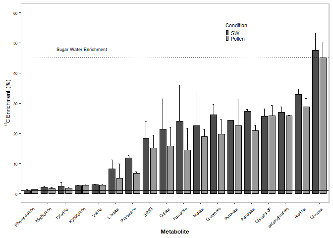
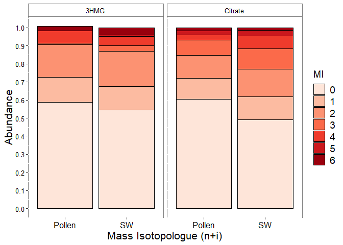
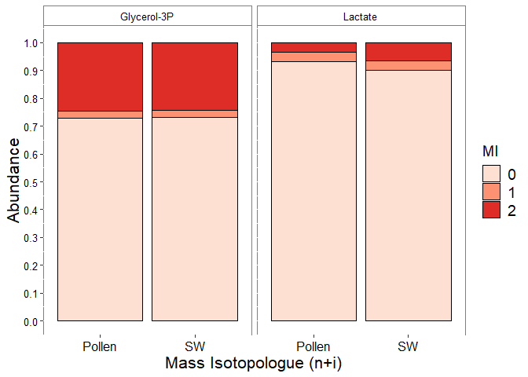

#This code combines processed 12C/13C isotopic abundances in gut
metabolites from MD bees \## Bees were fed a liquid diet of 65% Sucrose
: 45% 100% U-13C Glucose either with or without pollen.

#### These are the required package to reproduce this analysis.

``` r
#
#required_packages = c( "plyr","data.table", "readxl", "ggpubr", "RcolorBrewer","writexl","tibble", "purrr", "tidyverse")
#need_install = required_packages[!(required_packages) %in% installed.packages()]

#if (length(need_install) > 0){
#  install.packages((need_install))
#}

# Load packages
#lapply(required_packages, require, character.only=T)

#dir_script = dirname(rstudioapi::getSourceEditorContext()$path)

#setwd(dir_script)
#font_import()
#loadfonts(device="win")
```

``` r
library(data.table)
library(readxl)
library(plyr)
library(ggpubr)
#library(RcolorBrewer)
library(writexl)
library(tibble)
library(purrr)
library(tidyverse)
```

``` r
xlsx_data <- "Results_Combined_MD.xlsx"

excel_sheets(path = xlsx_data)
```

    ##  [1] "SW_1" "SW_2" "SW_3" "SW_4" "SW_5" "SW_6" "P_1"  "P_2"  "P_3"  "P_4"

``` r
tab_names <- excel_sheets(path = xlsx_data)

list_all <- lapply(tab_names, function(x) {     
  as.data.frame(read_excel("Results_Combined_MD.xlsx", sheet = x)) } )

full_data <- do.call(rbind.fill, list_all)

full_data$Metabolite <- factor(full_data$Metabolite)
full_data$MW <- factor(full_data$MW)
full_data$MI <- factor(full_data$MI)
```

## All of the data is now merged. We need to filter out bad data points

### Filter ‘total’ \> 0.90 & \<1.10

### Filter corrected abundances \< -0.05 or \> 1.05

### Find average abundance’s and enrichment’s

``` r
tidy_data <- full_data %>%
  mutate(Metabolite = fct_recode(Metabolite, "3HMG" = "BHMG", "a-Ketoglutarate" = "aKG", Aspartate = "Asp", Citrate = "Cit", Fumarate = "Fum", Glucose = "Glc", Glutamate = "Glu", "Glycerol-3P" = "G3P", Kynurenine = "Kyn", Lactate = "Lac",  Malate = "Mal", Putrescine = "Put", Pyruvate = "Pyr", Succinate = "Suc")) %>%
  filter(Total > 0.90 & Total < 1.10) %>%
  group_by(Metabolite, Frag, MW, Condition, Bee) %>%
  filter(!any(Abundance < -0.05)) %>%
  filter(!any(Abundance > 1.05))

tidy_data$MW <- factor(tidy_data$MW)
tidy_data$MI <- factor(tidy_data$MI)

avg_data <- tidy_data %>%
  select(Metabolite, Frag, MW, MI, Abundance, Enrichment, Condition, Bee) %>%
  ungroup() %>%
  group_by(Metabolite, Frag, MW, MI, Condition) %>%
  summarise(Mean_abundance = mean(Abundance),
            Sd_abundance = sd(Abundance),
            Mean_Enrichment = mean(Enrichment),
            Sd_Enrichment = sd(Enrichment)) %>%
  mutate(across(where(is.numeric), round, 3),
         Sd_abundance = case_when(Sd_abundance < 0.005 ~ 0.005,
                                  TRUE ~ Sd_abundance))
```

    ## `summarise()` has grouped output by 'Metabolite', 'Frag', 'MW', 'MI'. You can
    ## override using the `.groups` argument.

``` r
avg_Enrichments <- avg_data %>%
  filter(MI == 0) %>%
  mutate(ymax = Mean_Enrichment + Sd_Enrichment,
         ymin = Mean_Enrichment - Sd_Enrichment)

plot_Enrichments <- avg_Enrichments %>%
  group_by(Metabolite, Frag, MW) %>%
  filter(!any(is.na(Sd_Enrichment)))%>%
  filter(Metabolite %in% c("3HMG", "a-Ketoglutarate", "Acetylglucosamine", 
                           "Aspartate","Citrate","Fumarate","Glucose","Glutamate","Glycerol-3P",
                           "Kynurenine","Lactate","Malate","Putrescine","Pyruvate", "Alanine", "Isoleucine", "Methionine",                                 "Phenylalanine", "Tyrosine", "Valine")) %>%
  filter(MW %in% c("273", "304", "319", "218","375","245","319","246","357","307",
                   "117","233","200","174", "116", "158", "176")) %>%
  mutate(Condition = fct_relevel(Condition, "SW", "Pollen"))

#write_enrichments <- writexl::write_xlsx(
#  x=plot_Enrichments,
#  path = "Plot_Enrichments.xlsx",
#  col_names = TRUE,
#  format_headers = TRUE)  
```

## Plot results Figure 2B

``` r
ggplot(plot_Enrichments, aes(x = reorder(Metabolite, Mean_Enrichment), y = Mean_Enrichment, 
                             ymin = Mean_Enrichment, ymax = ymax, fill = Condition, color="none" ))+
  geom_col(color="black", width = .75, position = position_dodge(width = .9)) +
  geom_errorbar(width=0.2, color="black", position = position_dodge(width = .9),stat = "identity") +
  stat_compare_means(aes(group = Condition), label = "p.signif", label.y = 60, hide.ns=TRUE)+
  geom_hline(yintercept=45, col="black", linetype = "dotted") +
  geom_hline(yintercept=1.108, col="black") +
  scale_fill_manual(values=c("grey30","grey60")) +
  theme(panel.border = element_rect(colour = "grey", fill=NA, size=1),
        panel.background = element_rect(fill = "white", colour = "grey50"), 
        axis.text.x = element_text(color = "black", size=6, angle=45, hjust=0.95, vjust=0.95), 
        axis.text.y = element_text(color = "black", size=6),
        axis.title.x =element_text(color = "black", size=8, face = "bold"),
        axis.title.y =element_text(color = "black", size=8, face = "bold"), 
        legend.text = element_text(color = "black", size=8), 
        legend.title = element_text(color = "black", size=8),
        legend.position = c(0.7, 0.86),
        legend.key.size = unit(0.15, 'cm'),
        plot.title = element_text(hjust = 0.5, size=8))+
    ylab(expression(""^13*"C"~"Enrichment"~" (%)"))+
  scale_y_continuous(limits=c(0,60), breaks=seq(0, 100, 10))  +
  xlab("Metabolite") +
  annotate("text", x=4, y=48, size=2.5, label= "Sugar Water Enrichment")
```



``` r
#ggsave("Fig2b_MD_Gut_13C_Enrichments.pdf" ,device=cairo_pdf, width=5, height= 3, units = "in", dpi = 300) 
```

## Plot mass isotopologue’s (MI) of selected carboxylic acids

``` r
ggplot(subset(avg_data, Metabolite %in% c("Citrate","3HMG") & MW %in% c("375","273")), 
       aes(x = Condition, y = Mean_abundance, 
              ymin=Mean_abundance, ymax = Mean_abundance + Sd_abundance, fill = MI))+
  geom_col(position = position_stack(reverse = TRUE), color="black") +
  #geom_errorbar( width=0.2, color="black") +
  scale_fill_brewer(palette = "Reds") +
  theme(panel.background = element_rect(fill = "white", colour = "grey50"), legend.position = "right", 
        axis.text.x = element_text(color = "black", size=12), axis.text.y = element_text(color = "black", size=10),
        axis.title.x =element_text(color = "black", size=16), axis.title.y =element_text(color = "black", size=16),
        legend.text = element_text(color = "black", size=14), legend.title = element_text(color = "black", size=14),
        plot.title = element_text(hjust = 0.5, size=18),
        strip.text.x = element_text(size = 10, color = "black"), 
        strip.text.y = element_text(size = 10, color = "black"),
        strip.background = element_rect(color="grey50", fill="white", size=0.5, linetype="solid"))+
  scale_y_continuous(name = "Abundance",limits=c(0,1.01), breaks=seq(0, 1.01, 0.1))  +
  scale_x_discrete(name = "Mass Isotopologue (n+i)")+
  facet_wrap(~Metabolite, nrow=1)
```



``` r
ggplot(subset(avg_data, Metabolite %in% c("Gaba","Fumarate") & MW %in% c("304","245")), 
       aes(x = Condition, y = Mean_abundance, 
              ymin=Mean_abundance, ymax = Mean_abundance + Sd_abundance, fill = MI))+
  geom_col(position = position_stack(reverse = TRUE), color="black") +
  #geom_errorbar( width=0.2, color="black") +
  scale_fill_brewer(palette = "Reds") +
  theme(panel.background = element_rect(fill = "white", colour = "grey50"), legend.position = "right", 
        axis.text.x = element_text(color = "black", size=12), axis.text.y = element_text(color = "black", size=10),
        axis.title.x =element_text(color = "black", size=16), axis.title.y =element_text(color = "black", size=16),
        legend.text = element_text(color = "black", size=14), legend.title = element_text(color = "black", size=14),
        plot.title = element_text(hjust = 0.5, size=18),
        strip.text.x = element_text(size = 10, color = "black"), 
        strip.text.y = element_text(size = 10, color = "black"),
        strip.background = element_rect(color="grey50", fill="white", size=0.5, linetype="solid"))+
  scale_y_continuous(name = "Abundance",limits=c(0,1.01), breaks=seq(0, 1.01, 0.1))  +
  scale_x_discrete(name = "Mass Isotopologue (n+i)")+
  facet_wrap(~Metabolite, nrow=1)
```


``` r
ggplot(subset(avg_data, Metabolite %in% c("Glycerol-3P","Lactate") & MW %in% c("357","117")), 
       aes(x = Condition, y = Mean_abundance, 
              ymin=Mean_abundance, ymax = Mean_abundance + Sd_abundance, fill = MI))+
  geom_col(position = position_stack(reverse = TRUE), color="black") +
  #geom_errorbar( width=0.2, color="black") +
  scale_fill_brewer(palette = "Reds") +
  theme(panel.background = element_rect(fill = "white", colour = "grey50"), legend.position = "right", 
        axis.text.x = element_text(color = "black", size=12), axis.text.y = element_text(color = "black", size=10),
        axis.title.x =element_text(color = "black", size=16), axis.title.y =element_text(color = "black", size=16),
        legend.text = element_text(color = "black", size=14), legend.title = element_text(color = "black", size=14),
        plot.title = element_text(hjust = 0.5, size=18),
        strip.text.x = element_text(size = 10, color = "black"), 
        strip.text.y = element_text(size = 10, color = "black"),
        strip.background = element_rect(color="grey50", fill="white", size=0.5, linetype="solid"))+
  scale_y_continuous(name = "Abundance",limits=c(0,1.01), breaks=seq(0, 1.01, 0.1))  +
  scale_x_discrete(name = "Mass Isotopologue (n+i)")+
  facet_wrap(~Metabolite, nrow=1)
```


