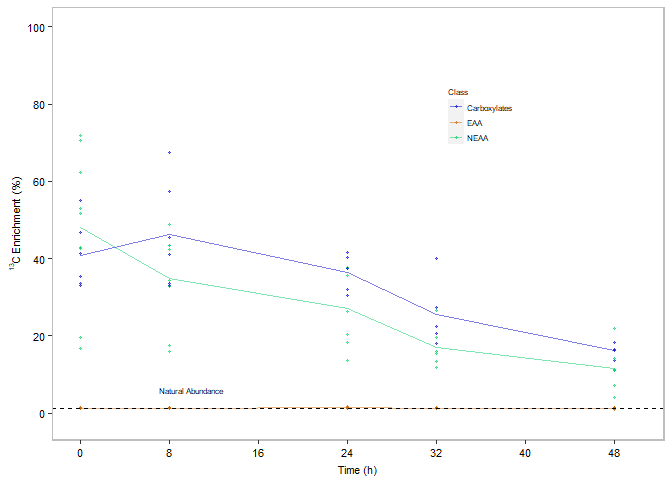
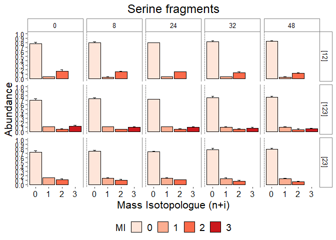
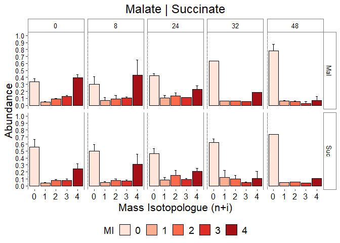
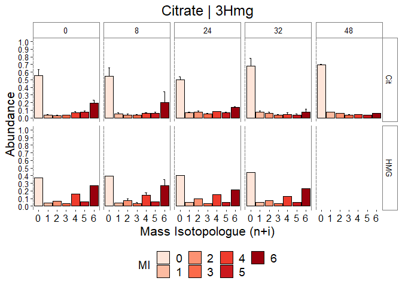

# Analysis of 13C Isotope labelling of gut metabolites in bees fed 100% U-13C glucose before switching to naturally abundant glucose at time zero.

### These are the required package to reproduce this analysis.

    ### env setup

    #required_packages = c( "data.table", "readxl",  "tidyverse", "plyr", "writexl", "tibble",  "wesanderson", "RColorBrewer" , "ggh4x", "purrr")
    #need_install = required_packages[!(required_packages) %in% installed.packages()]

    #if (length(need_install) > 0){
    #  install.packages((need_install))
    #}

    #lapply(required_packages, require, character.only=T)

    #dir_script = dirname(rstudioapi::getSourceEditorContext()$path)

    #setwd(dir_script)

\##This code combines processed 12C/13C isotopic abundances in gut
metabolites from experimental replicates across time and condition \###
Re-baseline time to begin at 13C –&gt; 12C transition

    library(data.table)
    library(readxl)
    library(plyr)
    library(writexl)
    library(tibble)
    library(wesanderson)
    library(RColorBrewer)
    #library(ggh4x)
    library(purrr)
    library(tidyverse)

    xlsx_data <- "Metabolite_ILE_results.xlsx"

    excel_sheets(path = xlsx_data)

    ##  [1] "24_a1" "24_a2" "24_a3" "24_b1" "24_b3" "24_bF" "24_c1" "24_c2" "24_c3"
    ## [10] "32_a1" "32_a2" "32_a3" "32_b1" "32_b2" "32_b3" "32_c1" "32_c2" "32_c3"
    ## [19] "48_a1" "48_a2" "48_a3" "48_b1" "48_b2" "48_b3" "48_c1" "48_c2" "48_c3"
    ## [28] "56_a1" "56_a2" "56_a3" "56_b1" "56_b2" "56_b3" "56_bf" "56_c2" "56_c3"
    ## [37] "72_a1" "72_a3" "72_af" "72_b1" "72_b2" "72_b3" "72_c1" "72_c2" "72_c3"

    tab_names <- excel_sheets(path = xlsx_data)

    list_all <- lapply(tab_names, function(x) {     
      as.data.frame(read_excel("Metabolite_ILE_results.xlsx", sheet = x)) } )

    full_data <- do.call(rbind.fill, list_all)

    full_data$MW <- factor(full_data$MW)
    full_data$MI <- factor(full_data$MI)

    full_data_1 <- full_data %>%
      mutate(Time = case_when(Time == 24 ~ 0,
                              Time == 32 ~ 8,
                              Time == 48 ~ 24,
                              Time == 56 ~ 32,
                              Time == 72 ~ 48,
                              TRUE ~ Time))

## all of the data is now merged. We need to filter out bad data points

### Filter ‘total’ &gt; 0.90 & -0.1 &lt;

### Find average abundance’s and enrichment’s

    tidy_data <- full_data_1 %>%
      filter(Total > 0.90) %>%
      group_by(Metabolite, Frag, MW, Time, Bee, Replicate) %>%
      filter(!any(Abundance < -0.01)) %>%
      filter(!any(Abundance > 1.01))

    tidy_data$MW <- factor(tidy_data$MW)
    tidy_data$MI <- factor(tidy_data$MI)

    tech_avg_data <- tidy_data %>%
      select(Metabolite, Frag, MW, MI, Abundance, Enrichment, Time, Bee, Replicate) %>%
      ungroup() %>%
      group_by(Metabolite, Frag, MW, MI, Time, Bee) %>%
      summarise(mean_abundance = mean(Abundance),
                sd_abundance = sd(Abundance),
                mean_Enrichment = mean(Enrichment),
                sd_Enrichment = sd(Enrichment))

    ## `summarise()` has grouped output by 'Metabolite', 'Frag', 'MW', 'MI', 'Time'.
    ## You can override using the `.groups` argument.

    avg_data <- tech_avg_data %>%
      ungroup() %>%
      group_by(Metabolite, Frag, MW, MI, Time) %>%
      summarise(Mean_abundance = mean(mean_abundance),
                Sd_abundance = sd(mean_abundance),
                Mean_Enrichment = mean(mean_Enrichment),
                Sd_Enrichment = sd(mean_Enrichment)) %>%
      mutate(across(where(is.numeric), round, 3),
             Sd_abundance = case_when(Sd_abundance < 0.005 ~ 0.005,
                                      TRUE ~ Sd_abundance))

    ## `summarise()` has grouped output by 'Metabolite', 'Frag', 'MW', 'MI'. You can
    ## override using the `.groups` argument.

    avg_Enrichments <- avg_data %>%
      filter(MI == 0 & Metabolite != "Pyrdc" & Metabolite != "Urate") %>%
      filter(Metabolite != "Nle") %>%
      filter(MW %in% c("260","418","459","287","431","432","246","315","416",
                       "274","320","336","286","330","390","289","466","567"))%>%
      mutate(Class = case_when(
               Metabolite == "Lac" | Metabolite == "Suc" |  Metabolite == "Fum" | Metabolite == "Glyc" |
                 Metabolite == "HMG" | Metabolite == "Mal" | Metabolite == "Cit"  ~ "Carboxylate",
               Metabolite == "Leu" | Metabolite == "Ile" |  Metabolite == "Met" | Metabolite == "Phe" |
                 Metabolite == "Hpro" | Metabolite == "Tyr" ~ "EAA",
               Metabolite == "Ala" | Metabolite == "Gly" |  Metabolite == "Pro" | Metabolite == "Ser" |
                Metabolite == "Asp" | Metabolite == "Glu" | Metabolite == "Gln" ~ "NEAA",
               TRUE ~ "other"))

## Figure 3D

    ggplot(avg_Enrichments, aes(x = Time, y = Mean_Enrichment))+
      geom_point(aes(color = Class),size = 1.2,alpha =0.5,stroke =0, na.rm=T) +
       stat_summary(aes(Time, Mean_Enrichment, colour=Class), geom = "line", fun = mean, alpha =0.5)+
      geom_hline(yintercept=1.08, col="black", linetype = "dashed") +
      theme(axis.title.x = element_text(vjust = -0.6, size=8),
        panel.background = element_rect(fill = "white", colour = "grey50") ,   legend.position = c(.7, .75),
            axis.text.x = element_text(color = "black", size=8), 
            panel.border = element_rect(colour = "grey", fill=NA, size=1),
            axis.text.y = element_text(color = "black", size=8),
            axis.title.y =element_text(color = "black", size=8),
            legend.text = element_text(color = "black", size=6), 
            legend.title = element_text(color = "black", size=6),
            plot.title = element_text(hjust = 0.5, size=8))+
        #theme(plot.margin = unit(c(0.2,0.2,0.2,0.2), "cm"))+
        scale_colour_manual(labels = c("Carboxylates", "EAA", "NEAA"),  
                            values = c("blue3", "darkorange3", "springgreen3"))+
      scale_y_continuous(limits=c(-2,100), breaks=seq(0, 100, 20))  +
      ylab(expression(""^13*"C"~"Enrichment"~" (%)"))+
        theme(legend.key.size = unit(0.4, 'cm'))+
      scale_x_continuous(name = "Time (h)", limits=c(0,50), breaks=seq(0, 50, 8))+
      annotate("text", x=10, y=6, size=2, label= "Natural Abundance")

     # force_panelsizes(rows = unit(1.6 ,"in"), cols = unit(2.4, "in"))
    #ggsave("Gut_13C_Enrichments_2.pdf",device=cairo_pdf, width=3, height= 2, units = "in", dpi = 300)
    write_xlsx(avg_Enrichments, "Dataset_S2.xlsx")

## Plot selected mass isotopologue (MI) abundances

    ggplot(subset(avg_data, Metabolite %in% "Ser" & MW %in% c("302", "362", "390")), aes(x = MI, y = Mean_abundance, 
                  ymin=Mean_abundance, ymax = Mean_abundance + Sd_abundance, fill = MI))+
      geom_col(color="black") +
      geom_errorbar( width=0.2, color="black") +
      scale_fill_brewer(palette = "Reds") +
      theme(panel.background = element_rect(fill = "white", colour = "grey50"), legend.position = "bottom", 
            axis.text.x = element_text(color = "black", size=12), axis.text.y = element_text(color = "black", size=10),
            axis.title.x =element_text(color = "black", size=16), axis.title.y =element_text(color = "black", size=16),
            legend.text = element_text(color = "black", size=14), legend.title = element_text(color = "black", size=14),
            plot.title = element_text(hjust = 0.5, size=18),
            strip.text.x = element_text(size = 10, color = "black"), 
            strip.text.y = element_text(size = 10, color = "black"),
            strip.background = element_rect(color="grey50", fill="white", size=0.5, linetype="solid"))+
      scale_y_continuous(name = "Abundance",limits=c(0,1), breaks=seq(0, 1, 0.1))  +
      scale_x_discrete(name = "Mass Isotopologue (n+i)")+
      ggtitle("Serine fragments") +
      facet_grid(vars(Frag), vars(Time))

    #ggsave("Ser_MIs.pdf")

    ggplot(subset(avg_data, Metabolite %in% c("Mal","Suc") & MW %in% c("287","289")), aes(x = MI, y = Mean_abundance, 
                  ymin=Mean_abundance, ymax = Mean_abundance + Sd_abundance, fill = MI))+
      geom_col(stat="identity", color="black") +
      geom_errorbar( width=0.2, color="black") +
      scale_fill_brewer(palette = "Reds") +
      theme(panel.background = element_rect(fill = "white", colour = "grey50"), legend.position = "bottom", 
            axis.text.x = element_text(color = "black", size=12), axis.text.y = element_text(color = "black", size=10),
            axis.title.x =element_text(color = "black", size=16), axis.title.y =element_text(color = "black", size=16),
            legend.text = element_text(color = "black", size=14), legend.title = element_text(color = "black", size=14),
            plot.title = element_text(hjust = 0.5, size=18),
            strip.text.x = element_text(size = 10, color = "black"), 
            strip.text.y = element_text(size = 10, color = "black"),
            strip.background = element_rect(color="grey50", fill="white", size=0.5, linetype="solid"))+
      scale_y_continuous(name = "Abundance",limits=c(0,1), breaks=seq(0, 1, 0.1))  +
      scale_x_discrete(name = "Mass Isotopologue (n+i)")+
      ggtitle("Malate | Succinate") +
      facet_grid(vars(Metabolite), vars(Time))

    ggplot(subset(avg_data, Metabolite %in% c("Cit","HMG") & MW %in% c("459","315")), aes(x = MI, y = Mean_abundance, 
                  ymin=Mean_abundance, ymax = Mean_abundance + Sd_abundance, fill = MI))+
      geom_col(stat="identity", color="black") +
      geom_errorbar( width=0.2, color="black") +
      scale_fill_brewer(palette = "Reds") +
      theme(panel.background = element_rect(fill = "white", colour = "grey50"), legend.position = "bottom", 
            axis.text.x = element_text(color = "black", size=12), axis.text.y = element_text(color = "black", size=10),
            axis.title.x =element_text(color = "black", size=16), axis.title.y =element_text(color = "black", size=16),
            legend.text = element_text(color = "black", size=14), legend.title = element_text(color = "black", size=14),
            plot.title = element_text(hjust = 0.5, size=18),
            strip.text.x = element_text(size = 10, color = "black"), 
            strip.text.y = element_text(size = 10, color = "black"),
            strip.background = element_rect(color="grey50", fill="white", size=0.5, linetype="solid"))+
      scale_y_continuous(name = "Abundance",limits=c(0,1), breaks=seq(0, 1, 0.1))  +
      scale_x_discrete(name = "Mass Isotopologue (n+i)")+
      ggtitle("Citrate | 3Hmg") +
      facet_grid(vars(Metabolite), vars(Time))

