``` r
library(knitr)
hook_output = knit_hooks$get("output")
knit_hooks$set(output = function(x, options) {
    # this hook is used only when the linewidth option is not NULL
    if (!is.null(n <- options$linewidth)) {
        x = knitr:::split_lines(x)
        # any lines wider than n should be wrapped
        if (any(nchar(x) > n))
            x = strwrap(x, width = n)
        x = paste(x, collapse = "\n")
    }
    hook_output(x, options)
})
```

#### These are the required package to reproduce this analysis.

``` r
### env setup

required_packages = c("dplyr", "data.table", "ggplot2", "readxl", "ggbeeswarm", "ggpubr",
    "EnvStats", "tidyverse", "patchwork", "ggforce", "wesanderson", "RcolorBrewer",
    "extrafont", "ggthemes", "egg", "officer", "rvg", "ggh4x", "grid")
need_install = required_packages[!(required_packages) %in% installed.packages()]

if (length(need_install) > 0) {
    install.packages((need_install))
}
```

    ## Error in contrib.url(repos, "source"): essai d'utilisation de CRAN sans fixer un miroir

``` r
# Load packages
lapply(required_packages, require, character.only = T)

dir_script = dirname(rstudioapi::getSourceEditorContext()$path)

setwd(dir_script)
# font_import() loadfonts(device='win')
```

#### **Tidying up the data and adding metadata to the dataset**

##### 1. Calculate the atom % enrichment as well as the delta value for both species measured

##### 2. Produce quality check plots

##### 3. Produce plot for supplementary and main text figures

``` r
## Load the data

dat = fread("NanoSIMS_data.csv", header = T)

## Needed only if interested in the 13C12C ratio dat[, ratio_13c12c:=`13C 12C
## /12C2`/mean(`13C 12C /12C2`[Label=='12C']), ] ## Calculate mean of the ratio
## 1

# dat[, delta_13c12c:=(`13C 12C /12C2`/mean(`13C 12C
# /12C2`[Label=='12C'])-1)*1000, ] ## Calculate delta permil


## Calculate the ratio by dividing the ratio of labeled and labeled samples
## (12C)
dat[, ratio_14N13c := dat$`14N 13C /14N 12C`/dat$`14N 13C /14N 12C`[Label == "12C"],
    ]

dat$ratio_14N13c
```

    ##   [1] 3.0410512 3.0479824 3.2411595 1.0145260 3.7293791 3.2586893 3.6144552
    ##   [8] 3.3470410 3.2606490 3.1114626 1.0062614 1.0002114 2.9000239 2.5642358
    ##  [15] 2.6143904 3.0610483 3.3082035 2.8425287 1.0004936 1.0080642 1.0009943
    ##  [22] 2.8449445 2.8543822 2.9965395 2.8685192 0.9775723 3.8485923 3.7194783
    ##  [29] 3.6824490 3.5894297 1.0172978 2.8853197 3.0176193 2.7258593 1.0068004
    ##  [36] 1.8966600 2.1123601 1.9968907 0.9696876 1.0340653 2.4770592 1.6204957
    ##  [43] 4.5418589 5.2628767 1.9062460 1.9248062 3.0532979 0.9942457 1.9717249
    ##  [50] 1.8719484 1.8606778 0.9641126 1.8934688 1.9832155 4.0702375 6.0444020
    ##  [57] 1.8855666 1.9839661 2.0641744 0.9818174 1.8391330 1.9629590 1.9484928
    ##  [64] 1.0047520 1.8255241 1.9353111 4.9347667 2.1067861 2.0046989 2.6643930
    ##  [71] 2.0998442 1.0054165 1.9667520 2.0772502 1.9642619 4.9796207 2.0087293
    ##  [78] 1.9923364 2.1437919 1.8907487 2.1267772 2.1128757 4.6716919 2.4942786
    ##  [85] 1.9984872 2.0059546 1.9878115 2.1098476 1.6667637 5.2812487 2.0225592
    ##  [92] 1.8774789 3.0178472 1.8980396 1.9866879 1.2034932 7.1227916 2.0153136
    ##  [99] 1.9634664 3.1761690 1.9584243 1.9960712 1.9780236 1.8841386 1.9936906
    ## [106] 2.0855248 1.8904393 2.0173718 2.0988171 2.0636851 1.8947868 1.8175782
    ## [113] 1.9558250 1.8790717 2.7196868 1.9587777 1.9830616 1.9782869 0.9217300
    ## [120] 1.3632137 1.9957847 1.9896990 1.9153826 2.0583337 0.9874865 0.9900248
    ## [127] 1.9705306 1.2062351 2.2006144 2.4547054 1.3102817 0.9975062 1.0105824
    ## [134] 1.0035710 2.1384540 2.1510789 2.5899629 2.3395340 1.0074369 1.4070080
    ## [141] 1.3956964 1.4716194 6.4864213 1.0000000 1.9027868 2.0177368 2.1616056
    ## [148] 1.0936524 1.7271023 1.9420334 2.0658217 2.0731790 2.3800177 1.9518257
    ## [155] 1.2852480 1.9708218 2.1073163 2.2339810 1.9571168 2.0297365 2.0080606
    ## [162] 1.1546345 1.9997624 1.7954534 1.9091642 1.9282094 1.9287794 1.9533789
    ## [169] 2.1007740 1.2745375 1.9735210 1.9119650 2.0123631 2.0156700 1.9439265
    ## [176] 1.2814553 1.1422802 1.9218890 1.8516862 1.9293813 1.0191826 0.9682722
    ## [183] 2.8681396 1.8626934 0.9306746 1.0825004 0.9654111 5.4014552 4.6463211
    ## [190] 7.7503075 2.1937224 2.0448457 1.9996919 0.9898613 1.8754713 1.9326250
    ## [197] 2.1030996 1.0337641 1.0045478 2.7590761 1.8720744 1.0212144 0.9958550
    ## [204] 1.0287535 4.7520978 4.4907781 5.0169943 2.0965897 1.8303581 2.8031226
    ## [211] 0.9947099 1.9418926 1.9656879 2.0489074 0.9883813 0.9830985 2.0405630
    ## [218] 1.9245069 0.9466719 1.0451955 1.0474075 4.0323573 4.3747257 4.5664384
    ## [225] 1.8232708 2.0666663 1.9659233 1.0001002 1.9602731 2.0178146 1.8573183
    ## [232] 1.0158388 1.0484669 2.9021951 1.9018320 0.9646388 0.9194054 0.9877193
    ## [239] 4.1638160 4.3395415 7.5043673 1.9467141 1.8676385 1.9172600 0.9826533
    ## [246] 1.8992188 1.9473762 1.9806872 0.9885377 1.0090143 2.8763348 1.8289180
    ## [253] 1.0372233 4.7635181 3.8058970 4.4749182 2.0372563 2.0108756 2.0029767
    ## [260] 0.9825018 1.9660766 2.0045463 1.9048724 0.9808557 0.9756006 1.8033811
    ## [267] 2.0231174 1.0901204 5.8769757 5.6692116 6.0026590 1.8837436 2.0147825
    ## [274] 2.4744722 1.0786838 1.7809350 1.9808952 2.0512990 0.9975779 1.0859838
    ## [281] 1.9933143 1.8469750 5.7941587 5.1779423 1.8528361 2.1251504 1.9567953
    ## [288] 1.0157357

``` r
## Calculate delta permil by removing 1 to the ratio and multiplying by 1000

dat[, delta_14N13c := (`14N 13C /14N 12C`/mean(`14N 13C /14N 12C`[Label == "12C"],
    na.rm = T) - 1) * 1000, ]

dat$delta_14N13c
```

    ##   [1] 2057.3792901 2043.3670058 2219.2144869    5.3692205 2723.9002827
    ##   [6] 2260.2053561 2620.5064347 2357.0584849 2262.1919280 2058.2995078
    ##  [11]   -1.5142555   -6.7707442 1868.1394981 1554.0733780 1603.1053021
    ##  [16] 2056.1446574 2177.6231292 1802.8350438   -9.0256759   -1.4690860
    ##  [21]    0.4652310 1843.7887147 1848.2498660 2003.2759837 1915.3885558
    ##  [26]    1.6741791 2720.8420425 2456.5385294 2988.1072571 2471.0769054
    ##  [31]    2.9929511 1941.0882242 2002.5010169 1782.5557142    0.4732021
    ##  [36]  955.5820655 1071.6393128  961.2858207  -17.0862157   -7.7272745
    ##  [41] 1484.3741980  702.3317923 3536.7110822 4484.2713267  945.0930014
    ##  [46]  880.9859815 2009.0709635   -6.9806494  934.6756771  851.3671956
    ##  [51]  845.3720529  -10.9945343  842.7433657  949.6214642 3035.8080098
    ##  [56] 5123.3230698 1021.1477942 1006.1559520 1151.0614468   -3.9631504
    ##  [61]  849.0077540  959.9865336  935.3000789   -4.3165352  822.8422199
    ##  [66]  936.2114397 3943.0283572 1113.0916194 1005.6475738 1618.8685683
    ##  [71] 1083.6180844   -1.6019374  945.1284284 1069.0177111  955.7831140
    ##  [76] 3971.6436718  929.4413303  964.5149964 1123.3946915  872.8678728
    ##  [81] 1125.6531660 1112.0172941 3661.6552053 1499.8859323 1031.1408796
    ##  [86] 1055.4110665  921.8280571  960.6968460  805.1118666 4107.1122860
    ##  [91]  994.1187258  913.7675173 2002.7277501  937.5178122  974.2025234
    ##  [96]  240.8811694 5985.4828655  979.3801869  990.2474348 2047.8015869
    ## [101]  964.2076667 1096.8740012  975.7816842  963.3990443 1034.3195717
    ## [106] 1038.0456118  863.0563510 1014.8834060 1059.3797819 1040.9957995
    ## [111]  879.2004581  864.5070888  903.4290182  847.2417155 1696.6814286
    ## [116]  984.3532592 1125.6531660 1000.4132270  -39.4716835  382.9569285
    ## [121] 1006.5004800  986.6861305  902.4140332 1039.7558527  -13.9642068
    ## [126]   -9.5145692  973.8296537  209.8453014 1201.6557039 1412.7637287
    ## [131]  300.1568252   -9.4570003   -0.5284978   -0.4062745 1129.2233270
    ## [136] 1147.6329940 1487.7326825 1306.8643026   -2.1483997  393.7019531
    ## [141]  394.9587277  471.0214916 5472.4858835    2.2480973  933.8767971
    ## [146] 1067.4837198 1089.8532454   16.3392068  870.4588333  877.9994811
    ## [151] 1036.7728950 1113.2501554 1368.0937603  992.4226557  277.1708689
    ## [156] 1032.0478121 1066.6928108 1194.1487118  983.8112253  947.7030894
    ## [161] 1013.9906443  212.9442827  997.4958094  870.9831537  948.0706450
    ## [166]  884.3116959  900.8410721  950.9694635 1061.2999280  260.5245834
    ## [171]  957.2869923  961.3309902  958.4525423  981.5261805  927.4831001
    ## [176]  298.1870812  224.4155618  943.3845319  929.6290937  957.3241907
    ## [181]   24.6548213  -33.1940101 1848.7201601  845.8813168  -70.6926577
    ## [186]   83.0040598  -32.9725910 4417.6215302 3648.5197405 6617.8840654
    ## [191] 1176.7708577 1030.5713898  977.7062588  -14.0616312  867.3757942
    ## [196]  929.5290123 1020.0867541   19.3283642   -5.0100197 1732.9835276
    ## [201]  871.0850064   20.7994725   -6.2845079   31.0662319 3829.7432765
    ## [206] 3601.4974158 3850.4601302  948.3762033  982.2852051 1710.6963699
    ## [211]  -19.2773788  979.4262421  955.8397973 1091.5236308  -17.8301838
    ## [216]   13.6396655 1001.2262778  890.1925863  -40.4158144    2.9530956
    ## [221]   50.5006263 3235.9938748 3369.7673046 3758.5357899  860.4267782
    ## [226] 1019.6164600  937.4469581   -1.1334147  923.4391022  995.6296895
    ## [231]  842.0401388   42.0672168   20.3787763 1853.0342893  885.7447201
    ## [236]  -22.7660576  -14.4849845   -1.2334961 3339.0830502 3402.3903045
    ## [241] 6544.6598939  943.7662583  854.9931542  899.9553959  -18.7902568
    ## [246]  900.1024181  950.6364492  986.6152764  -10.9945343   -8.2259103
    ## [251] 1854.1086146  816.1509357   25.8194856 3744.6395292 2789.4686685
    ## [256] 3467.7496706  956.8423828  982.7953546  983.9192778  -26.7896849
    ## [261]  965.0375454 1003.7318560  900.7799605  -16.9391934   -8.4588431
    ## [266]  847.8430897  955.9620206   13.0568905 5364.7885345 4482.2829835
    ## [271] 4918.2518144  920.1532433 1004.6883864 1525.9398712   71.9047648
    ## [276]  836.2619868  942.7087609 1014.7239842   11.1845709   42.0929014
    ## [281]  999.2007362  940.2483522 4787.5915367 4395.7639255  890.5946833
    ## [286] 1076.7691498  928.4511442   14.4828293

``` r
## calculate the percentage of 13C enrichment in 1 sample
dat[, atpercent_14N13c := 100 * (`14N 13C`)/(`14N 13C` + `14N 12C`)]
## Explore the data
min(dat$atpercent_14N13c, na.rm = T)
```

    ## [1] 1.038368

``` r
max(dat$atpercent_14N13c, na.rm = T)
```

    ## [1] 7.91999

``` r
head(dat)
```

    ##    NAME               IMAGEFILE ROI_NUM       19F     12C2   13C 12C  14N 12C
    ## 1: ROI1 ElChazli-Dec-2021_10.im       1 1056.6980 13671.51  863.3230 54821.05
    ## 2: ROI1 ElChazli-Dec-2021_11.im       1  981.7547 15008.36  958.7289 53838.83
    ## 3: ROI1 ElChazli-Dec-2021_12.im       1 1082.6490 15840.66 1073.6550 54972.97
    ## 4: ROI1 ElChazli-Dec-2021_13.im       1 1132.7280 14681.79  321.8138 47866.53
    ## 5: ROI1 ElChazli-Dec-2021_14.im       1 1728.5040 13388.37 1011.7320 66394.19
    ## 6: ROI1 ElChazli-Dec-2021_15.im       1 1078.3190 13933.92  876.1712 57313.16
    ##         31P       32S       SE 13C 12C /12C2 ER-13C 12C /12C2     CHSQ1 TOTNUM1
    ## 1: 2.542177 101.67370 39544.11    0.06314758     7.734077e-05  1.339256 1553597
    ## 2: 2.495762 112.02210 41524.00    0.06387968     5.597441e-05  1.255642 2673732
    ## 3: 2.722222 117.60820 41557.66    0.06777842     1.155810e-04 0.9399236  683361
    ## 4: 3.000171  96.58152 34687.50    0.02191924     7.232701e-05 0.7530214  158469
    ## 5: 3.766603 119.04520 34178.89    0.07556793     5.116726e-05  14.69137 6473161
    ## 6: 2.531129  95.87528 35871.04    0.06288043     4.006840e-05  15.05445 6302991
    ##      TOTDEN1 STD1  NPIX   ROIAREA   ROIDIAM ROIX ROIY ROI_XSTG ROI_YSTG
    ## 1:  45005340    1 16419 156.45850 14.114150   68  193   -14702    14921
    ## 2:  77810570    1 28905 275.43910 18.726980  143   66   -14651    14958
    ## 3:  18800760    1  6840  65.17915  9.109812   67   33   -14647    14951
    ## 4:  13960270    1  5833  55.58332  8.412543   19  178   -11998    14522
    ## 5: 153954800    1 46376 441.92220 23.720720  123  149   -13890     1287
    ## 6: 171228800    1 59752 569.38370 26.925110  125  129   -13888     1287
    ##      14N 13C 14N 13C /14N 12C ER-14N 13C /14N 12C      CHSQ2 TOTNUM2  TOTDEN2
    ## 1: 1892.4380       0.03452028        2.816921e-05  2.5954090  708745 11223630
    ## 2: 1850.0130       0.03436207        2.137256e-05  1.9321950 1385603 21690830
    ## 3: 1998.1320       0.03634753        4.476128e-05  1.9732010  367190  5417506
    ## 4:  543.3533       0.01135143        2.867671e-05  0.7292665   93857  4281945
    ## 5: 2791.6000       0.04204584        1.686973e-05 16.2622700 2346003 31044960
    ## 6: 2109.7170       0.03681035        1.492953e-05 14.0068400 2617649 41628990
    ##    STD2 Sample       Experiment Lm_number Date acquired Batch Date Loaded Type
    ## 1:    1 72_13C Replicate August     Lm_10         91221     B      231221   H1
    ## 2:    1 72_13C Replicate August     Lm_11         91221     B      231221   H1
    ## 3:    1 72_13C Replicate August     Lm_12         91221     B      231221   H1
    ## 4:    1 72_12C Replicate August     Lm_13        101221     C      231221   H1
    ## 5:    1 56_13C Replicate August     Lm_14        101221     C      241221   H1
    ## 6:    1 56_13C Replicate August     Lm_15        101221     C      241221   H1
    ##    Time Label     Tissue ratio_14N13c delta_14N13c atpercent_14N13c
    ## 1:   72   13C Host cells     3.041051  2057.379290         3.336839
    ## 2:   72   13C Host cells     3.047982  2043.367006         3.322053
    ## 3:   72   13C Host cells     3.241160  2219.214487         3.507273
    ## 4:   72   12C Host cells     1.014526     5.369221         1.122402
    ## 5:   56   13C Host cells     3.729379  2723.900283         4.034933
    ## 6:   56   13C Host cells     3.258689  2260.205356         3.550345

#### Quick check at the correlation between the two measured molecular weights

``` r
## Correlation between the ratio of 14N13C/14N12C and 13C12C/12C2
(ggplot(dat, aes(x = dat$`14N 13C /14N 12C`, dat$`13C 12C /12C2`), colour = dat$Sample) +
    geom_point(mapping = aes(colour = dat$Sample)) + geom_smooth(method = "lm", size = 0.5,
    colour = "black") + theme_light() + scale_y_continuous(breaks = seq(0, 0.15,
    by = 0.01)) + scale_x_continuous(breaks = seq(0, 0.1, by = 0.01)) + ylab("13C12C/12C2 ratio") +
    scale_colour_brewer(palette = "Set1")) + labs(colour = "Sample") + ggtitle("Ratio correlation") +
    xlab("14N13C/14N12C ratio") + stat_cor() + theme(text = element_text(family = "Arial",
    face = "bold", size = 12))
```

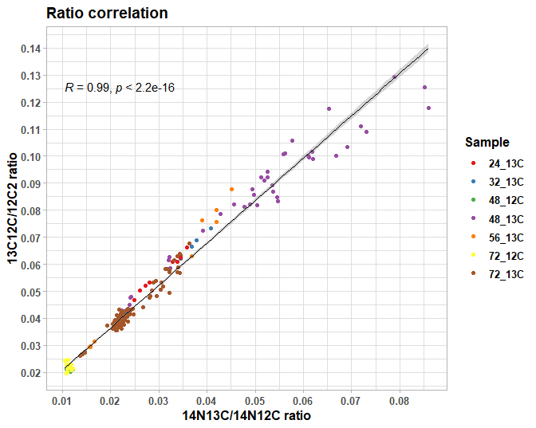

``` r
ggsave("Ratios_correlation.pdf", device = cairo_pdf)

## Correlation between the counts of 14N12C and 12C2

(ggplot(dat, aes(x = dat$`12C2`, dat$`14N 12C`), colour = dat$Sample) + geom_point(mapping = aes(colour = dat$Sample)) +
    geom_smooth(method = "lm", size = 0.5, colour = "black") + theme_light() + scale_y_continuous(breaks = seq(0,
    0.15, by = 0.01)) + scale_x_continuous(breaks = seq(0, 0.1, by = 0.01)) + ylab("14N12C counts") +
    scale_colour_brewer(palette = "Set1")) + labs(colour = "Sample") + ggtitle("Species correlation") +
    xlab("12C2 counts") + stat_cor() + theme(text = element_text(family = "Arial",
    face = "bold", size = 12))
```

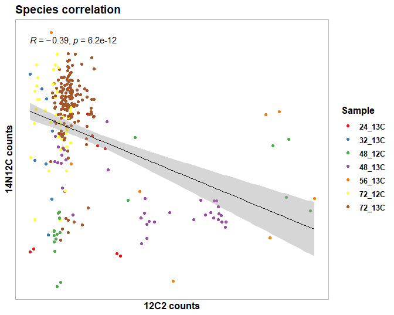

#### Quick check of different metrics to assess acquisition batch and experiment effects

``` r
## Evaluation of error per batch
(ggplot(dat, aes(x = as.factor(dat$`Date acquired`), dat$`ER-14N 13C /14N 12C`, colour = dat$Tissue)) +
    geom_quasirandom(dodge.width = 0.5) + theme_light() + scale_colour_manual(values = wes_palette("BottleRocket2")) +
    labs(colour = "Sample") + scale_y_continuous(breaks = seq(0, 0.0016, by = 1e-04)) +
    ylab("14N13C/14N12C error") + xlab("Batch") + theme(axis.text.x = element_text(angle = 90,
    hjust = 1)) + theme(text = element_text(family = "Arial", face = "bold", size = 12)))
```

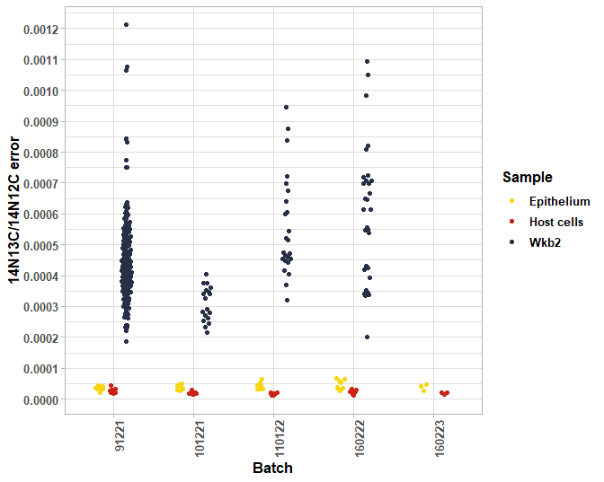

``` r
## Evaluation of 14N12C counts per Acquisition date

(ggplot(dat, aes(x = as.factor(dat$`Date acquired`), dat$`14N 12C`)) + geom_boxplot() +
    geom_quasirandom(dodge.width = 0.5) + theme_light() + scale_colour_manual(values = wes_palette("BottleRocket2")) +
    labs(colour = "Sample") + ylab("14N12C counts") + xlab("Date acquired") + theme(axis.text.x = element_text(angle = 90,
    hjust = 1)) + theme(text = element_text(family = "Arial", face = "bold", size = 12)))
```

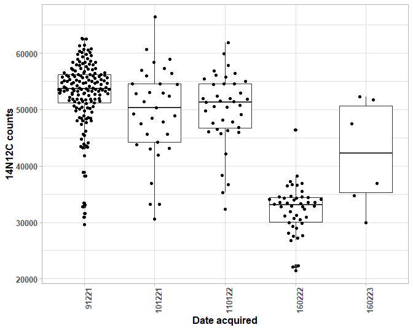

``` r
## Evaluation of the 14N13C counts per Acquisition date
(ggplot(dat, aes(x = as.factor(dat$`Date acquired`), dat$`14N 13C`)) + geom_boxplot(aes(group = `Date acquired`)) +
    geom_quasirandom(dodge.width = 0.5) + theme_light() + scale_colour_manual(values = wes_palette("BottleRocket2")) +
    labs(colour = "Sample") + ylab("14N13C") + xlab("Date acquired") + theme(axis.text.x = element_text(angle = 90,
    hjust = 1)) + theme(text = element_text(family = "Arial", face = "bold", size = 12)))
```

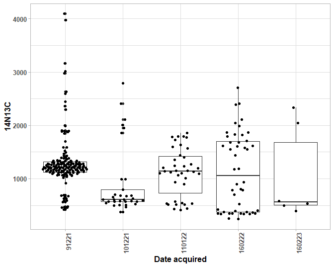

``` r
## Evaluation of 12C2 counts per Acquisition date
(ggplot(dat, aes(x = as.factor(dat$`Date acquired`), dat$`12C2`)) + geom_boxplot(aes(group = `Date acquired`)) +
    geom_quasirandom(dodge.width = 0.5) + theme_light() + scale_colour_manual(values = wes_palette("BottleRocket2")) +
    labs(colour = "Sample") + ylab("12C2 counts") + xlab("Date acquired") + theme(axis.text.x = element_text(angle = 90,
    hjust = 1)) + theme(text = element_text(family = "Arial", face = "bold", size = 12)))
```

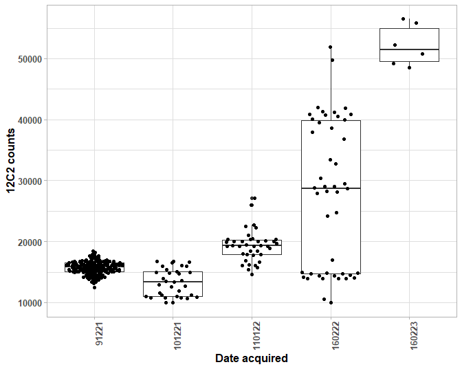

``` r
## Evaluation of the at_percent between 13C and 12C samples controls
(ggplot(dat, aes(x = Tissue, atpercent_14N13c)) + geom_quasirandom(dodge.width = 0.5) +
    theme_light() + scale_colour_manual(values = wes_palette("BottleRocket2")) +
    ylab("At% 13C") + xlab("Tissue") + theme(axis.text.x = element_text(angle = 90,
    hjust = 1)) + theme(text = element_text(family = "Arial", face = "bold", size = 12)) +
    facet_wrap(~Label))
```

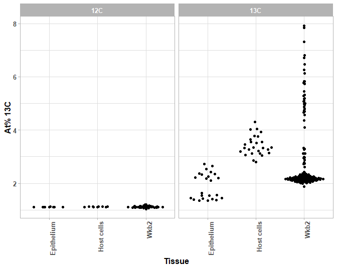

``` r
## sum of 14N12C and 14N13C per image file
(ggplot(dat, aes(x = as.character(dat$IMAGEFILE), y = dat$`14N 12C` + dat$`14N 13C`)) +
    geom_quasirandom(dodge.width = 0.5) + theme_light() + scale_colour_manual(values = wes_palette("BottleRocket2")) +
    labs(colour = "Sample") + ylab("14N12C+14N13C counts") + xlab("Image") + theme(axis.text.x = element_text(angle = 90,
    hjust = 1)) + theme(text = element_text(family = "Arial", face = "bold", size = 12)))
```

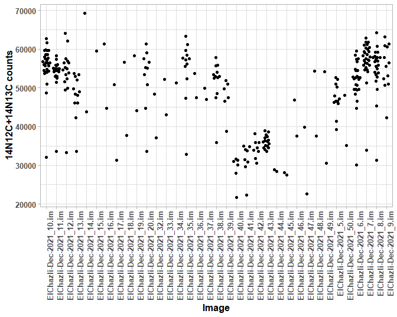

``` r
## sum of 14N12C and 14N13C per acqusition date
(ggplot(dat, aes(x = as.character(dat$`Date acquired`), y = dat$`14N 12C` + dat$`14N 13C`)) +
    geom_boxplot() + geom_quasirandom(dodge.width = 0.5) + theme_light() + scale_colour_manual(values = wes_palette("BottleRocket2")) +
    labs(colour = "Sample") + ylab("14N12C+14N13C counts") + xlab("Date acquried") +
    theme(axis.text.x = element_text(angle = 90, hjust = 1)) + theme(text = element_text(family = "Arial",
    face = "bold", size = 12)))
```

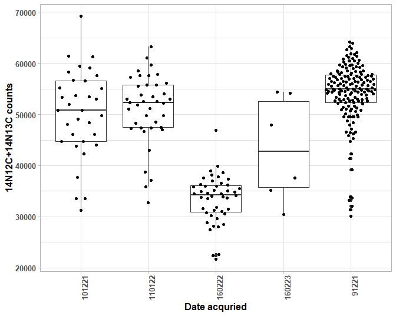

#### ROI sizes for host and for bacteria for the 12C and 13C ROIs

``` r
## Subset the 12C and 13C samples in distinct tables
dat_12C = dat[Label == "12C"]
dat_13C = dat[Label == "13C"]

## Plot the sizes of all ROIS of the 12C samples
(ggplot(dat_12C, aes(x = dat_12C$Tissue, dat_12C$ROIAREA)) + geom_boxplot() + ylab("ROI area") +
    xlab("Tissue type") + geom_quasirandom() + scale_colour_manual(values = wes_palette("BottleRocket2")) +
    stat_n_text() + theme_light() + facet_zoom(ylim = c(0, 2.5)) + theme(axis.text.x = element_text(angle = 90,
    hjust = 1)) + theme(text = element_text(family = "Arial", size = 14)))
```

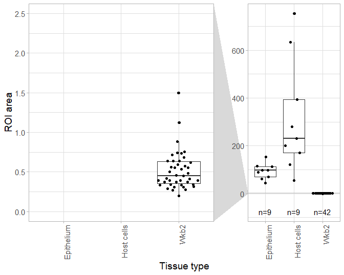

``` r
ggsave("ROIarea_12C.pdf", device = cairo_pdf)
```

    ## Saving 7 x 5.59 in image

``` r
## Plot the sizes of all ROIS of the 13C samples
(ggplot(dat_13C, aes(x = dat_13C$Tissue, dat_13C$ROIAREA)) + geom_boxplot() + ylab("ROI area") +
    xlab("Tissue type") + geom_quasirandom() + scale_colour_manual(values = wes_palette("BottleRocket2")) +
    stat_n_text() + theme_light() + facet_zoom(ylim = c(0, 2.5)) + theme(axis.text.x = element_text(angle = 90,
    hjust = 1)) + theme(text = element_text(family = "Arial", size = 14)))
```

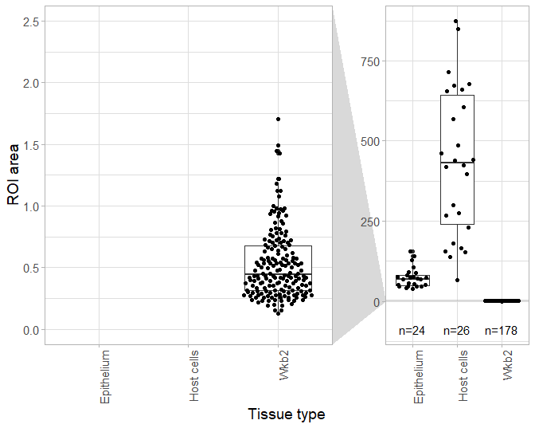

``` r
ggsave("ROIarea_13C.pdf", device = cairo_pdf)
```

    ## Saving 7 x 5.59 in image

#### Plots of all ROI ratios of the controls per tissue type. Quick review of at% enrichment in the different samples

``` r
## Subset 12C values only to determine the natural 13C abundance in our samples
dat_12C = dat[Label == "12C"]

## Calulate the mean for 13C12C/12C ratio in 12C samples
dat_12C[, by = .(Tissue), Average_ratio_C := mean(`13C 12C /12C2`, na.rm = T)]


## Unique values for Tissue and avergae ratio
unique(dat_12C[, c("Tissue", "Average_ratio_C")])  ## for wkb2 the ratio seems slightly lower that for host tissues
```

    ##        Tissue Average_ratio_C
    ## 1: Host cells      0.02198149
    ## 2:       Wkb2      0.02187182
    ## 3: Epithelium      0.02198979

``` r
## calculate the mean of 14N13C/14N12C ration in 12C samples
dat_12C[, by = .(Tissue), Average_ratio_N := mean(`14N 13C /14N 12C`, na.rm = T)]
head(dat_12C)
```

    ##    NAME               IMAGEFILE ROI_NUM        19F     12C2  13C 12C  14N 12C
    ## 1: ROI1 ElChazli-Dec-2021_13.im       1  1132.7280 14681.79 321.8138 47866.53
    ## 2: ROI1 ElChazli-Dec-2021_20.im       1   987.4949 10671.21 233.7717 50279.04
    ## 3: ROI1 ElChazli-Dec-2021_32.im       1 11839.1900 27123.83 592.1740 47799.36
    ## 4: ROI1 ElChazli-Dec-2021_39.im       1  1166.0030 16023.34 347.7498 46102.91
    ## 5: ROI1 ElChazli-Dec-2021_40.im       1   270.9239 14343.94 315.0346 30684.55
    ## 6: ROI1 ElChazli-Dec-2021_41.im       1   387.3940 13895.95 305.5277 30454.03
    ##         31P       32S       SE 13C 12C /12C2 ER-13C 12C /12C2     CHSQ1 TOTNUM1
    ## 1: 3.000171  96.58152 34687.50    0.02191924     7.232701e-05 0.7530214  158469
    ## 2: 2.715968  73.62431 36624.83    0.02190677     4.156474e-05  1.689731  688303
    ## 3: 43.73744 230.41330 49915.47    0.02183224     2.201422e-05  2.358527  909739
    ## 4: 3.345646  90.73304 42175.14    0.02170271     2.619360e-05 0.6193269 1040425
    ## 5: 2.396554 112.77710 23148.55    0.02196291     3.257993e-05 0.4230875  509991
    ## 6: 2.280887 120.59470 22062.79    0.02198682     4.239581e-05 0.7645146  309489
    ##     TOTDEN1 STD1  NPIX   ROIAREA   ROIDIAM ROIX ROIY ROI_XSTG ROI_YSTG  14N 13C
    ## 1: 13960270    1  5833  55.58332  8.412543   19  178   -11998    14522 543.3533
    ## 2: 61053840    1 24286 231.42410 17.165610   54  138   -11958    14562 566.8311
    ## 3: 81122690    1 33943 634.31800 28.418990  127  136     2441    15712 536.0392
    ## 4: 92987270    1 40339 753.84480 30.981040  116  142   -11959    14568 515.8408
    ## 5: 45235160    1 29484 280.95640 18.913610  146  121     2618    15704 345.9442
    ## 6: 27397970    1 17993 171.45740 14.775190  131  110     2619    15703 344.0105
    ##    14N 13C /14N 12C ER-14N 13C /14N 12C     CHSQ2 TOTNUM2  TOTDEN2 STD2 Sample
    ## 1:       0.01135143        2.867671e-05 0.7292665   93857  4281945    1 72_12C
    ## 2:       0.01127371        1.366505e-05 1.9125410  283869 12958050    1 72_12C
    ## 3:       0.01121436        1.182327e-05 1.2182170 1005008 46033210    1 48_12C
    ## 4:       0.01118890        1.103057e-05 1.4426240  701394 32318270    1 72_12C
    ## 5:       0.01127422        1.587594e-05 1.3239430  464424 21145830    1 48_12C
    ## 6:       0.01129606        2.041942e-05 9.5200810  274868 12501490    1 48_12C
    ##          Experiment Lm_number Date acquired Batch Date Loaded Type Time Label
    ## 1: Replicate August     Lm_13        101221     C      231221   H1   72   12C
    ## 2: Replicate August     Lm_20        101221     C      241221   H1   72   12C
    ## 3: Replicate August     Lm_32        110122     E      230122   H1   48   12C
    ## 4: Replicate August     Lm_39        110122     E      260122   H1   72   12C
    ## 5: Replicate August     Lm_40        160222     F      170222   H1   48   12C
    ## 6: Replicate August     Lm_41        160222     F      170222   H1   48   12C
    ##        Tissue ratio_14N13c delta_14N13c atpercent_14N13c Average_ratio_C
    ## 1: Host cells     1.014526     5.369221         1.122402      0.02198149
    ## 2: Host cells     1.006261    -1.514255         1.114803      0.02198149
    ## 3: Host cells     1.000211    -6.770744         1.108999      0.02198149
    ## 4: Host cells     1.000494    -9.025676         1.106509      0.02198149
    ## 5: Host cells     1.008064    -1.469086         1.114852      0.02198149
    ## 6: Host cells     1.000994     0.465231         1.116988      0.02198149
    ##    Average_ratio_N
    ## 1:      0.01128102
    ## 2:      0.01128102
    ## 3:      0.01128102
    ## 4:      0.01128102
    ## 5:      0.01128102
    ## 6:      0.01128102

``` r
## Unique values for Tissue and avergae ratio
unique(dat_12C[, c("Tissue", "Average_ratio_N")])  ## similar ratios across the 3 entities
```

    ##        Tissue Average_ratio_N
    ## 1: Host cells      0.01128102
    ## 2:       Wkb2      0.01130190
    ## 3: Epithelium      0.01124884

``` r
(ggplot(dat_12C, aes(x = dat_12C$Tissue, dat_12C$`14N 13C /14N 12C`)) + geom_quasirandom(width = 0.1) +
    theme_light() + ylab("14N13C/14N12C ratio") + xlab("Tissue type") + scale_y_continuous(labels = scales::number_format(accuracy = 1e-05)) +
    geom_point(stat = "summary", fun.y = "mean", type = 15, colour = "red") + geom_errorbar(width = 0.5,
    stat = "summary", fun.ymin = function(x) {
        mean(x) - 2 * sd(x)
    }, fun.ymax = function(x) {
        mean(x) + 2 * sd(x)
    }) + stat_compare_means(method = "kruskal") + theme(axis.text.x = element_text(angle = 90,
    hjust = 1)) + theme(text = element_text(family = "Arial", size = 14)))
```

    ## No summary function supplied, defaulting to `mean_se()`
    ## No summary function supplied, defaulting to `mean_se()`

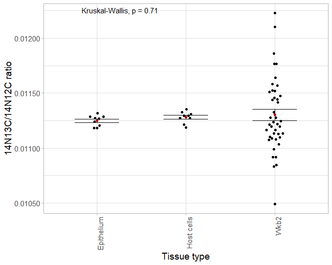

``` r
## More variability in bacterial cells compared to the rest
ggsave("standard_ratio_12C_samples.pdf", device = cairo_pdf)
```

    ## Saving 7 x 5.59 in image
    ## No summary function supplied, defaulting to `mean_se()`
    ## No summary function supplied, defaulting to `mean_se()`

``` r
## Overview of the enrichments in the different tissue types
(ggplot(dat, aes(Sample, dat$atpercent_14N13c)) + geom_boxplot() + ylab("At% 13C") +
    labs(colour = "Tissue") + scale_y_continuous(breaks = seq(0, 9, by = 1)) + theme_light() +
    ggtitle("13C atomic enrichment") + scale_fill_manual(values = wes_palette("BottleRocket2")) +
    xlab("Sample")) + theme(axis.text.x = element_text(angle = 90, hjust = 1)) +
    theme(text = element_text(size = 14, family = "Arial")) + facet_wrap(~Tissue)
```

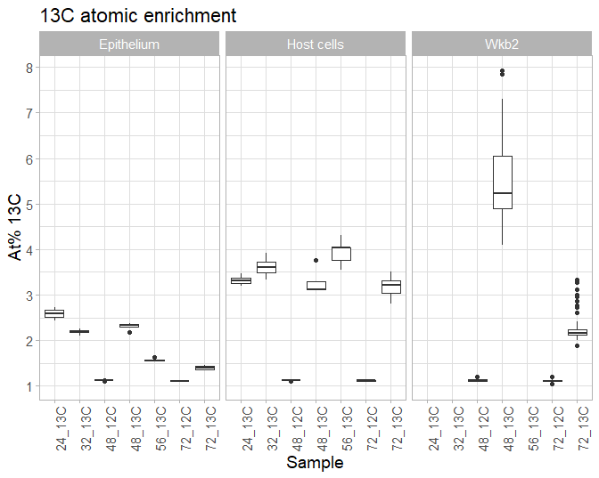

``` r
ggsave("13C_atomic_ernichment_14N13C.pdf", device = cairo_pdf)
```

    ## Saving 7 x 5.59 in image

#### The mean ratio for 13C12C/12C2 in host is 0.02178112 and for bacteria is 0.02191010

#### The mean ratio for 14N13C/14N12C in host is 0.01126608 and for bacteria is 0.01125358

``` r
## Subset the 12C and 13C samples in distinct tables
dat_12C = dat[Label == "12C"]
dat_13C = dat[Label == "13C"]

## Check the labelling of the host cells and the epithelium with time after
## switch from 13C glc to 12C glc
(dat_13C %>%
    subset(., Tissue %in% c("Host cells", "Epithelium")) %>%
    ggplot(., aes(as.numeric(Time), as.numeric(atpercent_14N13c))) + geom_beeswarm() +
    ylab(expression("At% " ~ ""^13 * "C" ~ "Enrichment")) + labs(colour = "Experiment") +
    theme_base() + stat_cor(method = "pearson") + geom_smooth(method = "lm", se = TRUE,
    aes(group = Tissue)) + scale_y_continuous(limits = c(0, 5), breaks = seq(0, 5,
    by = 1)) + scale_colour_manual(values = wes_palette("BottleRocket2")) + xlab("Time (h)") +
    geom_hline(yintercept = 1.11, linetype = "dashed") + scale_x_continuous(limits = c(0,
    80), breaks = seq(0, 80, 8)) + theme(strip.text = element_text(size = 20), text = element_text(size = 14,
    family = "Arial"), axis.title.x = element_text(face = "bold"), axis.title.y = element_text(face = "bold")) +
    stat_cor(label.y = 8) + facet_wrap(~Tissue))
```

    ## `geom_smooth()` using formula = 'y ~ x'

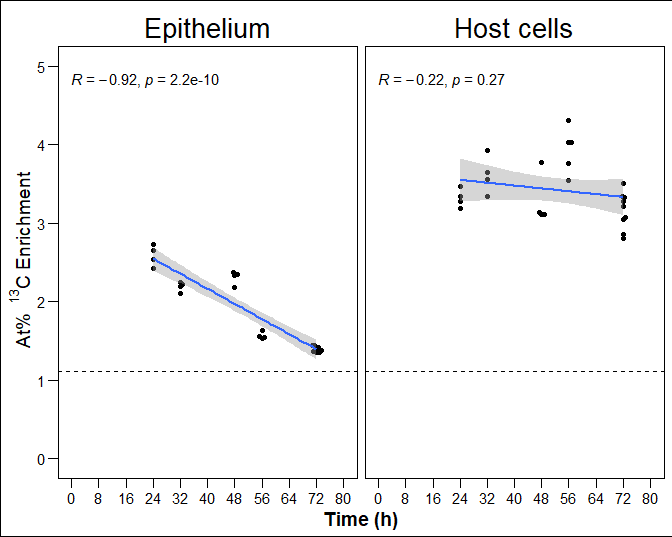

``` r
ggsave("cuticle_tissue_timecourse.pdf", device = cairo_pdf)
```

    ## Saving 7 x 5.59 in image
    ## `geom_smooth()` using formula = 'y ~ x'

``` r
## Figure 3C, labbeling timeline
(ggplot(dat[Label=="13C"], aes(x=Time, atpercent_14N13c, colour=Tissue))+
  stat_summary(aes(Time, atpercent_14N13c), geom = "pointrange", fun.y = mean, shape = 16, size = 0.2,alpha =0.5,
  fun.ymin = function(x) mean(x) - sd(x), fun.ymax = function(x) mean(x) + sd(x) ) + 
  stat_summary(aes(Time, atpercent_14N13c, colour=Tissue), geom = "line", size =0.5, fun = mean, alpha =0.5)+
  geom_quasirandom(alpha =1, size=0.5, colour="black", position=position_dodge2(width =2))+
  scale_colour_manual(labels = c("Cuticle","Host tissue", "S. alvi" ), values = c("blue3", "darkorange3", "springgreen3"))+
  scale_fill_manual( labels = c("Cuticle","Host tissue", "S. alvi"), values = c("blue3", "darkorange3", "springgreen3"))+
  labs(colour='Tissue') + 
  ylab(expression("At% "~""^13*"C"~"Enrichment"))+
  scale_y_continuous(limits = c(0,7), breaks = seq(0, 7, by = 1))+
  scale_x_continuous(limits = c(0,80), breaks = seq(0, 80, by = 8))+
  xlab("Time (h)")+
  annotate("text", x=18.5, y=1.3, size=2, label= "Natural Abundance")+
  #facet_wrap(~Tissue, nrow = 3)+
  geom_hline(yintercept = 1.11, linetype="dashed")+
  theme( legend.key.size = unit(0.4, 'cm'))+
     #theme(plot.margin = unit(c(0.2,0.2,0.2,0.2), "cm"), legend.key.size = unit(0.5,"line"))+
  guides(shape = "none")+
  theme(text=element_text(size=10,  family="Arial"),
        legend.text = element_text(color = "black", size=6), 
        legend.title = element_text(color = "black", size=6),
        panel.border = element_rect(colour = "grey", fill=NA, size=1),
        panel.background = element_rect(fill = "white", colour = "grey50"),
        legend.position = c(.2, .75), 
        axis.text.x = element_text(color = "black", size=10), 
        axis.text.y = element_text(color = "black", size=10), 
        axis.title.y=element_text(color = "black", size=10),
        axis.ticks.x = element_line(linetype = "dashed"))+
  force_panelsizes(rows = unit(1.6, "in"),
                 cols = unit(2.4, "in")))
```

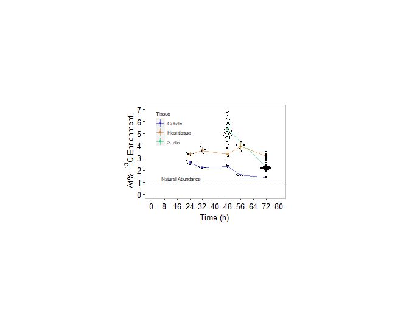

``` r
ggsave("Figure_3C.pdf",device=cairo_pdf, width=3, height= 2, units = "in", dpi = 300)
```

#### Scale calcluation for main text figure 3

``` r
## 14N13C ratios
scale_function = function(ratio) {
    delta = ((ratio/0.01125358) - 1) * 1000
    scale_value = ((delta + 1000)/(delta + 1000 + (1000/0.01125358))) * 100
    return(scale_value)
}


scale_function = function(ratio) {
    scale_value = (ratio * 1.11)/0.01125358
    return(scale_value)
}

original_scales = c(0, 0.0113, 0.0158, 0.0223, 0.0315, 0.0441, 0.0621, 0.0874, 0.1229)
atpercent_scale = scale_function(original_scales)
round(atpercent_scale, 2)
```

    ## [1]  0.00  1.11  1.56  2.20  3.11  4.35  6.13  8.62 12.12

``` r
#### For the main experiment Average Host cells enrichment per sample
dat[Tissue == "Host cells" & Label == "13C", .(mean(atpercent_14N13c), sd(atpercent_14N13c)),
    by = "Sample"]
```

    ##    Sample       V1        V2
    ## 1: 72_13C 3.158976 0.2337517
    ## 2: 56_13C 3.936404 0.2911503
    ## 3: 32_13C 3.617378 0.2446943
    ## 4: 48_13C 3.283697 0.3252773
    ## 5: 24_13C 3.316400 0.1156889

``` r
## Average cuticle enrichment per sample
dat[Tissue == "Epithelium" & Label == "13C", .(mean(atpercent_14N13c), sd(atpercent_14N13c)),
    by = "Sample"]
```

    ##    Sample       V1         V2
    ## 1: 48_13C 2.306339 0.08556653
    ## 2: 72_13C 1.395006 0.04009232
    ## 3: 56_13C 1.567763 0.04439553
    ## 4: 32_13C 2.190811 0.06324869
    ## 5: 24_13C 2.587035 0.13378179

``` r
## Average bacteria enrichment per sample
dat[Tissue == "Wkb2" & Label == "13C", .(mean(atpercent_14N13c), sd(atpercent_14N13c)),
    by = "Sample"]
```

    ##    Sample       V1        V2
    ## 1: 72_13C 2.245991 0.2653228
    ## 2: 48_13C 5.565341 0.9883702

``` r
## Average Host cells enrichment overall time points and samples
dat[Tissue == "Host cells" & Label == "13C", .(mean(atpercent_14N13c), sd(atpercent_14N13c)),
    ]
```

    ##          V1        V2
    ## 1: 3.422412 0.3759192
