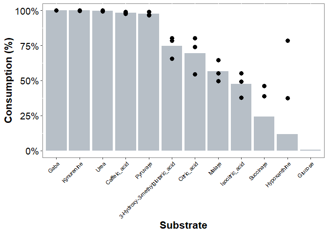

# S. alvi growth in 96 well plates using minimal Bee9 media + carbon sources

## Read OD600 data and plot maximum average exponential growth rates

``` r
OD_reading <- data.frame(read.csv("Growth_formatted_all.csv")) 
OD_reading_long <- OD_reading %>%
  pivot_longer(X0:X42.48, names_to = "Time", values_to = "OD600")
OD_reading_long$Time <- gsub("X", "",OD_reading_long$Time )
OD_reading_long$Time <- as.numeric(OD_reading_long$Time)
OD_reading_long$Well <- factor(OD_reading_long$Well)
OD_reading_long$Type <- factor(OD_reading_long$Type)
OD_reading_long$Condition <- factor(OD_reading_long$Condition)
OD_reading_long$Replicate <- factor(OD_reading_long$Replicate)

OD_reading_long_trim <- OD_reading_long %>%
  group_by(Type, Condition, Replicate, Time)%>%
  filter(Condition != "Water" & Condition != "Error")%>%
  summarise(OD_mean=mean(OD600))%>%
  pivot_wider(names_from = Type, values_from = OD_mean) %>%
  mutate(OD_correct=Sn-Blank,
         Condition = fct_relevel(Condition, "All","Cit_3Hmg", "3Hmg", "Cit_Fum", "Fum","Cit_Suc","Suc", "Cit_Gaba", "Gaba","Icit","Cit_Kyn", "Kyn","Cit_Pyr","Pyr","Cit_Ace","Ace","Cit_Urea","Cit_Hypox","Cit_Glc","Glc",
                                     "Mal", "Cit","Cit_Caff","None"))
```

    ## `summarise()` has grouped output by 'Type', 'Condition', 'Replicate'. You can
    ## override using the `.groups` argument.

``` r
Growth_rate <- OD_reading_long_trim %>%
  group_by(Condition, Replicate) %>%
  arrange(Time,.by_group = TRUE)%>%
  mutate(dOD = OD_correct - lag(OD_correct, default = first(OD_correct)),
         dt = Time - lag(Time, default = first(Time)),
         dODdt = dOD/dt,
         dODdt_roll = roll_mean(dODdt, n=8, align="left",fill=0))


Growth_rate_max <- Growth_rate %>%
  filter(Time > 12) %>%
  group_by(Condition, Replicate) %>%
  mutate(dODdt_max = max(dODdt_roll, na.rm=TRUE),
         dODdt_max = case_when(dODdt_max < 0 ~ 0,
                               TRUE ~ dODdt_max))%>%
  filter(between(Time, 20.45,20.50)) %>% 
  distinct(Condition, Replicate, .keep_all = TRUE)


Growth_rate_max_avg <- Growth_rate_max %>%
  group_by(Condition) %>%
  summarise(dODdt_m_avg = mean(dODdt_max),
         dODdt_m_sd = sd(dODdt_max,na.rm=TRUE))%>%
  mutate(FC_cit = dODdt_m_avg / dODdt_m_avg[Condition=="Cit"],
         FC_cit_sd = FC_cit*sqrt((dODdt_m_sd/dODdt_m_avg)^2 + (dODdt_m_sd[Condition=="Cit"]/dODdt_m_avg[Condition=="Cit"])^2),
         Abundance = case_when(FC_cit > 1.5 ~ "UP",
                               FC_cit > 0.1 & FC_cit < 0.667  ~ "Down",
                               FC_cit == 1 ~ "Cit",
                               FC_cit <= 0.1 ~ "None",
                               TRUE ~ "Same"),
         Abundance = fct_relevel(Abundance, "UP","Down","Same","Cit","None"))

ggplot(data = Growth_rate_max, aes(x = Condition, y = dODdt_max)) +
    geom_col(data=Growth_rate_max_avg, aes(x = Condition, y = dODdt_m_avg),
             color="black", fill="slategrey", alpha=0.5,outlier.shape = NA)+
  geom_point(color="black", size=0.75)+
  geom_hline(yintercept=0.00358, col="grey30", linetype = "dotted", size = 0.75) +
  theme(panel.background = element_rect(fill = "white", colour = "grey50"),
    panel.border = element_rect(colour = "grey", fill=NA, size=1),
    strip.background = element_rect(fill="white",colour = "black"),
    strip.text=element_text(color = "black", size=14),
    legend.position = "none",
    legend.text=element_text(face="bold", size = 14),
    axis.ticks=element_line(size=0.4),
    axis.text.x = element_text(color = "black", size = 5, angle=90, hjust=1),
    axis.text.y = element_text(color = "black", size = 6),
    axis.title = element_text(size=8),
    axis.title.y = element_text(size=8),
    legend.title = element_text(size=8),
    plot.background=element_blank())+
  scale_y_continuous( name = "[Growth rate]_max (/h)", limits=c(0,0.04), breaks=seq(0, 0.05, 0.005)) +
  stat_compare_means(p.adjust.method = "BH", ref.group = "Cit", 
                     label = "p.signif", label.y = 0.038, na.rm = TRUE, hide.ns = TRUE,size=5)
```


``` r
#ggsave("Fig4a_Sn_max_growth_rate_all.pdf",device=cairo_pdf, width=4, height= 3, units = "in", dpi = 300)
```

##Analysis of SCFA profiles from spent media

``` r
results_wide <- read_csv("SCFA_response.csv") 
```

    ## Rows: 102 Columns: 34
    ## ── Column specification ────────────────────────────────────────────────────────
    ## Delimiter: ","
    ## chr  (6): Name, Acq. Date-Time, Colonization, Condition, Batch, Type
    ## dbl (28): Replicate, Formate, Acetate, Propanoate, Isobutanol, Pyruvate_1, B...
    ## 
    ## ℹ Use `spec()` to retrieve the full column specification for this data.
    ## ℹ Specify the column types or set `show_col_types = FALSE` to quiet this message.

``` r
results_wide_2 <- results_wide %>%
  mutate(a_Ketoglutarate = a_Ketoglutarate_1 +a_Ketoglutarate_2 + a_Ketoglutarate_3,
         Pyruvate = Pyruvate_1 + Pyruvate_3 + Diacetyl_monoxime)
  
results <- results_wide_2 %>%
  pivot_longer(
   cols =  c("Formate":"Pyruvate"),
   names_to = "Metabolite",
   values_to = "Response",
   values_drop_na = FALSE) 

results$Colonization <- factor(results$Colonization)
results$Metabolite <- factor(results$Metabolite) 
results$Condition <- factor(results$Condition)
results$Replicate <- factor(results$Replicate)
results$Type <- factor(results$Type)
results$Batch <- factor(results$Batch)


Internal_std <- filter(results, Metabolite == "Isovalerate") %>%
  filter(Type != "Blank") %>%
  select(Name, Colonization, Condition, Replicate, Batch, Response) %>%
  rename(ISTD = Response) %>%
  group_by(Batch) %>%
  mutate(ISTD_med = median(ISTD),
         ISTD_norm = ISTD / ISTD_med,
         LB = median(ISTD) - 2*sd(ISTD),
         UB = median(ISTD) + 2*sd(ISTD),
         Decision = case_when(
           ISTD > LB & ISTD < UB ~ "ok",
           TRUE ~ "error")) 


Blank <- results %>%
  filter(Condition == 0) %>%
  group_by(Metabolite) %>%
  mutate(Response =case_when(is.na(Response) ~ 1,
                               TRUE ~ Response) ,
         Blank_avg = mean(Response, na.rm=TRUE),
         Blank_avg = case_when(Blank_avg == "NaN" ~ 0,
                               Metabolite == "Isovalerate" ~ 0,
                               TRUE ~ Blank_avg))%>%
  filter(Batch=="A")%>%
  select(Metabolite, Blank_avg)

results_norm <-  left_join(results, Internal_std)%>%
  left_join(Blank, by = "Metabolite")%>%
  mutate(Resp_norm = case_when(is.na(Response) ~ Blank_avg,
                               TRUE ~ Response),
         Blank_norm = Blank_avg / ISTD_norm,
         Resp_norm = Resp_norm / ISTD_norm,
         Resp_norm2 = Resp_norm - Blank_norm,
         Resp_norm2 = case_when(Resp_norm2 < 1 ~ 1,
                               TRUE ~ Resp_norm2)) %>%
  rename(Acq_Date = "Acq. Date-Time")
```

    ## Joining, by = c("Name", "Colonization", "Condition", "Replicate", "Batch")

``` r
results_fc <- results_norm %>%
  filter(Type =="Sample") %>%
  filter(Metabolite != "Isovalerate") %>%
  filter(Colonization == "Sn" | Colonization == "Control")%>%
  select(Colonization,Condition, Replicate, Batch, Metabolite, Blank_avg, Resp_norm2)%>%
  group_by(Metabolite, Condition, Replicate, Batch) %>%
  pivot_wider(names_from=Colonization, values_from=Resp_norm2)%>%
  mutate(FC=Sn/Control,
         Noise = case_when((Sn+Blank_avg) < 5*Blank_avg & (Control+Blank_avg) < 5*Blank_avg ~ "Yes",
                           TRUE ~"No"),
         FC_2 = case_when(Noise == "No" ~ FC,
                              TRUE ~ 0),
         Log_FC=log(FC_2,2))%>%
  filter(Metabolite != "4_Hydroxybenzoate" & Metabolite != "Carbonate"& Metabolite !="Compound_53"&
        Metabolite != "Maleate" & Metabolite != "a_Ketoglutarate_1" & Metabolite !=  
         "a_Ketoglutarate_2" & Metabolite != "a_Ketoglutarate_3" & Metabolite != "Pyruvate_1" & Metabolite != 
         "Pyruvate_3" & Metabolite != "Diacetyl_monoxime" & Metabolite != "Unknown_8_62") 

results_fc_avg <- results_fc %>%
  group_by(Condition, Metabolite) %>%
  summarise(Blank_avg = mean(Blank_avg),
            Sn_avg = mean(Sn),
            FC_avg = mean(FC_2),
            FC_sd = sd(FC_2),
            Log_FC_avg = log(FC_avg,2),
            Produced = case_when((FC_avg > 2) & (Sn_avg > 5* Blank_avg) ~ "Yes",
                                 TRUE ~ "No"))
```

    ## `summarise()` has grouped output by 'Condition'. You can override using the
    ## `.groups` argument.

``` r
Products <- results_fc_avg %>%
  filter(Metabolite != "Anthranilate",Metabolite != "C5/6_acid", Metabolite != "Benzoate",Metabolite != "Isobutanol") %>%
  mutate(Condition = fct_relevel(Condition, "All","Cit_3Hmg","Cit_Fum", "Fum","Cit_Suc","Suc", "Cit_Gaba",   
                                            "Cit_Pyr","Pyr","Cit_Ace","Mal","Cit"),
         Metabolite = fct_relevel(Metabolite,"Formate","Acetate","Pyruvate", "Lactate","Propanoate","Butyrate","Succinate", "Fumarate", "Malate","a_Ketoglutarate","2-Oxoisovalerate","Citrate","3_HMG"))


ggplot(data = Products, aes(x=Metabolite, y = Condition, fill = Produced)) + 
  geom_tile(colour="white",size=0.25)+
  coord_equal() +
  labs(x="")+
  scale_y_discrete(name = "Growth Substrates",limits=rev)+
  scale_x_discrete(name = "Products")+
  scale_fill_manual(values=c("grey90","darkorange1"))+
  theme(panel.background = element_rect(fill = "white", colour = "grey50"),
    panel.border = element_rect(colour = "grey", fill=NA, size=1),
    strip.background = element_rect(fill="white",colour = "black"),
    strip.text=element_text(color = "black", size=14),
    legend.position = "none",
    legend.text=element_text(face="bold", size = 14),
    axis.ticks=element_line(size=0.4),
    axis.text.x = element_text(color = "black", size = 5, angle=90, hjust=1),
    axis.text.y = element_text(color = "black", size = 6),
    axis.title = element_text(size=8),
    axis.title.y = element_text(size=8),
    legend.title = element_text(size=8),
    plot.background=element_blank())
```


``` r
#ggsave("Fig4B_Sn_products_heat.pdf",device=cairo_pdf, width=3, height= 3, units = "in", dpi = 300)
```

## Soluble metabolite analysis

``` r
results_wide_smet <- read_csv("Sn_SMet_data.csv") 
```

    ## Rows: 72 Columns: 59
    ## ── Column specification ────────────────────────────────────────────────────────
    ## Delimiter: ","
    ## chr  (6): Name, Acq. Date-Time, Colonization, Condition, Batch, Type
    ## dbl (53): Replicate, 2,3-Butanediol_1, 2,3-Butanediol_2, Pyruvate, 2-Pyrroli...
    ## 
    ## ℹ Use `spec()` to retrieve the full column specification for this data.
    ## ℹ Specify the column types or set `show_col_types = FALSE` to quiet this message.

``` r
results_wide_2_smet <- results_wide_smet %>%
  mutate(Gaba = Gaba_1 + Gaba_2,
         Isocitric_acid = Isocitric_acid_1 + Isocitric_acid_2,
         Kynurenine = Kynurenine_1 + Kynurenine_2,
         Urea = Urea_1 + Urea_2)
  
results_smet <- results_wide_2_smet %>%
  pivot_longer(
   cols =  c("2,3-Butanediol_1":"Urea"),
   names_to = "Metabolite",
   values_to = "Response",
   values_drop_na = FALSE) 

results_smet$Colonization <- factor(results_smet$Colonization)
results_smet$Metabolite <- factor(results_smet$Metabolite) 
results_smet$Condition <- factor(results_smet$Condition)
results_smet$Replicate <- factor(results_smet$Replicate)
results_smet$Type <- factor(results_smet$Type)
results_smet$Batch <- factor(results_smet$Batch)


Internal_std_smet <- filter(results_smet, Metabolite == "L-Norleucine") %>%
  filter(Type != "Blank") %>%
  select(Name, Colonization, Condition, Replicate, Batch, Response) %>%
  rename(ISTD = Response) %>%
  group_by(Batch) %>%
  mutate(ISTD_med = median(ISTD),
         ISTD_norm = ISTD / ISTD_med,
         LB = median(ISTD) - 2*sd(ISTD),
         UB = median(ISTD) + 2*sd(ISTD),
         Decision = case_when(
           ISTD > LB & ISTD < UB ~ "ok",
           TRUE ~ "error")) 


Blank_smet <- results_smet %>%
  filter(Type == "Blank") %>%
  group_by(Metabolite) %>%
  mutate(Response =case_when(is.na(Response) ~ 0,
                               TRUE ~ Response) ,
         Blank_avg = mean(Response, na.rm=TRUE),
         Blank_avg = case_when(Blank_avg == "NaN" ~ 0,
                               Metabolite == "L-Norleucine" ~ 0,
                               TRUE ~ Blank_avg))%>%
  filter(Batch=="A")%>%
  select(Metabolite, Blank_avg)

results_norm_smet <-  left_join(results_smet, Internal_std_smet)%>%
  left_join(Blank_smet, by = "Metabolite")%>%
  mutate(Resp_norm = case_when(is.na(Response) ~ 1,
                               TRUE ~ Response),
         Blank_norm = Blank_avg / ISTD_norm,
         Resp_norm = Resp_norm / ISTD_norm,
         Resp_norm2 = Resp_norm - Blank_norm,
         Resp_norm2 = case_when(Resp_norm2 < 0 ~ 1e-3,
                               TRUE ~ Resp_norm2)) %>%
  rename(Acq_Date = "Acq. Date-Time")
```

    ## Joining, by = c("Name", "Colonization", "Condition", "Replicate", "Batch")

``` r
results_fc_smet <- results_norm_smet %>%
  filter(Type =="Sample") %>%
  filter(Metabolite != "L-Norleucine") %>%
  filter(Colonization == "Sn" | Colonization == "Control")%>%
  select(Colonization,Condition, Replicate, Batch, Metabolite, Blank_avg, Resp_norm2)%>%
  group_by(Metabolite, Condition, Replicate, Batch) %>%
  pivot_wider(names_from=Colonization, values_from=Resp_norm2)%>%
  mutate(FC=Sn/Control,
         Noise = case_when((Sn+Blank_avg) < 5*Blank_avg & (Control+Blank_avg) < 5*Blank_avg ~ "Yes",
                           TRUE ~"No"),
         FC_2 = case_when(Noise == "No" ~ FC,
                              TRUE ~ 0),
         Log_FC=log(FC_2,2))
 

results_fc_avg_smet <- results_fc_smet %>%
  group_by(Condition, Metabolite) %>%
  summarise(FC_avg = mean(FC_2),
            FC_sd = sd(FC_2),
            Log_FC_avg = log(FC_avg,2),
            Produced = case_when(FC_avg > 5 ~ "Yes",
                                 TRUE ~ "No"))
```

    ## `summarise()` has grouped output by 'Condition'. You can override using the
    ## `.groups` argument.

## Plot Substrate consumption (%) relative to control values. Show results for case “All” where all substrates are added to the supernatant

``` r
Sn_products_smet <- read.csv("Sn_substrates_Smet.csv")

Sn_products_smet <- Sn_products_smet %>%
  left_join(results_fc_smet, by = c("Condition", "Metabolite"))%>%
  mutate(Consumption = (1-FC)) 

Sn_consumption <- Sn_products_smet %>%
  filter(Condition == "All")
Sn_consumption_avg <- Sn_consumption %>%
  group_by(Metabolite) %>%
  mutate(Consumption_avg = mean(Consumption),
         Consumption_avg = case_when(Consumption_avg < 0 ~ 0.005,  # set negative values to 0
                                     TRUE ~ Consumption_avg))%>%
  filter(Replicate==4)

ggplot(data = Sn_consumption_avg, aes(x = fct_rev(fct_reorder(Metabolite, Consumption_avg)), y = Consumption_avg)) +
  geom_col(fill="slategrey", alpha=0.5 )+
  geom_point(data = Sn_consumption,aes(x=Metabolite, y=Consumption), size=3, color="black")+
  theme(panel.background = element_rect(fill = "white", colour = "grey50"), 
        legend.position = "none", 
        legend.text = element_text(size=12),
        axis.text.x = element_text(color = "black", size = 8, angle=45, hjust=1),
        axis.text.y = element_text(color = "black", size = 14),
        axis.title.x = element_text(size=16,face="bold"),
        axis.title.y = element_text(size=16,face="bold"),
        legend.title = element_text(size=12, face="bold"),
        plot.title= element_text(size=18, face="bold")) +
  scale_y_continuous(labels=scales::percent, name = "Consumption (%)", limits=c(0,1.0))+
  xlab("Substrate") +
  scale_color_manual(values= wes_palette("Darjeeling1", n = 5))
```



``` r
ggsave("Figure_S4.pdf",device=cairo_pdf, width=5, height= 4, units = "in", dpi = 300)
```

## Analysis of degradation of kynurenine to anthranilate

``` r
results_kyn <- results_norm_smet %>%
  filter(Condition == "Cit_Kyn") %>%
  filter(Metabolite == "Anthranilic_acid" | Metabolite == "Kynurenic_Acid" | Metabolite == "Kynurenine" | 
  Metabolite == "L-Tryptophan") %>%
  mutate(Metabolite = fct_relevel(Metabolite, "Kynurenine","Anthranilic_acid", "Kynurenic_Acid","L-Tryptophan"),
         TIC = Resp_norm2-Blank_avg,
         TIC = case_when(TIC < 0 ~ 1,
                              TRUE ~ TIC))


ggplot(data = results_kyn, aes(x = Colonization, y=TIC, color=Colonization, shape=Condition)) +
  stat_summary(aes(y = TIC, group = Metabolite), fun=mean, color="grey30", geom="crossbar", size=0.1)+
  #stat_summary(aes(y = TIC, group = Metabolite), fun=mean, color="grey30", geom="line", size=0.2)+
  geom_jitter(width = 0.15, height = 0, size=2)+
    facet_grid(~Metabolite,   #vars(Condition),vars(Metabolite),
             scales = "free_x", 
             space = "free_x",  
             switch = "x")+
  theme(strip.placement = "outside",
        panel.background = element_rect(fill = "white"),
        panel.border = element_blank(),
        panel.spacing.x = unit(0,"line"),
        legend.position = "none",
        strip.text.x = element_text(size=5, color = "black"),
        strip.background = element_rect(fill="white"),
        axis.line = element_line(size=0.5, color="black"),
        axis.text.x = element_text(color = "black", size = 8),
        axis.text.y = element_text(color = "black", size = 8),
        axis.title.x = element_text(size=8),
        axis.title.y = element_text(size=8),
        plot.title= element_text(size=8)) +
  scale_y_log10(breaks = scales::trans_breaks("log10", function(x) 10^x),
                labels = scales::trans_format("log10", scales::math_format(10^.x)),
                 limits = c(1e+00, 1e+07)) +
 # stat_compare_means(method = "wilcox.test", na.rm = TRUE,  hide.ns = TRUE, size=2)+
  xlab("Metabolite") +
  ylab("Ion Abundance") +
  scale_color_manual(values= c("orangered1","steelblue2"))
```


``` r
#  ggsave("Fig4c_Sn_Kyn_consumption.pdf",device=cairo_pdf, width=3, height= 3, units = "in", dpi = 300)
```
