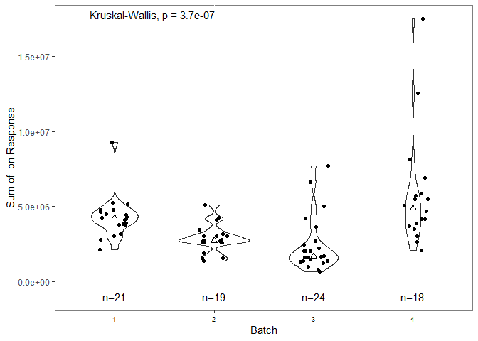
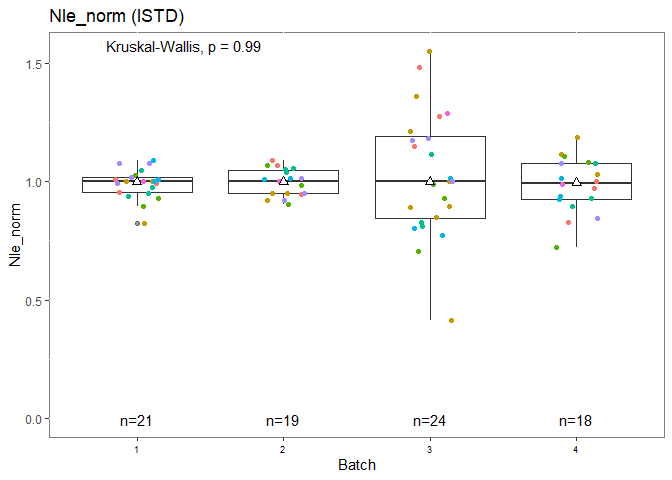
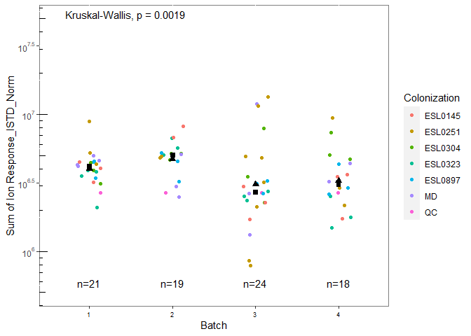
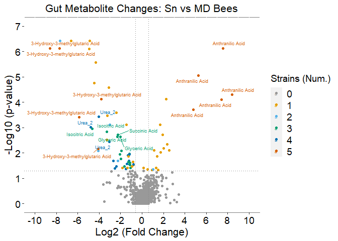

# Gut metabolomics of honey bees monocolonized with strains of S alvi. Figure 5B, Figure S6

#### These are the required package to reproduce this analysis. Uncomment to download

``` r
#required_packages = c(  "readxl",  "tidyverse",    "RColorBrewer" ,"ggpubr","EnvStats", "stats", #"wesanderson", "ggsci", "lubridate" )
#need_install = required_packages[!(required_packages) %in% installed.packages()]

#if (length(need_install) > 0){
#  install.packages((need_install))
#}

#lapply(required_packages, require, character.only=T)

#dir_script = dirname(rstudioapi::getSourceEditorContext()$path)

#setwd(dir_script)
```

## Load libraries and data

## Convert to tidy dataframe

``` r
library(tidyverse)
library(readxl)
library(RColorBrewer)
library(wesanderson)
library(ggsci)
library(EnvStats)
library(ggpubr)
library(lubridate)
library(stats)


results_wide <- read_csv("Quant_table_11032021_Processed.csv")

results <- results_wide %>%
  pivot_longer(
   cols =  c("Pyruvic Acid_MEOX":"Disaccharide_31_36"),
   names_to = "Metabolite",
   values_to = "Response",
   values_drop_na = FALSE) %>%
  select(-Species)
  
results$Type <- factor(results$Type) 
results$Colonization <- factor(results$Colonization)
results$Cage <- factor(results$Cage)
results$Metabolite <- factor(results$Metabolite)
results$Replicate <- factor(results$Replicate)
results$Batch <- factor(results$Batch)
results$Bee <- factor(results$Bee)
```

##Need to deal with NA data and metabolites with many missing values \##
Remove Metabolite(x) with is.na(x) \> 25% \## Convert NA(x) –\> min(x)-1

``` r
blank_sample <- results %>%
  filter(Type == "Blank")

results_trim <- results %>%
  filter(Type != "Blank", Type != "ISTD") %>%
  group_by(Metabolite) %>%
  filter(sum(!is.na(Response))>=(1-.25)*83) %>%   
   mutate_at("Response", function(x) ifelse(is.na(x), min(x, na.rm = T)-1, x)) 
```

## Lets look at total ion abundance

``` r
Total_response <- results_trim %>%
  filter(Metabolite != "Norleucine" & Metabolite != "Norvaline") %>%
  group_by(Name) %>%
    mutate(total = sum(Response)) %>% 
  ungroup() %>%
  group_by(Batch, Type) %>%
  mutate(TIC_avg = mean(total),
         TIC_norm = total / TIC_avg,
         Resp_norm = Response / (total * TIC_avg))

ggplot(subset(Total_response, Metabolite %in% "Alanine"), mapping = aes(x = Batch, y = total)) +
  geom_violin(scale = "count", na.rm = TRUE, alpha = 0.5, trim = TRUE, aes(x = Batch, y = total)) +
  geom_jitter(aes(x = Batch, y = total),width = 0.15, height = 0) +
  stat_summary(fun = median, geom = "point", size = 2, shape = 24, fill = "white", na.rm = TRUE) +
  stat_n_text(na.rm = TRUE, size = 4) +
  theme(panel.background = element_rect(fill = "white", colour = "grey50"), 
        legend.position = "right", axis.text.x = element_text(color = "black", size=7)) +
  scale_y_continuous(name="Sum of Ion Response") +
  stat_compare_means(method = "kruskal.test")
```



## Analyze ISTD for uniformity in samples

### Replace ISTD values that fall outside of the error bounds.

``` r
Internal_std <- filter(results_trim, Metabolite == "Norleucine") %>%
  select(Name, Batch, Colonization, Replicate, `Acq. Date-Time`, Response) %>%
  rename(Norleucine = Response) %>%
  group_by(Batch) %>%
  mutate(Nle_med = median(Norleucine),
         Nle_norm = Norleucine / Nle_med,
         LB = median(Norleucine) - 2*sd(Norleucine),
         UB = median(Norleucine) + 2*sd(Norleucine),
         Decision = case_when(
           Norleucine > LB & Norleucine < UB ~ "ok",
           TRUE ~ "error"),
         Nle_norm = case_when(Decision == "error" ~ 1.0,
                              TRUE ~ Nle_norm)) %>%
  select(-Metabolite)

ggplot(data = Internal_std, mapping = aes(x = Batch, y = Nle_norm)) +
  geom_boxplot(na.rm = TRUE, alpha = 0.5) +
  geom_jitter(aes(x = Batch, y = Nle_norm, fill = Colonization, color = Colonization),
              width = 0.15, height = 0) +
  stat_summary(fun = median, geom = "point", size = 2, shape = 24, fill = "white", na.rm = TRUE) +
  stat_n_text(na.rm = TRUE, size = 4, y.pos = -.001 ) +
  theme(panel.background = element_rect(fill = "white", colour = "grey50"), 
        legend.position = "none", axis.text.x = element_text(color = "black", size=7)) +
  scale_y_continuous(name="Nle_norm") +
  ggtitle("Nle_norm (ISTD)") +
  stat_compare_means(method = "kruskal.test") +
  stat_compare_means(label = "p.signif", method = "wilcox.test", ref.group = ".all.", hide.ns = TRUE) 
```



``` r
results_norm <-  merge(Total_response, Internal_std)%>%
  mutate(Resp_norm = Response / Nle_norm) %>%
  rename(Acq_Date = "Acq. Date-Time")

## Lets look at normalized total ion abundance 
Total_response_norm <- results_norm %>%
  filter(Metabolite != "Norleucine",Metabolite != "Norvaline" ) %>%
  group_by(Type, Colonization, Cage, Name, Batch)

Total_response_1_norm <- summarise(Total_response_norm, total = sum(Resp_norm, na.rm = TRUE))

QC <- results_norm %>%
  filter(Type == "QC") %>%
  filter(Metabolite != "Norleucine",Metabolite != "Norvaline" ) %>%
  group_by(Metabolite) %>%
  mutate(avg = mean(Resp_norm),
         Resp_Ratio = Resp_norm / avg) %>%
  ungroup() %>%
  group_by(Name) %>%
    mutate(QC_TIC = sum(Response)) %>%
  ungroup() %>%
  mutate(QC_TIC_avg = mean(QC_TIC))

QC_TIC <- results_norm %>%
  filter(Type == "QC") %>%
  filter(Metabolite != "Norleucine",Metabolite != "Norvaline" ) %>%
  group_by(Name) %>%
  mutate(QC_TIC = sum(Response),
         QC_TIC_norm = sum(Resp_norm)) %>%
  ungroup() %>%
  mutate(QC_TIC_avg = mean(QC_TIC),
         QC_TIC_norm_avg = mean(QC_TIC_avg),
         QC_Ratio = QC_TIC / QC_TIC_avg,
         QC_Ratio_norm = QC_TIC_norm / QC_TIC_norm_avg) %>%
  select(Batch, Metabolite, QC_Ratio_norm)
  
results_norm <- results_norm %>%
  left_join(QC_TIC) %>%
  mutate(Resp_norm_QC = Resp_norm / QC_Ratio_norm)

Total_response_2_norm <- results_norm %>%
  group_by(Name) %>%
  mutate(TIC = sum(Resp_norm_QC, na.rm = TRUE)) %>%
  filter(Metabolite == "Alanine")

ggplot(data = Total_response_2_norm, mapping = aes(x = Batch, y = TIC)) +
  geom_jitter(aes(x = Batch, y = TIC, color=Colonization),width = 0.15, height = 0) +
  stat_n_text(na.rm = TRUE, size = 4) +
  stat_summary(fun = mean, geom = "point", size = 2, shape = 24, fill = "black", na.rm = TRUE) +
  stat_summary(fun = median, geom = "point", size = 2, shape = 22, fill = "black", na.rm = TRUE) +
  theme(panel.background = element_rect(fill = "white", colour = "grey50"), 
        legend.position = "right", axis.text.x = element_text(color = "black", size=7)) +
  #scale_y_continuous(name="Sum of Ion Response_ISTD_Norm") +
  scale_y_log10( name = "Sum of Ion Response_ISTD_Norm", 
                 breaks = scales::trans_breaks("log10", function(x) 10^x),
                 labels = scales::trans_format("log10", scales::math_format(10^.x)),
                 limits = c(5e+05, 5e+07)) +
  annotation_logticks(sides = "l") +
  stat_compare_means(method = "kruskal.test") 
```



## Fnd the z-score of each metabolite

``` r
results_norm <- results_norm %>%
  filter(Type == "Sample") %>%
  group_by(Metabolite) %>%
  mutate(z_score = (Resp_norm_QC - mean(Resp_norm_QC))/sd(Resp_norm_QC))

results_norm$Colonization <- factor(results_norm$Colonization, levels = c("MD", "ESL0145", "ESL0304", "ESL0323", "ESL0251", "ESL0897"))
```

##Volcano_plot

``` r
results_group <- results_norm %>%
  group_by(Colonization, Metabolite) %>%
  summarise(med = median(Resp_norm),
            sd = sd(Resp_norm),
            n = n())

results_group_wide <- results_group %>%
  pivot_wider(names_from = Colonization, values_from = c(med, sd, n))
  

results_group_wide_145 <- results_group %>%
  filter(Colonization == "ESL0145" | Colonization == "MD") %>%
  filter( Metabolite != "Norleucine") %>%
  pivot_wider(names_from = Colonization, values_from = c(med, sd, n)) %>%
  mutate(FC = med_ESL0145 / med_MD,
         Log_FC = log2(FC),
         stdev_fc = FC*sqrt((sd_ESL0145/med_ESL0145)^2 + (sd_MD/med_MD)^2))

results_group_wide_251 <- results_group %>%
  filter(Colonization == "ESL0251" | Colonization == "MD") %>%
  pivot_wider(names_from = Colonization, values_from = c(med, sd, n)) %>%
  mutate(FC = med_ESL0251 / med_MD,
         Log_FC = log2(FC),
         stdev_fc = FC*sqrt((sd_ESL0251/med_ESL0251)^2 + (sd_MD/med_MD)^2)) 

results_group_wide_304 <- results_group %>%
  filter(Colonization == "ESL0304" | Colonization == "MD") %>%
  pivot_wider(names_from = Colonization, values_from = c(med, sd, n)) %>%
  mutate(FC = med_ESL0304 / med_MD,
         Log_FC = log2(FC),
         stdev_fc = FC*sqrt((sd_ESL0304/med_ESL0304)^2 + (sd_MD/med_MD)^2))

results_group_wide_323 <- results_group %>%
  filter(Colonization == "ESL0323" | Colonization == "MD") %>%
  pivot_wider(names_from = Colonization, values_from = c(med, sd, n)) %>%
  mutate(FC = med_ESL0323 / med_MD,
         Log_FC = log2(FC),
         stdev_fc = FC*sqrt((sd_ESL0323/med_ESL0323)^2 + (sd_MD/med_MD)^2)) 

results_group_wide_897 <- results_group %>%
  filter(Colonization == "ESL0897" | Colonization == "MD") %>%
  pivot_wider(names_from = Colonization, values_from = c(med, sd, n)) %>%
  mutate(FC = med_ESL0897 / med_MD,
         Log_FC = log2(FC),
         stdev_fc = FC*sqrt((sd_ESL0897/med_ESL0897)^2 + (sd_MD/med_MD)^2))
 
## Need to calculate p-values

p_value <- results_norm %>%
  filter(Type == "Sample")

p_value <- compare_means(Resp_norm ~ Colonization, data = p_value, 
                         group.by = "Metabolite", ref.group = "MD", p.adjust.method = "BH")
  
p_value <- p_value %>%
    mutate(Log10_p = -log10(p)) %>%
  rename(Colonization = group2)

p_value_145 <- p_value %>%
  filter(Colonization == "ESL0145")
p_value_251 <- p_value %>%
  filter(Colonization == "ESL0251")
p_value_304 <- p_value %>%
  filter(Colonization == "ESL0304")
p_value_323 <- p_value %>%
  filter(Colonization == "ESL0323")
p_value_897 <- p_value %>%
  filter(Colonization == "ESL0897")

results_group_wide_145 <- merge(results_group_wide_145, p_value_145, by=c("Metabolite")) %>%
  rename(med_Colonization = med_ESL0145, sd_Colonization = sd_ESL0145, n_Colonization = n_ESL0145)
results_group_wide_251 <- merge(results_group_wide_251, p_value_251, by=c("Metabolite")) %>%
  rename(med_Colonization = med_ESL0251, sd_Colonization = sd_ESL0251, n_Colonization = n_ESL0251)
results_group_wide_304 <- merge(results_group_wide_304, p_value_304, by=c("Metabolite")) %>%
  rename(med_Colonization = med_ESL0304, sd_Colonization = sd_ESL0304, n_Colonization = n_ESL0304)
results_group_wide_323 <- merge(results_group_wide_323, p_value_323, by=c("Metabolite")) %>%
  rename(med_Colonization = med_ESL0323, sd_Colonization = sd_ESL0323, n_Colonization = n_ESL0323)
results_group_wide_897 <- merge(results_group_wide_897, p_value_897, by=c("Metabolite")) %>%
  rename(med_Colonization = med_ESL0897, sd_Colonization = sd_ESL0897, n_Colonization = n_ESL0897)

results_sig <- rbind(results_group_wide_145,results_group_wide_251)
results_sig <- rbind(results_sig,results_group_wide_304)
results_sig <- rbind(results_sig,results_group_wide_323)
results_sig <- rbind(results_sig,results_group_wide_897)

  
  results_sig$Abundance <- "NO"
  # if log2Foldchange > 0.6 and pvalue < 0.05, set as "UP" 
  results_sig$Abundance[results_sig$Log_FC > 0.6 & results_sig$p < 0.05] <- "UP"
  # if log2Foldchange < -0.6 and pvalue < 0.05, set as "DOWN"
  results_sig$Abundance[results_sig$Log_FC < -0.6 & results_sig$p < 0.05] <- "DOWN"
  
  results_sig$siglabel <- NA
  results_sig$Metabolite <- as.character(results_sig$Metabolite)
  results_sig$siglabel[results_sig$p < 0.05] <- results_sig$Metabolite[results_sig$p < 0.05]
  
  results_sig$siglabel <- factor(results_sig$siglabel)
  results_sig <-results_sig %>%
    ungroup() %>%
    add_count(siglabel, name = "Colonizations")
  results_sig$Colonizations[results_sig$Colonizations == 715] <- 0
    results_sig <- results_sig %>%
      mutate(siglabel = case_when(Colonizations > 2 ~siglabel, TRUE ~ NA_integer_))
  
  results_sig$Colonizations <- factor(results_sig$Colonizations)
  results_sig$Colonization <- factor(results_sig$Colonization, 
                                     levels = c("MD", "ESL0145", "ESL0304", "ESL0323", "ESL0251","ESL0897"))
  results_sig$Colonizations <- recode_factor(results_sig$Colonizations, "701" = "0")
  
  #Volcano plot
  
  library(ggrepel)
  
 ggplot(data=results_sig, aes(x=Log_FC, y=Log10_p, col=Abundance, label=siglabel)) + 
  geom_point(alpha = 0.7, size=1.0, stroke=0) + 
   geom_text_repel(size=2, color = "black", force = 5) +
   theme(panel.background = element_rect(fill = "white", colour = "grey50"),
         strip.background = element_rect(fill="white", size = 3),
         strip.text=element_text(color = "black", size=8),
         legend.position = "none", 
         axis.text.x = element_text(color = "black", size=6),
         axis.text.y = element_text(color = "black", size=6),
         axis.title.x = element_text(color = "black",size = 8, face = "bold"), 
         axis.title.y = element_text(color = "black",size = 8, face = "bold")) +
   geom_vline(xintercept=c(-0.6, 0.6), col="grey50", linetype = "dashed", size = 0.25) +
   geom_hline(yintercept=-log10(0.05), col="grey50", linetype = "dashed", size = 0.25) +
   scale_x_continuous(name="Log2 (Fold Change)",limits=c(-10,10), breaks=seq(-10, 10, 2))+
   scale_y_continuous(name="-Log10 (p-Value)",limits=c(0,7), breaks=seq(0, 7, 1))+
   scale_color_manual(values=c("steelblue2","grey70", "orangered1")) +
   facet_wrap(~Colonization, nrow =1)
```


``` r
#ggsave("FigS5_Sn_strain_volcanos.pdf",device=cairo_pdf, width=7, height= 4, units = "in", dpi = 300)
 
ggplot(data=results_sig, aes(x=Log_FC, y=Log10_p, color=Colonizations, label=siglabel)) + 
   geom_point(size = 1.5) + 
   geom_text_repel(size=2.5) +
   theme(panel.background = element_rect(fill = "white", colour = "grey50"), 
         legend.position = "right", 
         axis.text.x = element_text(color = "black", size=14), 
         axis.text.y = element_text(color = "black", size=14),
         axis.title.x =element_text(color = "black", size=16), 
         axis.title.y =element_text(color = "black", size=16),
         legend.text = element_text(color = "black", size=14), 
         legend.title = element_text(color = "black", size=14),
         plot.title = element_text(hjust = 0.5, size=16)) +
   guides(colour = guide_legend(nrow = 6)) +
   geom_vline(xintercept=c(-0.6, 0.6), col="grey50", linetype = "dotted") +
   geom_hline(yintercept=-log10(0.05), col="grey50", linetype = "dotted") +
   labs(color = "Strains (Num.)")+
   scale_x_continuous(name="Log2 (Fold Change)",limits=c(-10,10), breaks=seq(-10, 10, 2))+
   scale_y_continuous(name="-Log10 (p-value)",limits=c(0,7), breaks=seq(0, 7, 1))+
   scale_color_manual(values=c( "#999999", "#E69F00","#56B4E9","#009E73", "#0072B2", "#D55E00")) +
   #scale_color_brewer(palette = "Dark2", direction = -1) +
   ggtitle("Gut Metabolite Changes: Sn vs MD Bees")
```



``` r
 #ggsave("Fig6.pdf",device=cairo_pdf, width=4, height= 4, units = "in", dpi = 300)
```
