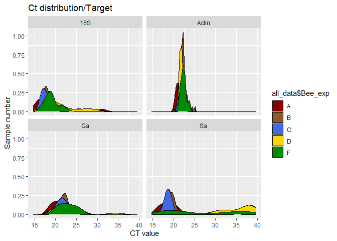
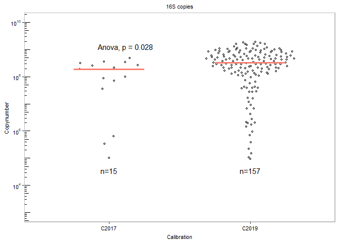
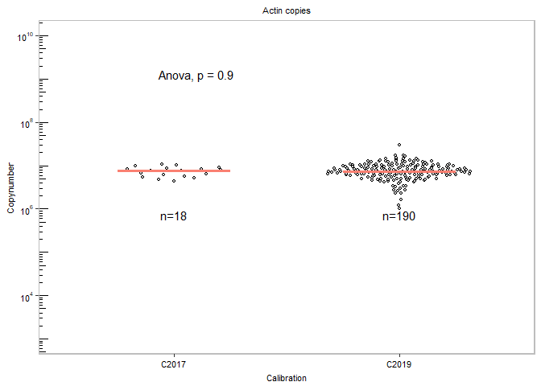
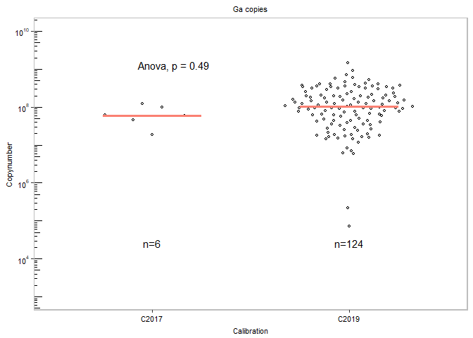
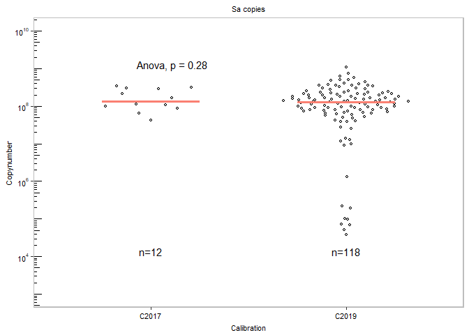
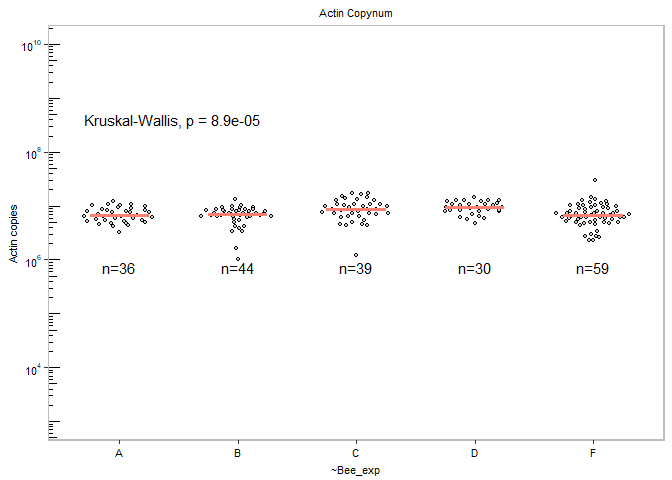
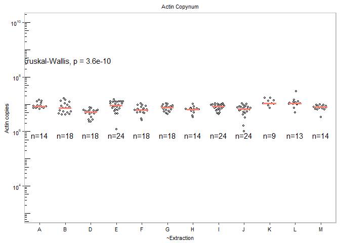
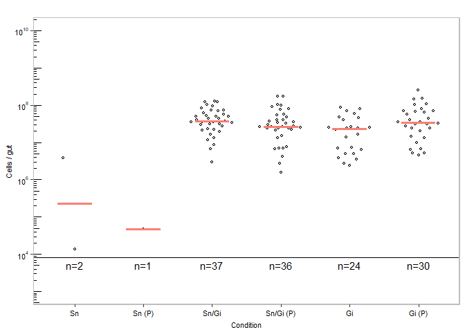
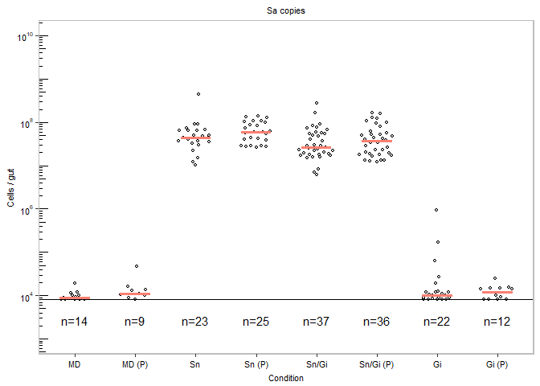

#### These are the required packages to reproduce this analysis.

``` r
### env setup

required_packages = c("dplyr", "data.table", "ggplot2",  "ggbeeswarm", "ggpubr", "EnvStats", "tidyverse", "patchwork", "ggforce", "wesanderson", "RcolorBrewer", "ggthemes" , "rvg","ggh4x","grid" , "multcompView" , "gridExtra")
need_install = required_packages[!(required_packages) %in% installed.packages()]

if (length(need_install) > 0){
  install.packages((need_install), repos = "http://cran.us.r-project.org")
}

# Load packages
lapply(required_packages, require, character.only=T)

dir_script = dirname(rstudioapi::getSourceEditorContext()$path)

setwd(dir_script)
#font_import()
#loadfonts(device="win")
```

This code defines the standard plot theme for the following plots

``` r
#### Make a standard theme and plot properties for the next 5 plots
Conditions <- c("MD", "MD (P)", "Sn", "Sn (P)", "Sn/Gi", "Sn/Gi (P)", "Gi", "Gi (P)")

CAGES <- c("A", "B", "C", "D", "E", "F", "G", "H")
plot_theme <- list(stat_n_text(),
                   scale_x_discrete(labels= Conditions),
  geom_quasirandom(fill="grey80",color = "black", height = 0, width = 0.33, shape=21, size = 1),
  stat_summary(fun.y = median, fun.ymin = median, fun.ymax = median,
                  geom = "crossbar",width = 0.5, color="salmon") ,
                   scale_y_log10(
                     breaks = scales::trans_breaks("log10", function(x) 10^x),
                     labels = scales::trans_format("log10", scales::math_format(10^.x))
                   ),    # set the of y axis, log scale and 10x ticks
                   #geom_errorbar(aes(ymin=Ct-SD, ymax=Ct+SD))+
theme(axis.title.x = element_text(vjust = -0.6, size=8),
    panel.background = element_rect(fill = "white", colour = "grey50") ,   legend.position = "none",
        axis.text.x = element_text(color = "black", size=8), 
        panel.border = element_rect(colour = "grey", fill=NA, size=1),
        axis.text.y = element_text(color = "black", size=8),
        axis.title.y =element_text(color = "black", size=8),
        legend.text = element_text(color = "black", size=6), 
        legend.title = element_text(color = "black", size=6),
        plot.title = element_text(hjust = 0.5, size=8)),
  coord_cartesian(ylim = c(1000,10000000000)),
                   annotation_logticks(sides = "l"))#,
#facet_wrap(~Target))
```

Here are some plots to check the the quality of data \# 1- Distribution
of Ct values

``` r
####Plot the same but coloring the bars according to cage
all_data= subset(all_data, !is.na(all_data$Ct)) 
  
ggplot(all_data, aes(x=all_data$Ct, fill=all_data$Bee_exp))+
  geom_density(binwidth = 0.3)+
  ggtitle("Ct distribution/Target")+
  xlab("CT value")+
  scale_fill_manual(values=c("red4", "tan4", "royalblue", "Gold1","Green4")) +
  ylab("Sample number")+
  facet_wrap(~Target)
```



There are a couple of Ct values for the MD in Ga and Sa. They might be
under the LOD when calculating the cell number. Pollen shows lower CTs
in the the MD cages. We need to subtract the CT values obtained for UV
primers on 40 mg of Pollen grains.

Here check that the two calibrations do not affect the data. There is a
little number of datapoints from the 2017 calibration, so it’s probably
not an issue for the analysis. Importantly there is no difference
between actin values from the two conditions.

``` r
#### Split the df into a list based on the calibration and target
data_split = split(all_data, list(all_data$Target)) 

plot_list= lapply(data_split, function(f){
 ggplot(f[f$Copynum > 36000,], aes(Calibration, Copynum ))+ 
 ggtitle(paste(f$Target, "copies"))+
  xlab("Calibration")+
  ylab("Copynumber")+
      plot_theme+
  # annotate("text", x =df$cage , y=10^8, label = df$letter)+
  scale_x_discrete()+
  #geom_hline(yintercept = 7500)+
 stat_compare_means(method="anova", label.y=9)
})
```

    ## Scale for x is already present.
    ## Adding another scale for x, which will replace the existing scale.
    ## Scale for x is already present.
    ## Adding another scale for x, which will replace the existing scale.
    ## Scale for x is already present.
    ## Adding another scale for x, which will replace the existing scale.
    ## Scale for x is already present.
    ## Adding another scale for x, which will replace the existing scale.

``` r
ggsave("Copynum_calibration.pdf", arrangeGrob(grobs = plot_list), device = "pdf",width = 15)
```

    ## Saving 15 x 5 in image

``` r
plot_list
```

    ## $`16S`



    ## 
    ## $Actin



    ## 
    ## $Ga



    ## 
    ## $Sa

 There
is a difference for 16S, but there two few samples in C2017 to really
compare and most points have been done in C2019

``` r
##Function to get the right order of letters from the multcompletters function (created by me ^^)

strip_signif_letters = function(s){

char <- as(s[1], "character")
vect <- as(char[1], "vector")

new_vect= str_split(vect, ",", simplify = T)

new_vect = str_remove_all(new_vect, "[()\"=]")
new_vect = str_remove_all(new_vect, '^([c]*)')

return (print(data.frame("letter"=str_remove_all(new_vect, "[A-Z0-9 ]"), "cage"= str_remove_all(new_vect, "[a-z ]"))))
}


#### Check actin copires per experiment

ggplot(data_split$Actin, aes(Bee_exp, Copynum))+ 
 ggtitle("Actin Copynum")+
  xlab("Bee experiment")+
  ylab("Actin copies")+
   #annotate("text", x =signif_letters$Actin$cage , y=10^9, label = signif_letters$Actin$letter)+
    plot_theme+
  scale_x_discrete(aes(Bee_exp))+ 
  #geom_hline(yintercept = 7500)+
 stat_compare_means(method="kruskal", label.y=8.5, )
```

    ## Scale for x is already present.
    ## Adding another scale for x, which will replace the existing scale.



``` r
#### Check actin copies per extraction
ggplot(data_split$Actin, aes(Extraction, Copynum))+ 
 ggtitle("Actin Copynum")+
  xlab("Bee experiment")+
  ylab("Actin copies")+
   #annotate("text", x =signif_letters$Actin$cage , y=10^9, label = signif_letters$Actin$letter)+
    plot_theme+
  scale_x_discrete(aes(Extraction))+ 
  #geom_hline(yintercept = 7500)+
 stat_compare_means(method="kruskal", label.y=8.5, )
```

    ## Scale for x is already present.
    ## Adding another scale for x, which will replace the existing scale.



``` r
plot_list= lapply(data_split,  function(f){
 ggplot(f, aes(Cage, Norm_cell ))+ 
 ggtitle(paste(f$Target, "copies"))+
  xlab("Condition")+
  ylab("Cells / gut")+
          plot_theme+
  # annotate("text", x =df$cage , y=10^8, label = df$letter)+
  geom_hline(yintercept = 8000)
})


  plot_list$Ga +
   scale_x_discrete(labels= c("Sn", "Sn (P)", "Sn/Gi", "Sn/Gi (P)", "Gi", "Gi (P)" ))+
  ggtitle("")
```

    ## Scale for x is already present.
    ## Adding another scale for x, which will replace the existing scale.



``` r
#ggsave("Fig_S1B.pdf", device = cairo_pdf, dpi =300, height=3, width=4 ,unit="in")

  plot_list$Sa +
  scale_x_discrete(labels= c("MD", "MD (P)","Sn", "Sn (P)", "Sn/Gi", "Sn/Gi (P)", "Gi", "Gi (P)" ))
```

    ## Scale for x is already present.
    ## Adding another scale for x, which will replace the existing scale.



``` r
#ggsave("Fig_1A.pdf", device = cairo_pdf, dpi =300, height=3, width=4 ,unit="in")
```
